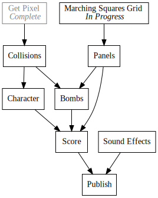
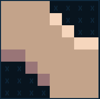
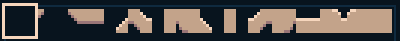
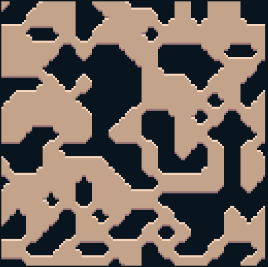

+++
title = "Day11 - Marching Squares"
description = "Implementing Marching Squares in SCRIPT-8"
date = 2019-02-17

[extra]
project = "8bomb"
+++

Today I implemented an implementation of Marching Squares in SCRIPT-8 for my
[Bomb Survival Demake](../day7-bomb-survival-demake/). As a bit of background,
[marching squares](https://en.wikipedia.org/wiki/Marching_squares) is a graphics
technique for using sprites to draw a smoother depiction of a two dimensional
grid. In other words, I can use Marching Squares to implement destructible
terrain in a clean and efficient way.

The basic idea is to split the terrain into a grid of boolean values where each
value is associated with a corner of a tile of terrain, and the boolean
indicates whether that corner is covered or uncovered. The implementor then
draws a tile for each of the 16 possible combinations of covered and uncovered
corners and uses those tiles to draw every square in the terrain. As an example,
the tile I drew for covered top left and bottom right, uncovered top right and
bottom left looks like:

So drawing an entire block of terrain values in the grid becomes looking up the
corners, and drawing the correct tile out of the pre-drawn list. Since tiles are
8 * 8 times larger than pixels, we only have to store about 1/64th of the
terrain data. We also get artistic control over what the tiles look like for
free since we can draw the tiles in whatever way we like. Making changes to the
terrain becomes similarly easier, since any change to the terrain grid booleans
will show up in the rendered result.

## Indexing

I label each of the possible combinations via a 4 bit sequence moving clockwise
from the top left. So for the above texture, it would be labeled True False True
False. This labeling scheme allows me to quickly calculate the index of a given
combination and draw it to the screen. I drew the textures in order such that
each sprite is positioned in the sprite index which matches the number formed by
the corner values.

As mentioned above, since the tiles are 8 by 8, I must scale the terrain data
coordinates accordingly.


const tileWidth = 8;
const tileHeight = 8;

function drawTile(tx, ty, topLeft, topRight, bottomRight, bottomLeft) {
  let s = 0;
  if (topLeft) s += 1;
  if (topRight) s += 2;
  if (bottomRight) s += 4;
  if (bottomLeft) s += 8;
  sprite(tx * tileWidth, ty * tileHeight, s);
}


## Terrain Data

SCRIPT-8 tracks the current state of the game in order to enable it's rewind
feature. To that end all state must be initialized into the `initialState`
object when the game starts, and all modifications must happen on the associated
state object that gets passed to `update` and `draw`. So I created an
`initTerrain` function which creates the data grid for the terrain to get
drawn from.


function initTerrain() {
  let result = [];
  for (let i = 0; i < 17; i++) {
    let row = [];
    for (let j = 0; j < 17; j++) {
      row.push(random(0, 1) == 1);
    }
    result.push(row);
  }
  return result;
}

initialState = {
  terrain: initTerrain()
};


The grid goes from 0 to 17 for a total of 18 by 18 booleans. This makes sense
because SCRIPT-8's screen is 128 by 128 which leaves room for 16 by 16 tiles.
Each tile requires 2 data points to describe it, so we need 2 more indices on
either side of the tiles to have all of them be fully specified.

## Drawing it All

All that is left is to give a function for drawing the terrain. I created this
by simply looping over all of the data in the grid and drawing it with the
`drawTile` function. I then call my `drawTerrain` function in the SCRIPT-8
`draw` function to get it drawn to the screen.


function drawTerrain(terrain) {
  for (let y = 0; y < terrain.length - 1; y++) {
    for (let x = 0; x < terrain[y].length - 1; x++) {
      drawTile(x, y, terrain[y][x], terrain[y][x + 1], terrain[y + 1][x + 1], terrain[y + 1][x]);
    }
  }
}

draw = state => {
  clear();
  drawTerrain(state.terrain);
}


This yields the satisfying randomly generated image below.

An editable live version can be found
[here](https://script-8.github.io/?id=46394495fbd4c3b6cae31a9a0f749521). Next up
for this project is to build some collision detection using Verlet Integration!

Till tomorrow,  
Kaylee
