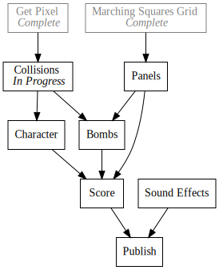
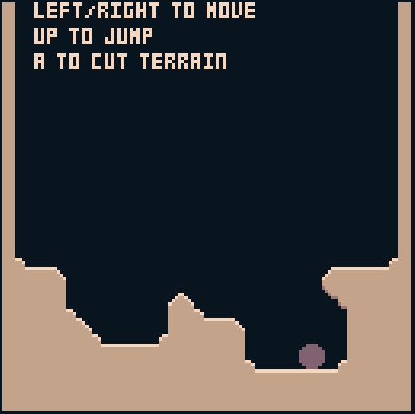

+++
title = "Day15 - 8Bomb Physics"
description = "Implement simple pixel based collisions"
date = 2019-02-21

[extra]
project = "8bomb"
+++

Today's task is to implement pixel collisions in my bomb survival demake on
[SCRIPT-8](https://script-8.github.io/). Last time on this project I implemented
dynamic terrain rendering using marching squares. Today I will build a modular
physics system which allows for colliding circles that can interact with a layer
of graphics rendered to the screen. In particular I will be using an algorithm
loosely based on the ideas presented in
[this](https://www.youtube.com/watch?v=3HjO_RGIjCU) video series.

As a rough outline, the algorithm is split up into setup, motion, and collision
portions. After finishing the physics, I will add some controls and a simple way
to edit the terrain. I will pick roughly at the end of the
[previous](../day11-marching-squares/) post on 8Bomb.

## Setup

First up is to initialize the terrain into an interesting arena to play with. I
fill the bottom third of the terrain, and add walls to the edges.


function initTerrain() {
  let terrain = [];
  for (let y = 0; y < 17; y++) {
    let row = [];
    for (let x = 0; x < 17; x++) {
      if (y > 10 || x == 0 || x == 16) {
        row.push(1);
      } else {
        row.push(0);
      }
    }
    terrain.push(row);
  }
  return terrain;
}


Similarly I defined a function for creating physics circles. The physics engine
requires a position, previous position, radius and sprite index. I also add a
grounded property for future use.


function initPhysicsObject(x, y, radius, sprite) {
  return {
    previous: {
      x,
      y
    },
    position: {
      x,
      y
    },
    radius,
    sprite,
    grounded: false
  }
}


And finally I combine them into an initial state object.


initialState = {
  terrain: initTerrain(),
  player: initPhysicsObject(20, 20, 3.75, 16)
};


## Motion

Every frame in the physics simulation the physics objects need to continue their
previous motion, and get effected by gravity. Since the position of the previous
frame is recorded, we can calculate the velocity, modify it for gravity, and get
a new position by adding the velocity to the position.


const gravity = 0.07;

function updatePhysicsObjects(...objects) {
  for (const obj of objects) {
    let vx = obj.position.x - obj.previous.x;
    let vy = obj.position.y - obj.previous.y;
    obj.previous.x = obj.position.x;
    obj.previous.y = obj.position.y;
    vy += gravity;
    
    obj.position.x += vx;
    obj.position.y += vy;
  }
}


Recording the position and velocity in this way provides a natural way to
automatically update the velocity of the object. When the position changes, the
velocity changes automatically. Similarly if we want to inject some motion into
the object without moving it, we simply modify the previous position and things
work out naturally.

I run this code in the update loop.


update = (state, input) => {
  updatePhysicsObjects(state.player);
}


To get the object to actually show up I needed to create a sprite (for now a
circle will do) and add a `drawPlayer` function that gets called in the `draw`
function.


function drawPlayer({ player }) {
  sprite(player.position.x - player.radius, player.position.y - player.radius, 16);
}

draw = state => {
  clear();
  drawTerrain(state.terrain);
  drawPlayer(state);
}


Running at this point should draw the player which will fall down the screen and
through the terrain. Lets fix that next.

## Collision

Unfortunately, since the algorithm depends on access to the pixel data, the
collision code needs to happen in the `draw` function. So I created a
`handleTerrainCollisions` function which gets run right after drawing the
terrain, and updates the positions of every physics object to not collide with
the terrain. The entire function is big, so I will build it up piece by piece.


function handleTerrainCollisions(...objects) {
  for (const obj of objects) {
  }
}


I start pretty straight forward looping over every object in the passed in list.


function handleTerrainCollisions(...objects) {
  for (const obj of objects) {
    for (let r = 0; r < Math.PI * 2; r += Math.PI / 10) {
      let dx = Math.cos(r) * obj.radius;
      let dy = Math.sin(r) * obj.radius;
      if (getPixel(obj.position.x + dx, obj.position.y + dy) != 7) {

      }
    }
  }
}


I then loop over the pixels around the border of the physics object by using
some simple trig to figure out how far horizontally and vertically to move at 10
different angles around the circle. These points act as test points to see if the
object has intersected with the terrain around the border.


function handleTerrainCollisions(...objects) {
  for (const obj of objects) {
    let totalX = 0;
    let totalY = 0;
    let count = 0;
    for (let r = 0; r < Math.PI * 2; r += Math.PI / 10) {
      let dx = Math.cos(r) * obj.radius;
      let dy = Math.sin(r) * obj.radius;
      if (getPixel(obj.position.x + dx, obj.position.y + dy) != 7) {
        totalX += dx;
        totalY += dy;
        count++;
      }
    }
    if (count == 0) {
      continue;
    }
    let dx = totalX / count;
    let dy = totalY / count;
  }
}


For each pixel on the border which does not have background color, I add the
pixel value to an accumulator for averaging. Then after the loop I calculate the
average using the count and accumulated sum. If not intersecting pixels were
found, then there is nothing to do and I move on. I use this average value to
calculate how far to push the physics object to escape the terrain.


let length = Math.sqrt(dx * dx + dy * dy);
let nx = dx / length;
let ny = dy / length;

let displacement = obj.radius - length;

obj.position.x -= nx * displacement;
obj.position.y -= ny * displacement;


To wrap up the calculation, I calculate the length of the intersection average,
and us that to calculate the desired displacement. When multiplied by the
normalized intersection average gives the amount to move the position.

Lastly, I add some logic to track when the physics object is on the ground. And
that's it! The complete function:


function handleTerrainCollisions(...objects) {
  for (const obj of objects) {
    let totalX = 0;
    let totalY = 0;
    let count = 0;
    for (let r = 0; r < Math.PI * 2; r += Math.PI / 10) {
      let dx = Math.cos(r) * obj.radius;
      let dy = Math.sin(r) * obj.radius;
      if (getPixel(obj.position.x + dx, obj.position.y + dy) != 7) {
        if (dy > 3 && Math.abs(dx) <= 1) {
          obj.grounded = true;
        }
        totalX += dx;
        totalY += dy;
        count++;
      }
    }
    if (count == 0) {
      obj.grounded = false;
      continue;
    }
  
    let dx = totalX / count;
    let dy = totalY / count;
    
    let length = Math.sqrt(dx * dx + dy * dy);
    let nx = dx / length;
    let ny = dy / length;
    
    let displacement = obj.radius - length;
    
    obj.position.x -= nx * displacement;
    obj.position.y -= ny * displacement;
  }
}


I run this after clearing and drawing the terrain, but before drawing anything
else in order to keep the intersections from intersecting with anything in the
foreground. I also execute the function multiple times because the physics
sometimes needs some time to settle.


draw = state => {
  clear();
  drawTerrain(state.terrain);
  for (let i = 0; i < 5; i++) {
    handleTerrainCollisions(state.player);
  }
  drawPlayer(state);
  drawInstructions();
}


Running now drops the ball just as before, but the ball should land instead of
falling through.

## Input

To wrap things up I added an input function which adds some controls to the ball.


const runSpeed = 0.05;
const airSpeed = 0.01;

function handleInput(input, player, terrain) {
  let speed = player.grounded ? runSpeed : airSpeed;
  if (input.left) {
    player.position.x -= speed;
  }
  if (input.right) {
    player.position.x += speed;
  }
  
  if (input.up && player.grounded) {
    player.previous.y += 1;
  }
  
  if (input.a) {
    cutTerrain(player.position.x, player.position.y, 10, terrain);
  }
}


Since the velocity is determined by the difference between the previous and
current position, modifying the position of the object feels natural and the
motion is preserved. I also created a simple `cutTerrain` function which
modifies the terrain array to cut out a small circle around the player.


function cutTerrain(x, y, radius, terrain) {
  let tx = Math.round(x / tileWidth);
  let ty = Math.round(y / tileHeight);
  let tr = Math.floor(radius / tileWidth);
  
  for (let cx = tx - tr; cx <= tx + tr; cx++) {
    for (let cy = ty - tr; cy <= ty + tr; cy++) {
      if (cy >= 0 && cy < terrain.length) {
        let row = terrain[cy];
        if (cx >= 0 && cx < row.length) {
          row[cx] = false;
        }
      }
    }
  }
}


Complete!

Collisions now work with the destructible terrain we built last time. A runable
version of the game at this point can be found
[here](https://script-8.github.io/?id=2a24d4038406b2ea5f648c9ebb8d3a6b).

This marks the 15th day of daily blog posts. In this time I have built a
directory script runner, todo tree rendering tool, half of a retro game, and
worked out a setup for running rust code in the blog cleanly. I've been very
pleased with the general progress and am excited to see how far I get in the
next half of the month.

Till tomorrow,  
Kaylee
