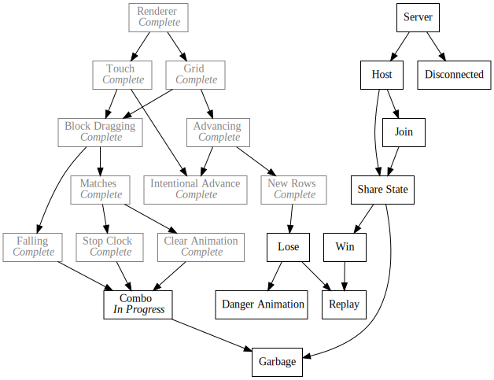

+++
title = "Day42 - Finished Combos!"
description = "Built combo recognition"
date = 2019-03-20

[extra]
project = "ta"
+++

Today I finally finished the combo recognition feature! It took me a couple of
days to figure out the exact semantics, but I am fairly confident that I have
gotten it correct. The combo feature in the original game was more complicated than I originally thought!

## Problem Definition

Although easy to understand intuitively, the combo feature in Tetris attack is
somewhat nuanced. The complication stems from the fact that combo extension can
happen a ways after the original match occurred. Any block that falls as the
result of a match may be used to extend the combo. To that end when implementing the combo recognition, every block effected by a match must be watched until we can prove the block has "settled" and will not fall anymore.

Another complication is that the current combo status must be reported at the
start of a match while the tracked blocks must be collected after the match has
been cleared. So to keep concerns properly separated I introduced events for
match creation and completion and used them to track when to create and manage
matches.

## Events


MatchStarted.Subscribe(matchedBlocks => {
  for (let combo of combos) {
    if (matchedBlocks.some(matchedBlock => combo.trackedBlocks.has(matchedBlock))) {
      combo.cascades++;
      ComboExtended.Publish(matchedBlocks, combo.cascades);
    }
  }
});

MatchCompleted.Subscribe(clearedBlocks => {
  let foundExistingCombo = false;
  for (let combo of combos) {
    if (clearedBlocks.some(clearedBlock => combo.trackedBlocks.has(clearedBlock))) {
      foundExistingCombo = true;
      combo.processMatchedBlocks(clearedBlocks);
    }
  }

  if (!foundExistingCombo) {
    combos.add(new Combo(clearedBlocks));
  }
});


At match creation, any combos with tracked blocks participating in the match
increment their counters and notify of their extension.

Upon completion, any combos with tracked blocks will search upward for new
blocks to track and if no existing combos are participating a new combo is
created for the newly matched blocks.

## Combo Class


export class Combo {
  constructor(matchedBlocks) {
    this.cascades = 0;
    this.trackedBlocks = new Set();
    this.processMatchedBlocks(matchedBlocks);
  }


This new combo tracks the number of cascades it has participated in, a set of
the blocks it is currently tracking, and searches upward from the initial block
set for blocks to track.


processMatchedBlocks(matchedBlocks) {
  for (let matchedBlock of matchedBlocks) {
    for (let y = matchedBlock.gridSlot.y - 1; y > 0; y--) {
      let fallingBlock = getBlock(matchedBlock.gridSlot.withY(y));
      if (!fallingBlock) break;
      if (fallingBlock.state === state.WAITING) {
        this.trackedBlocks.add(fallingBlock);
      }
    }
    this.trackedBlocks.delete(matchedBlock);
  }
}


Since the matched blocks are no longer needed, I search upward from each one
until the top of the grid or the first empty block space. Any blocks currently
in the `Waiting` state are added to the tracking list. Then every update loop
the blocks are checked to ensure they are not settled. Any settled blocks are
removed from the list and if the combo no is no longer tracking any blocks, then
it is assumed that the combo is finished and it reports completion with the
`ComboFinished` event as well as returning a true value to indicate that this
combo should be removed from the combo list.


update() {
  for (let trackedBlock of this.trackedBlocks) {
    if (trackedBlock.state !== state.FALLING &&
        trackedBlock.state !== state.MATCHED &&
        trackedBlock.state !== state.CLEARING &&
        !emptySlotBelow(trackedBlock)) {
      this.trackedBlocks.delete(trackedBlock);
    }
  }

  if (this.trackedBlocks.size == 0) {
    if (this.cascades > 0) {
      ComboFinished.Publish(this.cascades);
    }
    return true;
  }

  return false;
}


## Settled

A block is considered settled if it is not `Falling`, `Matched`, or `Clearing`,
or if there is an empty block somewhere below it as defined by the
`emptySlotBelow` function:


function emptySlotBelow(block) {
  for (let y = block.gridSlot.y + 1; y <= previousFilledY; y++) {
    let possiblyEmptyBlock = getBlock(block.gridSlot.withY(y));
    if (!possiblyEmptyBlock || volatileStates.includes(possiblyEmptyBlock.state)) {
      return true;
    }
  }
  return false;
}


Which super cleanly searches downward from each block checking if any of them
are blank or about to be blank.

And thats it! Not super complicated when put together, but it took me a long
time to get to this point. And to top it all off, while writing this description
I realized that my definition of settled will need some help since garbage
blocks can let settled blocks rest above empty spaces. For now though this
solution is good enough and I will cross that bridge when I get to it.

Not a super visual post today, but I plan on working on some better artwork soon
so hopefully those posts will make for prettier reading.

Till tomorrow!  
Kaylee
