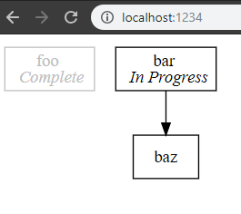

+++
title = "Day54 - Remove Pando Abbreviations"
description = "Delete unnecessary abbreviation code in Pando"
date = 2019-04-01

[extra]
project = "pando"
+++

Today I did some code cleanup in Pando to make the graph operations easier
later. Since in the future I will never be editing the Pando file format
directly, I don't mind specifying the dependencies fully instead of as
abbreviations. By relaxing the abbreviation constraint, I no longer need to
calculate the smallest abbreviation for a new dependency added in the UI; I just
have to add the dependency identifier to the dependency list of the dependent
task.

## Deletion

For the most part this exercise was one of code deletion. I don't need to do any
of the fancy abbreviation shenanigans I worked on before, so I deleted the
methods in `abbreviation.rs` and moved the `resolve_dependent_tasks` function
into the generator code.


pub fn resolve_dependent_tasks(tasks: &Vec<Todo>) -> Result<HashMap<String, Vec<String>>, String> {
    let mut dependent_tasks = HashMap::new();

    for task in tasks.iter() {
        dependent_tasks.insert(task.identifier.clone(), Vec::new());
    }

    for task in tasks.iter() {
        for dependency in task.dependencies.clone() {
            match tasks.iter().find(|task| &task.identifier == &dependency) {
                Some(_) =>
                    dependent_tasks
                        .entry(dependency.clone())
                        .and_modify(|dependent_tasks| dependent_tasks.push(task.identifier.clone())),
                None => return Err(format!("Could not find dependency: {}", dependency))
            };
        }
    }

    Ok(dependent_tasks)
}


I then updated the tests to specify dependencies fully, for example:


#[test]
fn parse_pando_works() {
    assert_eq!(
        parse_pando(
"x Brainstorm
> Specify Format [ Brainstorm ]
- Implement Parser [ Specify Format ]
- DOT Generator [ Brainstorm ]
- Command Line [ Implement Parser, DOT Generator ]"),
        vec![
            Todo::new(TaskStatus::Completed, "Brainstorm", vec![]),
            Todo::new(TaskStatus::InProgress, "Specify Format", vec!["Brainstorm"]),
            Todo::new(TaskStatus::Waiting, "Implement Parser", vec!["Specify Format"]),
            Todo::new(TaskStatus::Waiting, "DOT Generator", vec!["Brainstorm"]),
            Todo::new(TaskStatus::Waiting, "Command Line", vec!["Implement Parser", "DOT Generator"])
        ]);
}


## Pando File Generation

Since the operations from the Rust side will just be from Pando file formats to
other Pando file formatted files, I needed a way to turn a transformed list of
tasks back into a Pando file for storage. Luckily code generation from a data
structure is MUCH simpler than parsing a code file into said data structure. I
implemented it in 3 parts, the status, the identifier, and the dependencies.
After each line is generated they are concatenated with line breaks.


pub fn generate_pando_status(status: TaskStatus) -> String {
    (match status {
        TaskStatus::Completed => "x ",
        TaskStatus::InProgress => "> ",
        TaskStatus::Waiting => "- "
    }).to_owned()
}

pub fn generate_pando_dependencies(dependencies: Vec<String>) -> String {
    if dependencies.is_empty() {
        String::new()
    } else {
        format!(" [ {} ]", dependencies.join(", "))
    }
}

pub fn generate_pando_file(tasks: Vec<Todo>) -> String {
    let task_lines: Vec<String> = tasks.into_iter().map(|task| {
        generate_pando_status(task.status) +
        &task.identifier +
        &generate_pando_dependencies(task.dependencies)
    }).collect();

    task_lines.join("\n")
}


## Operation Test

To test everything out I decided to implement one of the graph manipulations:
dependency removal. Once a task list is parsed into a list of `Todo` structures
the operation is as simple as looping over each task until I find one with a
matching identifier and filter out the dependency identifier from the dependency
list.


pub fn remove_task_dependency(task_identifier: &str, dependency_identifier: &str, tasks: Vec<Todo>) -> Vec<Todo> {
    tasks.into_iter()
         .map(|todo| {
             if todo.identifier == task_identifier {
                 let new_dependencies = todo.dependencies
                     .into_iter()
                     .filter(|dependency| dependency != dependency_identifier)
                     .collect();
                 Todo { dependencies: new_dependencies, ..todo }
             } else {
                 todo
             }
         }).collect()
}


I then wrapped this function in a JavaScript available function which parses
Pando code into a task list, removes the specified dependency link, and
re-generates Pando code to return.


#[js_export]
pub fn remove_dependency(task_identifier: &str, dependency_identifier: &str, pando_code: &str) -> String {
    let tasks = remove_task_dependency(task_identifier, dependency_identifier, parse_pando(pando_code));
    generate_pando_file(tasks)
}


## Errors

In the process of working on this I realized that the current Pando library just
panics when something parses incorrectly. This isn't correct in a wasm library
however as it is difficult to recover from a panic-ed wasm binary. So I decided
to pump `Result` structures containing error information through the Pando
functions. Then on the public side a JavaScript value is created with the result
information.


#[js_export]
pub fn compile(pando_code: &str) -> Value {
    ::std::panic::set_hook(Box::new(|info| {
        console!(error, format!("!!! RUST PANIC !!! {:?}", info));
    }));

    match generate_dot_file(parse_pando(pando_code)) {
        Ok(dot_code) => js! {
            return { success: true, dotCode: @{dot_code} }
        },
        Err(reason) => js! {
            return { success: false, reason: @{reason} }
        }
    }
}


The `js!` macro allows embedding of actual javascript code into the Rust source
file which is honestly incredibly useful and awesome. Very exciting stuff.

## End to End Test

Finally I modified the JavaScript file to call this new function to remove a
link in the test graph before rendering.


async function renderGraph() {
  let compileResult = compile(remove_dependency("bar", "foo", "x foo\n> bar [ foo ]\n- baz [ bar ]"));
  if (compileResult.success) {
    let element = await viz.renderSVGElement(compileResult.dotCode);
    document.body.appendChild(element);
  } else {
    console.error(compileResult.reason);
  }
}


Which when opened in the browser shows the graph with the tasks separated as
expected:

Thats it for today. At this point the ground work is all finished for
implementing graph operations. After that its just UI and the tool should be
usable again!

Till tomorrow,  
Kaylee
