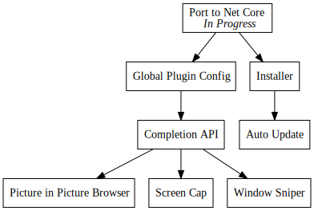

+++
title = "Day70 - Porting WPF App to Core"
description = "Porting a dotnet framework WPF app to dotnet core"
date = 2019-04-21

[extra]
project = "traffic-control"
+++

Today I completed the porting work to move my old version of Traffic Control
from dotnet framework to the new dotnet core preview. This lets me greatly
simplify the project system and benefit from the performance improvements in
dotnet core. Further, since dotnet core is where most of the innovation has been
happening in .net land, its kinda the place to be at this point.

Porting a dotnet framework application (let alone a WPF app) is relatively
straightforward, and more a manner of subtraction than rewriting. I will try to
summarize in this post the general process.

To port over netframework app, you first need to have a cursory understanding of
the anatomy of a `csproj` file. The new style `csproj` files have a streamlined
the process significantly and made editing these files directly much more
viable. In the process they have populated many of the properties that existed
in old project files with sane defaults so that most of the time they can be
omitted completely.  What follows is a section by section conversion.

## Project Tag

Old:


<?xml version="1.0" encoding="utf-8"?>
<Project ToolsVersion="15.0" xmlns="http://schemas.microsoft.com/developer/msbuild/2003">


New:


<Project Sdk="Microsoft.NET.Sdk.WindowsDesktop">


Old style projects required an XML version tag, a `ToolsVersion`, and a URL to
the schema description. The new style projects ignore the XML version, and
populate the `ToolsVersion` and schema automatically depending on the `Sdk`
property. The `Sdk` also tells msbuild where to import the default props and
targets for csharp projects later on down the line.

## Props and COnfiguration

Old:


<Import Project="$(MSBuildExtensionsPath)\$(MSBuildToolsVersion)\Microsoft.Common.props" Condition="Exists('$(MSBuildExtensionsPath)\$(MSBuildToolsVersion)\Microsoft.Common.props')" />
<PropertyGroup>
  <Configuration Condition=" '$(Configuration)' == '' ">Debug</Configuration>
  <TargetPlatformVersion>8.1</TargetPlatformVersion>
  <Platform Condition=" '$(Platform)' == '' ">x64</Platform>
  <ProjectGuid>{81100206-5E00-4110-A875-6F75C4983D90}</ProjectGuid>
  <OutputType>WinExe</OutputType>
  <RootNamespace>TrafficControl</RootNamespace>
  <AssemblyName>TrafficControl</AssemblyName>
  <TargetFrameworkVersion>v4.7.2</TargetFrameworkVersion>
  <FileAlignment>512</FileAlignment>
  <ProjectTypeGuids>{60dc8134-eba5-43b8-bcc9-bb4bc16c2548};{FAE04EC0-301F-11D3-BF4B-00C04F79EFBC}</ProjectTypeGuids>
  <WarningLevel>4</WarningLevel>
  <AutoGenerateBindingRedirects>true</AutoGenerateBindingRedirects>
  <NuGetPackageImportStamp>
  </NuGetPackageImportStamp>
</PropertyGroup>
<PropertyGroup Condition="'$(Configuration)|$(Platform)' == 'Debug|x64'">
  <DebugSymbols>true</DebugSymbols>
  <OutputPath>bin\x64\Debug\</OutputPath>
  <DefineConstants>DEBUG;TRACE</DefineConstants>
  <DebugType>full</DebugType>
  <PlatformTarget>x64</PlatformTarget>
  <ErrorReport>prompt</ErrorReport>
  <CodeAnalysisRuleSet>MinimumRecommendedRules.ruleset</CodeAnalysisRuleSet>
  <Prefer32Bit>true</Prefer32Bit>
  <LangVersion>latest</LangVersion>
</PropertyGroup>
<PropertyGroup Condition="'$(Configuration)|$(Platform)' == 'Release|x64'">
  <OutputPath>bin\x64\Release\</OutputPath>
  <DefineConstants>TRACE</DefineConstants>
  <Optimize>true</Optimize>
  <DebugType>pdbonly</DebugType>
  <PlatformTarget>x64</PlatformTarget>
  <ErrorReport>prompt</ErrorReport>
  <CodeAnalysisRuleSet>MinimumRecommendedRules.ruleset</CodeAnalysisRuleSet>
  <Prefer32Bit>true</Prefer32Bit>
</PropertyGroup>


New:


<PropertyGroup>
  <OutputType>WinExe</OutputType>
  <TargetFramework>netcoreapp3.0</TargetFramework>
  <RuntimeIdentifier>win10-x64</RuntimeIdentifier>
  <UseWpf>true</UseWpf>
</PropertyGroup>


Old style projects required a ton of misc configuration which almost never
changed from project to project. So when the MsBuild team got the chance to
rework things, these were the first to go. In new style projects configuration
and platform specific properties are no longer needed. Similarly, much of the
complexity in specifying what framework and platforms to build for have been
cleaned up.

Now the OutputType specifies what kind of asset to build (dll or exe), the
target framework specifies what libraries to build for, and the runtime
identifier specifies what platforms to build for. In my case I also added a
UseWpf property to tell the default targets to compile xaml properly.

Lastly, old style projects also required a referenced to the
`Microsoft.Common.props` file in every project. Now the correct properties are
imported based on the project Sdk removing the need for the extra boilerplate.

## References

Old:


<ItemGroup>
  <Reference Include="Caliburn.Micro, Version=3.2.0.0, Culture=neutral, PublicKeyToken=8e5891231f2ed21f, processorArchitecture=MSIL">
    <HintPath>..\packages\Caliburn.Micro.Core.3.2.0\lib\net45\Caliburn.Micro.dll</HintPath>
  </Reference>
  <Reference Include="Caliburn.Micro.Platform, Version=3.2.0.0, Culture=neutral, PublicKeyToken=8e5891231f2ed21f, processorArchitecture=MSIL">
    <HintPath>..\packages\Caliburn.Micro.3.2.0\lib\net45\Caliburn.Micro.Platform.dll</HintPath>
  </Reference>
  <Reference Include="Caliburn.Micro.Platform.Core, Version=3.2.0.0, Culture=neutral, PublicKeyToken=8e5891231f2ed21f, processorArchitecture=MSIL">
    <HintPath>..\packages\Caliburn.Micro.3.2.0\lib\net45\Caliburn.Micro.Platform.Core.dll</HintPath>
  </Reference>
  <Reference Include="DeltaCompressionDotNet, Version=1.1.0.0, Culture=neutral, PublicKeyToken=1d14d6e5194e7f4a, processorArchitecture=MSIL">
    <HintPath>..\packages\DeltaCompressionDotNet.1.1.0\lib\net20\DeltaCompressionDotNet.dll</HintPath>
  </Reference>
  <Reference Include="DeltaCompressionDotNet.MsDelta, Version=1.1.0.0, Culture=neutral, PublicKeyToken=46b2138a390abf55, processorArchitecture=MSIL">
    <HintPath>..\packages\DeltaCompressionDotNet.1.1.0\lib\net20\DeltaCompressionDotNet.MsDelta.dll</HintPath>
  </Reference>
  <Reference Include="DeltaCompressionDotNet.PatchApi, Version=1.1.0.0, Culture=neutral, PublicKeyToken=3e8888ee913ed789, processorArchitecture=MSIL">
    <HintPath>..\packages\DeltaCompressionDotNet.1.1.0\lib\net20\DeltaCompressionDotNet.PatchApi.dll</HintPath>
  </Reference>
  <Reference Include="Mono.Cecil, Version=0.9.6.0, Culture=neutral, PublicKeyToken=0738eb9f132ed756, processorArchitecture=MSIL">
    <HintPath>..\packages\Mono.Cecil.0.9.6.1\lib\net45\Mono.Cecil.dll</HintPath>
  </Reference>
  <Reference Include="Mono.Cecil.Mdb, Version=0.9.6.0, Culture=neutral, PublicKeyToken=0738eb9f132ed756, processorArchitecture=MSIL">
    <HintPath>..\packages\Mono.Cecil.0.9.6.1\lib\net45\Mono.Cecil.Mdb.dll</HintPath>
  </Reference>
  <Reference Include="Mono.Cecil.Pdb, Version=0.9.6.0, Culture=neutral, PublicKeyToken=0738eb9f132ed756, processorArchitecture=MSIL">
    <HintPath>..\packages\Mono.Cecil.0.9.6.1\lib\net45\Mono.Cecil.Pdb.dll</HintPath>
  </Reference>
  <Reference Include="Mono.Cecil.Rocks, Version=0.9.6.0, Culture=neutral, PublicKeyToken=0738eb9f132ed756, processorArchitecture=MSIL">
    <HintPath>..\packages\Mono.Cecil.0.9.6.1\lib\net45\Mono.Cecil.Rocks.dll</HintPath>
  </Reference>
  <Reference Include="NHotkey, Version=1.2.1.0, Culture=neutral, processorArchitecture=MSIL">
    <HintPath>..\packages\NHotkey.1.2.1\lib\net20\NHotkey.dll</HintPath>
  </Reference>
  <Reference Include="NHotkey.Wpf, Version=1.2.1.0, Culture=neutral, processorArchitecture=MSIL">
    <HintPath>..\packages\NHotkey.Wpf.1.2.1\lib\net35\NHotkey.Wpf.dll</HintPath>
  </Reference>
  <Reference Include="NuGet.Squirrel, Version=3.0.0.0, Culture=neutral, processorArchitecture=MSIL">
    <HintPath>..\packages\squirrel.windows.1.9.0\lib\Net45\NuGet.Squirrel.dll</HintPath>
  </Reference>
  <Reference Include="PropertyChanged, Version=2.5.11.0, Culture=neutral, PublicKeyToken=ee3ee20bcf148ddd, processorArchitecture=MSIL">
    <HintPath>..\packages\PropertyChanged.Fody.2.5.11\lib\net452\PropertyChanged.dll</HintPath>
  </Reference>
  <Reference Include="SharpCompress, Version=0.17.1.0, Culture=neutral, PublicKeyToken=afb0a02973931d96, processorArchitecture=MSIL">
    <HintPath>..\packages\SharpCompress.0.17.1\lib\net45\SharpCompress.dll</HintPath>
  </Reference>
  <Reference Include="Splat, Version=1.6.2.0, Culture=neutral, processorArchitecture=MSIL">
    <HintPath>..\packages\Splat.1.6.2\lib\Net45\Splat.dll</HintPath>
  </Reference>
  <Reference Include="Squirrel, Version=1.9.0.0, Culture=neutral, processorArchitecture=MSIL">
    <HintPath>..\packages\squirrel.windows.1.9.0\lib\Net45\Squirrel.dll</HintPath>
  </Reference>
  <Reference Include="System" />
  <Reference Include="System.Data" />
  <Reference Include="System.Drawing" />
  <Reference Include="System.Windows.Forms" />
  <Reference Include="System.Windows.Interactivity, Version=4.5.0.0, Culture=neutral, PublicKeyToken=31bf3856ad364e35, processorArchitecture=MSIL">
    <HintPath>..\packages\Caliburn.Micro.3.2.0\lib\net45\System.Windows.Interactivity.dll</HintPath>
  </Reference>
  <Reference Include="System.Xml" />
  <Reference Include="Microsoft.CSharp" />
  <Reference Include="System.Core" />
  <Reference Include="System.Xml.Linq" />
  <Reference Include="System.Data.DataSetExtensions" />
  <Reference Include="System.Net.Http" />
  <Reference Include="System.Xaml">
    <RequiredTargetFramework>4.0</RequiredTargetFramework>
  </Reference>
  <Reference Include="WindowsBase" />
  <Reference Include="PresentationCore" />
  <Reference Include="PresentationFramework" />
</ItemGroup>


New:


<ItemGroup>
  <PackageReference Include="Caliburn.Micro" Version="3.2.0.0" />
  <PackageReference Include="NHotkey.Wpf" Version="1.2.1.0" />
  <PackageReference Include="PropertyChanged.Fody" Version="2.5.11.0" />
</ItemGroup>
<ItemGroup>
  <Reference Include="System" />
  <Reference Include="System.Data" />
  <Reference Include="System.Windows.Interactivity, Version=4.5.0.0, Culture=neutral, PublicKeyToken=31bf3856ad364e35, processorArchitecture=MSIL">
    <HintPath>..\packages\Caliburn.Micro.3.2.0\lib\net45\System.Windows.Interactivity.dll</HintPath>
  </Reference>
  <Reference Include="System.Xml" />
  <Reference Include="Microsoft.CSharp" />
  <Reference Include="System.Core" />
  <Reference Include="System.Xml.Linq" />
  <Reference Include="System.Data.DataSetExtensions" />
  <Reference Include="System.Net.Http" />
  <Reference Include="System.Xaml">
    <RequiredTargetFramework>4.0</RequiredTargetFramework>
  </Reference>
  <Reference Include="WindowsBase" />
  <Reference Include="PresentationCore" />
  <Reference Include="PresentationFramework" />
</ItemGroup>


The next biggest change is the way Nuget packages are referenced. In old style
projects, the Nuget package is referenced with a standard assembly `Reference`.
This required hinting the location of the reference, and adding a bunch of
verification information to make sure the correct assembly is selected.

Further installing of packages required a `package.config` file which specified
how and where to download which packages. The process was fragile and would
frequently get confused if the packages every got out of sync.

New style projects use a new tag called `PackageReference` which specifies the
assembly reference and which package to pull down all at once. It simplifies the
process and makes it human editable instead of having to look up obscure
properties of the installed package.

## CSharp File List

Old:


<ItemGroup>
  <Compile Include="BrowserManager.cs" />
  <Compile Include="CompletionUtils.cs" />
  <Compile Include="Events.cs" />
  <Compile Include="InputManager.cs" />
  <Compile Include="PipManager.cs" />
  <Compile Include="UpdateFlagUtils.cs" />
  <Compile Include="WindowsUtils.cs" />
  <Compile Include="TrafficControl.cs" />
  <Compile Include="ViewModels\BrowserViewModel.cs" />
  <Compile Include="ViewModels\HelpViewModel.cs" />
  <Compile Include="ViewModels\PipViewModel.cs" />
  <Page Include="Views\HelpView.xaml">
    <Generator>MSBuild:Compile</Generator>
    <SubType>Designer</SubType>
  </Page>
  <Page Include="Views\CompletionResultView.xaml">
    <SubType>Designer</SubType>
    <Generator>MSBuild:Compile</Generator>
  </Page>
  <Page Include="Views\InputBoxView.xaml">
    <SubType>Designer</SubType>
    <Generator>MSBuild:Compile</Generator>
  </Page>
  <Content Include="FodyWeavers.xml">
    <SubType>Designer</SubType>
  </Content>
  <Compile Include="Bootstrapper.cs" />
  <Compile Include="Input\KeySequence.cs" />
  <Compile Include="Input\KeyTrigger.cs" />
  <Compile Include="Input\MultiKeyGesture.cs" />
  <Compile Include="Input\MultiKeyGestureConverter.cs" />
  <Compile Include="ViewModels\CompletionResultViewModel.cs" />
  <Compile Include="ViewModels\InputBoxViewModel.cs" />
  <Page Include="Views\BrowserView.xaml">
    <Generator>MSBuild:Compile</Generator>
    <SubType>Designer</SubType>
  </Page>
  <Page Include="Views\PipView.xaml">
    <SubType>Designer</SubType>
    <Generator>MSBuild:Compile</Generator>
  </Page>
</ItemGroup>
<ItemGroup>
  <Compile Include="Properties\AssemblyInfo.cs">
    <SubType>Code</SubType>
  </Compile>
  <Compile Include="Properties\Resources.Designer.cs">
    <AutoGen>True</AutoGen>
    <DesignTime>True</DesignTime>
    <DependentUpon>Resources.resx</DependentUpon>
  </Compile>
  <Compile Include="Properties\Settings.Designer.cs">
    <AutoGen>True</AutoGen>
    <DependentUpon>Settings.settings</DependentUpon>
    <DesignTimeSharedInput>True</DesignTimeSharedInput>
  </Compile>
  <EmbeddedResource Include="Properties\Resources.resx">
    <Generator>ResXFileCodeGenerator</Generator>
    <LastGenOutput>Resources.Designer.cs</LastGenOutput>
  </EmbeddedResource>
  <None Include="packages.config" />
  <None Include="Properties\Settings.settings">
    <Generator>SettingsSingleFileGenerator</Generator>
    <LastGenOutput>Settings.Designer.cs</LastGenOutput>
  </None>
</ItemGroup>


New:

*Nothing*

Old style projects required listing every file added to the old style project
along with what the compiler should do for each one. In contrast, new style
projects will automatically populate the list of files to compile by adding the
appropriate action for every file in the directory containing the csproj file
automatically. The result is that all of the boilerplate goes away and you only
need to list files that should have non default handling. This is a HUGE win.

## Targets

Old: 


  <Import Project="$(MSBuildToolsPath)\Microsoft.CSharp.targets" />
  <Import Project="..\packages\Fody.3.2.4\build\Fody.targets" Condition="Exists('..\packages\Fody.3.2.4\build\Fody.targets')" />
  <Target Name="EnsureNuGetPackageBuildImports" BeforeTargets="PrepareForBuild">
    <PropertyGroup>
      <ErrorText>This project references NuGet package(s) that are missing on this computer. Use NuGet Package Restore to download them.  For more information, see http://go.microsoft.com/fwlink/?LinkID=322105. The missing file is {0}.</ErrorText>
    </PropertyGroup>
    <Error Condition="!Exists('..\packages\Fody.3.2.4\build\Fody.targets')" Text="$([System.String]::Format('$(ErrorText)', '..\packages\Fody.3.2.4\build\Fody.targets'))" />
    <Error Condition="!Exists('..\packages\cef.redist.x64.3.3396.1786\build\cef.redist.x64.props')" Text="$([System.String]::Format('$(ErrorText)', '..\packages\cef.redist.x64.3.3396.1786\build\cef.redist.x64.props'))" />
    <Error Condition="!Exists('..\packages\cef.redist.x86.3.3396.1786\build\cef.redist.x86.props')" Text="$([System.String]::Format('$(ErrorText)', '..\packages\cef.redist.x86.3.3396.1786\build\cef.redist.x86.props'))" />
    <Error Condition="!Exists('..\packages\CefSharp.Common.67.0.0\build\CefSharp.Common.props')" Text="$([System.String]::Format('$(ErrorText)', '..\packages\CefSharp.Common.67.0.0\build\CefSharp.Common.props'))" />
    <Error Condition="!Exists('..\packages\CefSharp.Common.67.0.0\build\CefSharp.Common.targets')" Text="$([System.String]::Format('$(ErrorText)', '..\packages\CefSharp.Common.67.0.0\build\CefSharp.Common.targets'))" />
    <Error Condition="!Exists('..\packages\CefSharp.Wpf.67.0.0\build\CefSharp.Wpf.props')" Text="$([System.String]::Format('$(ErrorText)', '..\packages\CefSharp.Wpf.67.0.0\build\CefSharp.Wpf.props'))" />
    <Error Condition="!Exists('..\packages\CefSharp.Wpf.67.0.0\build\CefSharp.Wpf.targets')" Text="$([System.String]::Format('$(ErrorText)', '..\packages\CefSharp.Wpf.67.0.0\build\CefSharp.Wpf.targets'))" />
  </Target>
  <Import Project="..\packages\CefSharp.Common.67.0.0\build\CefSharp.Common.targets" Condition="Exists('..\packages\CefSharp.Common.67.0.0\build\CefSharp.Common.targets')" />
  <Import Project="..\packages\CefSharp.Wpf.67.0.0\build\CefSharp.Wpf.targets" Condition="Exists('..\packages\CefSharp.Wpf.67.0.0\build\CefSharp.Wpf.targets')" />
</Project>


New:

*Nothing*

Similarly to the file list, new style projects do not require any imports as
they are imported automatically. Old style projects required importing a
standard CSharp target and any targets that a nuget package might provide. New
style projects do this automatically and provide a mechanism for nuget packages
to specify imports as well which will get automatically included. Another big
win for readability.

## Summary

Thats it! The entire process cut down a 204 line csproj file to just 40 succinct
and understandable lines. Along with the easier readability, new style files are
also editable while the project is open and allow targeting old framework and
new simultaneously.

As for the actual Traffic Control project, I had to tear out a number of pieces
to get things working on netcore. The browser control I had been using: CefSharp
does not support netcore, so I had to remove my picture in picture utility.
Similarly the installer I had does not support netcore integration beyond the
integration of any non dotnet app, so I also went ahead and teared it out. This
removes a number of useful features, but I get back the ability to publish a
standalone application directory, so installation is simpler. Further I am
planning on pulling out the commands from the traffic control application
anyways in favor of having tools register themselves in a central listing.

Thats it for today. I ported Traffic Control to netcore, and paved the way for
the plugin api next time.

Till tomorrow  
Kaylee
