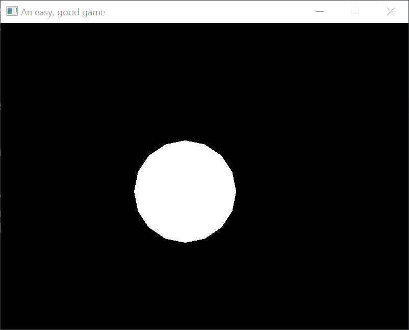
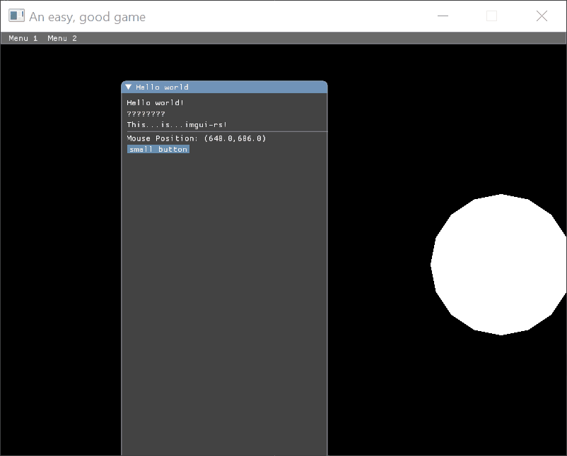

+++
title = "Day72 - Imgui and GGEZ Experimentation"
description = "Testing out ggez and imgui libraries in rust"
date = 2019-04-24
+++

Yesterday I didn't get anything posted because I was doing some experimentation
with GGEZ, imgui, and my data collection process. I bit off more than I could
chew and it got too late by the time I got to a good stopping place to write
everything up.

## Org Capture

Recently I've been putting some thought into how I can streamline my writing
process a bit more and potentially integrate my coding and writing process a bit
more. I eventually landed on using [org-mode](https://orgmode.org/) and the
org-capture feature to record code snippets and various data without breaking my
programming flow.

As I have mentioned in a
[previous](@/oak/day64-spacemacs-chrome-debugging/index.md) post, I
*currently* use emacs as my primary editor. One huge benefit to this is that I
can take advantage of the wonderful org-mode plain text organization system.
Giving an overview of all of the crazy things org-mode can do would take an
entire blog. [There are those who](https://sachachua.com/blog/) have written
such blogs, so I won't try to repeat that here. Suffice it to say that org-mode
is pretty great.

org-capture is the canonical way for pulling things into the org-mode system.
The core idea is to build easy key bindings which will use contextual
information to add an org-mode entry. The process is highly configurable, so you
can prompt the user for some extra information, store the location you are
coming from, currently clipboard, etc. You specify all of this configuration
information in a fairly succinct variable like so:

<pre>
<code class="language-lisp">org-capture-templates `(
    ("d" "Daily Info" entry (file "c:/dev/Notes/daily.org")
     "* %?\n%i")
    ("c" "Daily Code" entry (file "c:/dev/Notes/daily.org")
     "* %?\n\n%i")))
</code>
</pre>

Here I have defined two commands: d for daily info which will store whatever
region is around, and c for daily code which will store the region and wrap it
in a code block. The format is a bit weird, but it has the key binding followed
by the name, the file to store in, and the format of text to insert. The format
has a number `%` tokens which get replaced by various data related to the
particular captured content. More details about the exact formats can be found
[here](https://orgmode.org/manual/Template-expansion.html#Template-expansion).

This small change lets me code along and any time I find some piece of code or
information that would be worth pointing out in the blog post, I can tag it and
save it for later.

## GGEZ

With the blog stuff out of the way I moved on to building the GGEZ and ImGui
demo. The idea for this pairing as a UI framework came from
[this](https://iolivia.me/posts/imgui-ggez/) which goes into detail how to
integrate the two projects. Unfortunately the blog post was written a while ago
and is missing some crucial details about how to use the new version of GGEZ.

The strategy is still sound though so I soldiered on. The first step was to get
a building version of GGEZ with a simple graphics demo. The particular demo
recommended in the blog post was to have a simple circle slide across the
screen, so I just went with that.


use ggez::*;

struct State {
    pos_x: f32,
}

impl ggez::event::EventHandler for State {
    fn update(&mut self, _ctx: &mut Context) -> GameResult<()> {
        self.pos_x = self.pos_x % 800.0 + 1.0;
        Ok(())
    }

    fn draw(&mut self, ctx: &mut Context) -> GameResult<()> {
        graphics::clear(ctx, graphics::BLACK);
        let circle = graphics::Mesh::new_circle(
            ctx,
            graphics::DrawMode::fill(),
            mint::Point2{x: self.pos_x, y: 330.0},
            100.0,
            1.0,
            graphics::WHITE)?;
        graphics::draw(ctx, &circle, graphics::DrawParam::default())?;
        graphics::present(ctx)
    }
}

pub fn main() {
    let state = &mut State { pos_x: 0.0 };
    let c = conf::Conf::new();

    let(ref mut ctx, ref mut event_loop) = ContextBuilder::new("ggez_imgui_test", "Kaylee Simmons")
        .conf(c)
        .build()
        .unwrap();

    event::run(ctx, event_loop, state).unwrap();
}


The only real difficulty was getting SDL to install properly. Some minor
fiddling and updating to the newest version of GGEZ and that was working too.

Integrating the ImGui library required following (copying) the guide in the blog
post, and clicking build until things starting running. The main issues I ran
into was finding the correct version. After updating to GGEZ 0.5 which switched
off of SDL for window creation, things built just fine.

## ImGui

As a bit of background, ImGui is a UI toolkit in an immediate mode style which
simply means that it doesn't keep an entire tree around between frames. Every
frame renders the whole UI from scratch. Recently there has been a similar
pattern in Javascript with virtual dom libraries which try to emulate immediate
mode interfaces by diffing trees between frames.

ImGui has an added benefit that the interface is pretty simple. If you have a
way to render textures to the screen, mouse and keyboard input and a window,
then its not too hard to integrate ImGui. The imgui-rs libraries handles most of
this for you, so I just needed to hook up the correct shader and input bindings.

As mentioned above, most of the code for doing this was lifted straight from
[this blog](https://iolivia.me/posts/imgui-ggez/). So I won't repeat all of it
here. The changes I made had to do with updated interfaces. GGEZ used
`get_property` naming scheme in the earlier versions, but updated to having
direct property names instead. So the vast majority of the changes were just
deleting `get_` from the beginning of property names.

The code in question can be found
[here](https://github.com/Kethku/GGEZ_ImGui_Test/blob/401d1360f0b53d3dd8b880b00d4cf3e2766800b4/src/imgui_wrapper.rs).

Unfortunately at this point (at 1 am in the morning no less) I ran into an issue
I have yet to figure out. Weirdly when I tried running everything seemed to be
working fine, but the text inside the gui was cut off. 

As shown in the above gif, when I move the window, more and more of the text is
cut off. I've tried a number of things related to dpi scaling and the like but
without a deeper understanding of all that is going on, I have decided to give
up for now but will probably post an issue on the ImGui repo to see if they have
any ideas.

## Thoughts

As far as UI goes, I actually think ImGui is pretty promising for demo purposes.
The immediate mode pattern works really well in a game dev environment and the
amount of code for the interface is pretty tiny.

I do have some concerns with how flexible they toolkit is. If I am very
particular about the look of the controls, I don't know how much leeway ImGui
gives for styling. I didn't get far enough along to really tell either way.

Similarly I didn't get far enough along to tell one way or the other if the
performance was good enough. I didn't notice any issues with the super tiny demo
I built, but I suspect the immediate mode style will not perform as well as a
retained mode toolkit. Hard to tell though.

Overall I think its promising. Its a good tool to keep in my pocket for when I
want a simple UI in a game or other Rust project.

## House Keeping

Some notes on the state of the Blog: I mentioned in an earlier post that I will
allow myself some wiggle room on blog posts. More recently I have realized that
that didn't really happen. I still feel pretty guilty when I miss a day even if
I did get work done that day (like yesterday). To that end I'm going to be more
explicit. My goal is to have a post at least every other day. This should let me
to take on more exploratory projects some days with the understanding that
failing to learn or finish anything is an acceptable result. 

So from here on out I will try to make a post each day but I won't feel too bad
if I miss a day for whatever reason so long as I get one every other day at
minimum.

Till tomorrow (or the day after),  
Kaylee

