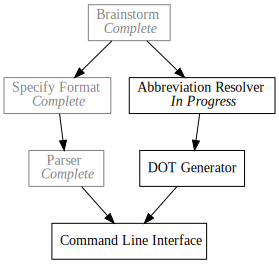

+++
title = "Day8 - Pando Abbreviations"
description = "Resolving abbreviations in the Pando file format"
date = 2019-02-14

[extra]
project = "pando"
+++

Short day today, so instead of completing the DOT generator as I had planned, I
split the task into two parts; the Abbreviation Resolver and the Generator
itself. Today I am tackling the Abbreviation Resolver.

The Pando format [specification](../day4-pando/) has a quality of life feature
which allows the user to specify dependencies as abbreviations of the full
dependency name. To make the problem tractable, I defined the abbreviation as a
camel case concatenation of one or more prefixes of words in an identifier. Read
further in the [specification](../day4-pando/) post.

Implementing the abbreviation resolution was an interesting tour of Rust's
string and iterator functions. 

## Splitting

Since each of the identifiers and abbreviations are compared pairwise, we need
functions to split both of them. Identifiers are split on spaces. Easy enough.


pub fn split_identifier(identifier: &str) -> Vec<String> {
    identifier.split(" ").map(|part| part.to_lowercase()).collect()
}

#[test]
fn identifier_split_works() {
    assert_eq!(split_identifier("Specify Format"), vec!["specify", "format"]);
    assert_eq!(split_identifier("DOJ Appointment"), vec!["doj", "appointment"]);
}


Note: I force the identifier words to lowercase for easier comparison down the
line.

Splitting the abbreviations was somewhat more complicated. The idea is to split
the abbreviation into sections that start with a capital letter. So `SF` would
split into `s` and `f` and `DotA` would split into `dot` and `a`. Similar to the
identifiers, I also lowercase the resulting components for easier matching.


pub fn split_abbreviation(abbreviation: &str) -> Vec<String> {
    let mut parts = Vec::new();

    let remainder = abbreviation.chars()
        .fold(String::new(), |mut current, character| {
            if character.is_uppercase() && current.len() != 0 {
                parts.push(current);
                character.to_string()
            } else {
                current.push(character);
                current
            }
        });

    if !remainder.is_empty() {
        parts.push(remainder);
    }

    parts.iter().map(|part| part.to_lowercase()).collect()
}

#[test]
fn abbreviation_split_works() {
    assert_eq!(split_abbreviation("DotA"), vec!["dot", "a"]);
}


Not super complicated. The majority of the calculation can be done in a fold
iteration where the accumulate is the current string being built up. When a new
capital letter is found, we push it into the parts vector that gets captured in
the iteration closure.

Finally as cleanup, we add the remainder to the parts if it isn't empty, and
return the lowercase versions of the parts.

## Matching

Once we have a clean way to split the identifiers and abbreviations, determining
if a given abbreviation is a match for an identifier is fairly simple.


pub fn abbreviation_matches(identifier: &str, abbreviation: &str) -> bool {
    let identifier_words = split_identifier(identifier);
    let abbreviation_parts = split_abbreviation(abbreviation);

    if identifier_words.len() != abbreviation_parts.len() {
        return false
    }

    let mut pairs = abbreviation_parts.iter().zip(identifier_words.iter());
    pairs.all(|(abbreviation_part, identifier_word)| identifier_word.starts_with(abbreviation_part))
}

#[test]
fn abbreviation_matches_works() {
    assert!(abbreviation_matches("Implement Parser", "IP"));
    assert!(!abbreviation_matches("DOT Generator", "IP"));
    assert!(abbreviation_matches("DOJ Appointment", "DojA"));
    assert!(!abbreviation_matches("DOJ Appointment", "Doj"));
}


If there are different numbers of identifier words or abbreviation parts,
clearly we don't have a match. Otherwise I pair up the abbreviation parts with
the identifier words and check if all of the abbreviation parts are prefixes of
the identifier words. If any are not, the match fails.

## Building the Lookup

Hooking it all together, we would like to cache these results in reverse
direction, so that each task has a list of tasks that depend on it. DOT files
specify dependencies from the dependency to the dependent task because that is
the direction we want the arrows to point.


pub fn resolve_dependent_tasks(tasks: Vec<Todo>) -> Option<HashMap<String, Vec<String>>> {
    let mut dependent_tasks = HashMap::new();

    for task in tasks.iter() {
        dependent_tasks.insert(task.identifier.clone(), Vec::new());
    }

    for task in tasks.iter() {
        for dependency_abbreviation in task.dependencies.clone() {
            match tasks.iter().find(|task| abbreviation_matches(&task.identifier, &dependency_abbreviation)) {
                Some(dependency) => dependent_tasks
                    .entry(dependency.identifier.clone())
                    .and_modify(|dependent_tasks| dependent_tasks.push(task.identifier.clone())),
                None => return None
            };
        }
    }

    Some(dependent_tasks)
}

#[test]
fn abbreviation_resolution_works() {
    let resolved_abbreviations = resolve_dependent_tasks(vec![
        Todo::new(TaskStatus::Completed, "Brainstorm", vec![]),
        Todo::new(TaskStatus::InProgress, "Specify Format", vec!["B"]),
        Todo::new(TaskStatus::Waiting, "Implement Parser", vec!["SF"]),
        Todo::new(TaskStatus::Waiting, "DOT Generator", vec!["B"]),
        Todo::new(TaskStatus::Waiting, "Command Line", vec!["IP", "DG"])
    ]).unwrap();

    assert_eq!(resolved_abbreviations["Brainstorm"], vec!["Specify Format", "DOT Generator"]);
    assert_eq!(resolved_abbreviations["Specify Format"], vec!["Implement Parser"]);
    assert_eq!(resolved_abbreviations["Implement Parser"], vec!["Command Line"]);
    assert_eq!(resolved_abbreviations["DOT Generator"], vec!["Command Line"]);
    assert!(resolved_abbreviations.["Command Line"].is_empty());
}


I construct a dependent task lookup, add empty collections for each identifier,
and loop over each of the tasks. Then for each abbreviation in a given task, I
find the matching task, and add an entry in the correct list. The `entry`
function is a very clean way to to modify an entry in the `HashMap` while
iterating over it. Since it is guaranteed for the tasks to already have entries
in the `HashMap` from the first loop, I use `and_modify` without a default and
throw away the entry object.

I return an option from this function so that if any of the abbreviations don't
have a matching identifier, we can track that failure.

That about wraps it up. This was the hardest portion of the DOT file generator,
so next time it will be some simple string interpolation and we should be able
to produce an end to end execution. On the home stretch for V1 of Pando!

Till tomorrow,  
Kaylee
