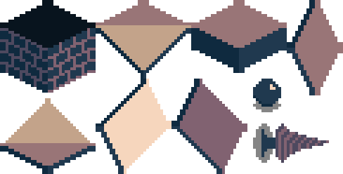

+++
title = "Day80 - TexturePacker Sprite Sheet Import"
description = "Do initial work for integrating texture mapper sprite sheets"
date = 2019-05-12

[extra]
project = "robot"
+++

Today and yesterday I did the initial work and investigation to use spritesheets
for my Monogame engine. The is necessary for my eventual plan to build a sprite
renderer from scratch which will give me more precise control over the rendering
logic and hopefully give me a way to fix the weird pixels between tiles problem.
As an added benefit, this should let me do better z ordering instead of hacking
it together with the layer order.

The tool I decided to use was a cheap sprite backer utility which lets you
specify a list of textures and it will pack all of them into a single
spritesheet with a data file holding all of the positions of each sprite. There
is a bunch of really great documentation online for how to get it working with
many different game engines.

Unfortunately since my game needs to run on windows and iOS, and since the Nuget
package is a bit old, I was unable to figure out how to get the Monogame
specific spritesheet importer working. Luckily TexturePacker lets you export to
a generic format such as xml or json. I picked the json export because the
wonderful Newtonsoft Json library is pretty easy to use and fast enough. I spent
some time fiddling with the settings in TexturePacker and eventually came up
with this packed sheet:

With the sheet generated, my first step to importing it was to take a look at
the json that gets output and create a datastructure which matches that output
format so that I can have a deserialization target.


{"frames": {

"Ball.png":
{
	"frame": {"x":1,"y":182,"w":32,"h":24},
	"rotated": false,
	"trimmed": false,
	"spriteSourceSize": {"x":0,"y":0,"w":32,"h":24},
	"sourceSize": {"w":32,"h":24},
	"pivot": {"x":0.5,"y":0.583333}
},
... } }


Given the basic example, I picked the data I cared about such as the actual
frames object, the frame position, and the pivot location and omitted the rest
as they are extra information not necessary for the particular settings I used
to create the spreadsheet.


public class Frame {
    public int X { get; }
    public int Y { get; }
    public int Width { get; }
    public int Height { get; }

    public Frame(int x, int y, int width, int height) {
        X = x;
        Y = y;
        Width = width;
        Height = height;
    }
}

public class Pivot {
    public float X { get; }
    public float Y { get; }

    public Pivot(float x, float y) {
        X = x;
        Y = y;
    }
}

public class SheetElement {
    public Frame Frame { get; }
    public Pivot Pivot { get; }

    public SheetElement(Frame frame, bool rotated, Pivot pivot) {
        Frame = frame;
        Pivot = pivot;
    }
}
public class SheetSpecification {
    public IReadOnlyDictionary<string, SheetElement> Frames { get; }

    public SheetSpecification(Dictionary<string, SheetElement> frames) {
        Frames = frames;
    }
}


Theres a fair amount of goo going on here to get the core data types, but the
basic idea is to create a class for each level of the data structure with a
constructor for each property. After these are defined, I can use Newtonsoft
Json's JsonConvert class to deserialize a file into an instance of the above
type.


public void LoadContent(ContentManager content) {
    string sheetSpecJson = File.ReadAllText("./Content/TileSheet.json");
    SheetSpecification = JsonConvert.DeserializeObject<SheetSpecification>(sheetSpecJson);

    Sheet = content.Load<Texture2D>("TileSheet");
}


And thats it for deserializing. I now how a class with the positions of each of
the tiles in the spritesheet which I can then use to determine the source
position of each sprite I want to draw.

Using spritesheets in this way is not only an efficient way to save video
memory, but also lets me draw any type of sprite in a single draw call. If the
scene is simple enough and the sprites I need can be loaded into one texture,
then I can draw everything with one list of triangles all referring to different
parts of that one texture. Since draw calls are handled sequentially unless you
use a depth buffer, this can be the best way to handle drawing sprites in a
particular order by z value.

There are arguably better ways to draw many different sprites on top of
each other, but this is the way I understand so I'm going for it! Thats it for
today. Much of my time was spent fumbling around trying to get the TexturePacker
Monogame nuget package working before falling back to the generic method. It was
a bunch of time wasted, but I think things are working now.

Till tomorrow,  
Kaylee

