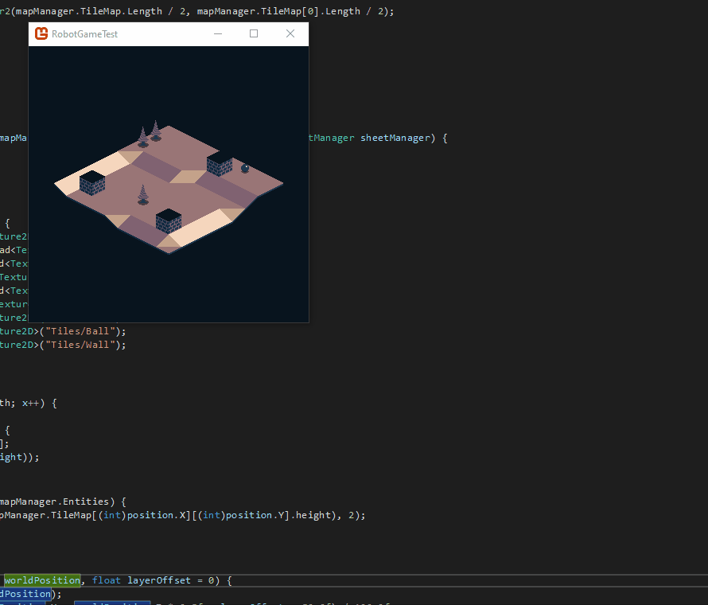

+++
title = "Day81 - Sprite Rendering and Gap Fix"
description = "Finish up spritesheet rendering and fix pixel gap between tiles"
date = 2019-05-15

[extra]
project = "robot"
+++

Today I finished up the sprite renderer which renders subsets of the TileSheet
generated by TexturePacker as tiles, and made a quick fix for the pixel gap
issue between tiles.

## SheetManager

Continuing on from last time, I created a draw function on the `SheetManager`
which takes a given Tiles enum value, position, and width and renders it based
on the Spritesheet metadata. Not only does TexturePacker layout the sprites and
allow specifying of a pivot location, but it also trims the sprites so as to lay
them out more compactly in the sheet. As a result the rendering code is slightly
more complicated since it has to pay attention to the trimmed offset on top of
just the source rectangle.

I make things slightly more complicated on top of the above issues by specifying
a single position and width for the tile location instead of a full rectangle.
This simplifies other game logic, so the trade-off of slightly more complexity
in the `SheetManager` makes good sense.

TexturePacker provides 4 useful bits of information in the JSON format: The
SourceSize, Frame, SpriteSourceSize, and Pivot. These are somewhat confusingly
named, so I think of the SourceSize as the original sprite dimensions, the Frame
as the source rectangle, the SpriteSourceSize as the offset rectangle, and the
Pivot as the center point of the Tile.


public void DrawTile(Tiles tile, Vector2 position, float width, Color color, float layerDepth) {
    SheetElement spritePosition = SpritePositions[tile];

    var scale = width / spritePosition.SourceSize.Width;
    var sourceRectangle = new Rectangle(spritePosition.Frame.X, spritePosition.Frame.Y, spritePosition.Frame.Width, spritePosition.Frame.Height);
    var destinationWidth = spritePosition.SpriteSourceSize.Width * scale;
    var destinationHeight = spritePosition.SpriteSourceSize.Height * scale;
    var destinationRectangle = new Rectangle(
        (int)(spritePosition.SpriteSourceSize.X * scale + position.X - spritePosition.Pivot.X * spritePosition.SourceSize.Width * scale),
        (int)(spritePosition.SpriteSourceSize.Y * scale + position.Y - spritePosition.Pivot.Y * spritePosition.SourceSize.Height * scale),
        (int)destinationWidth,
        (int)destinationHeight);

    spriteBatch.Draw(Sheet, destinationRectangle, sourceRectangle, color, 0, Vector2.Zero, SpriteEffects.None, layerDepth);
}


Given this data, I compute a scaling factor based on the desired Width, create a
rectangle using the frame for the source rectangle to draw from, compute the
trimmed dimensions of the destination rectangle, and offset the position by the
desired position location and pivot.

With the draw code out of the way, I can use the new function as a drop in
replacement for the SpriteBatch draw function. This greatly simplifies the tile
rendering logic by removing the need to calculate tile offsets and base
position. It also lets me set an arbitrary pivot location, which may be useful
in the future.


private void DrawTile(Tiles tileToDraw, Vector3 worldPosition, float layerOffset = 0) {
    Vector2 screenPosition = WorldToScreen(worldPosition);
    float layerDepth = (worldPosition.Y - worldPosition.X + worldPosition.Z * 0.5f + layerOffset + 50.0f) / 100.0f;
    sheetManager.DrawTile(tileToDraw, screenPosition, TileWidth, Color.White, layerDepth);
}


## Pixel Gap Fix

After stumbling around trying to come up with a fix for the pixel gap, I decided
to use a hack for now. The pixel gap arises primarily because the pixel size of
the tiles frequently is not a constant or simple fraction multiple of the
rendered tile size. Monogame doesn't know how to greedily scale up textures
without making them look weird, so there sometimes is a super tiny gap between
tile locations.

This gap shows up as a weird zigzag between tiles, but is never more than half a
pixel wide. This hints at a potential solution. I can fix the pixel gap problem
by rendering the tiles to a texture with resolution that matches a constant
multiple of the tile pixel width. Then I can render that texture to the screen
by upscaling it instead of each tile individually. With proper sampler settings,
this means that every pixel is accounted for and no gap appears.

Monogame has support for rendering to a texture by using a `RenderTarget2D`
which is basically just an editable and target-able `Texture2D`. The `GraphicsDevice`
has a RenderTarget2D which defaults to the screen target (represented by null),
but this value can be overridden with a custom value at any time causing the
system to render to the target instead of the screen.

The only trick was figuring out the size of the `RenderTarget` texture. I
decided to use 10 times the tile width (32) plus half a tile for a gap on either
side of the screen resulting in 352. Then the height of the target is just that
width times the aspect ratio of the screen at a given point in time. I wrapped
this logic in a `ResizeRenderTarget` function so that it could be called any
time the window size changes.


private void ResizeRenderTarget() {
    RenderTarget = new RenderTarget2D(
        GraphicsDevice,
        352, 352 * GraphicsDevice.PresentationParameters.BackBufferHeight / GraphicsDevice.PresentationParameters.BackBufferWidth,
        false, GraphicsDevice.PresentationParameters.BackBufferFormat,
        DepthFormat.Depth24);
}


Then the draw function needed changed to draw to the target for normal draw
calls, and then swap back to the screen to render the target to the screen.


protected override void Draw(GameTime gameTime) {
    GraphicsDevice.SetRenderTarget(RenderTarget);
    graphics.GraphicsDevice.Clear(colorManager.Lookup[0]);

    foreach (IDrawable drawable in drawables) {
        spriteBatch.Begin(samplerState: SamplerState.PointClamp, sortMode: SpriteSortMode.FrontToBack);
        drawable.Draw(gameTime);
        spriteBatch.End();
    }
    GraphicsDevice.SetRenderTarget(null);
    spriteBatch.Begin(samplerState: SamplerState.PointClamp, sortMode: SpriteSortMode.FrontToBack);
    spriteBatch.Draw(RenderTarget, new Rectangle(0, 0, graphics.PreferredBackBufferWidth, graphics.PreferredBackBufferHeight), Color.White);
    spriteBatch.End();

    base.Draw(gameTime);
}


Lastly I updated the `ScreenSizeManager` to refer to the `RenderTarget` instead
of the backbuffer.


public class ScreenSizeManager {
    private Game game;

    public int PixelWidth => game.RenderTarget.Width;
    public int PixelHeight => game.RenderTarget.Height;

    public ScreenSizeManager(Game game) {
        this.game = game;
    }
}


Thats it! With these changes, tiles render without ever showing a gap between
them. Once I get higher resolution assets, I will revert this change since the
high resolution versions won't have as visible of gaps, but for now this works
great.

Thats it for today, with this work out of the way, I can get back to gameplay
features. This also enables me to write a custom renderer for tiles in the
future which allows for actual z value layering since all draw calls will be
using one texture. For now though I will continue to use the SpriteBatch since
it is conceptually simpler and requires no work to use, but its nice to have
options.

Till tomorrow,  
Kaylee

