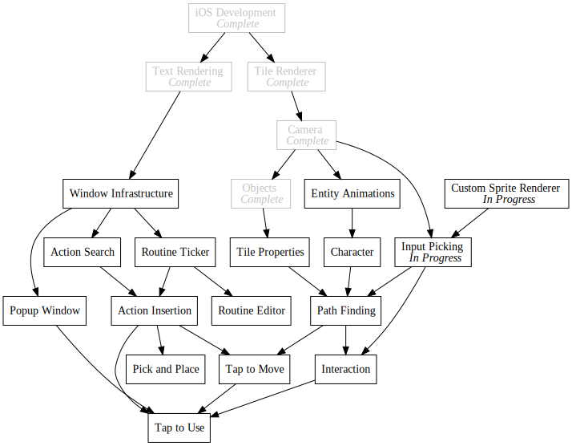
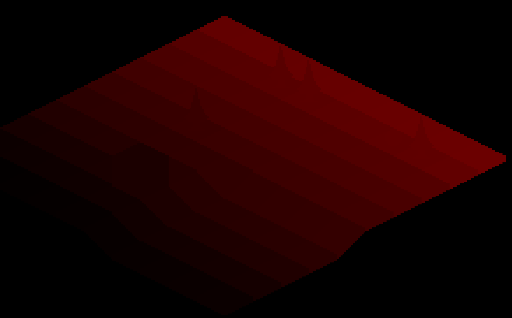
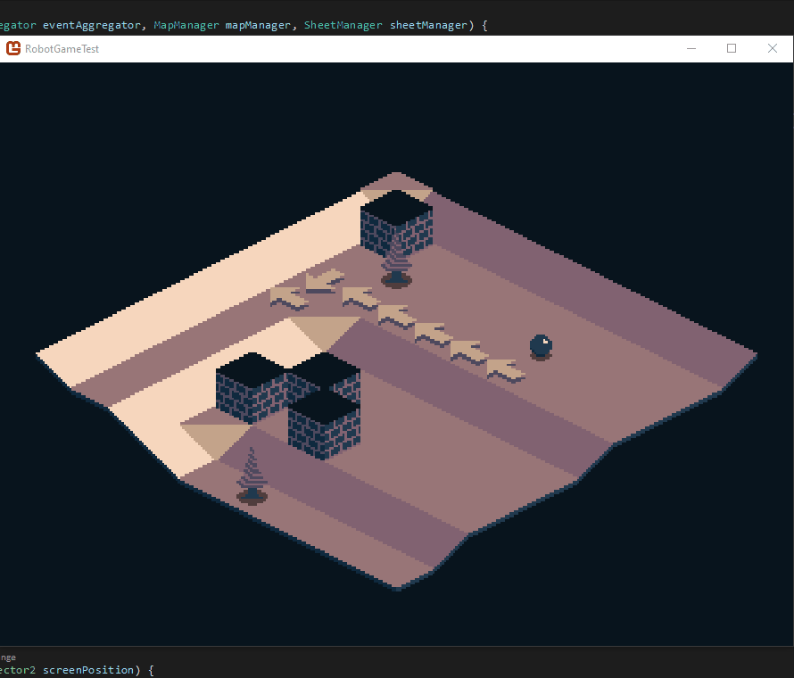

+++
title = "Day83 - Isometric Picking"
description = "Using color coding to implement mouse picking in an Isometric game engine"
date = 2019-05-23

[extra]
project = "robot"
+++

Been a couple days because I've been hard at work at a complicated part of my
isometric game engine. Before about a week ago, I had been working on
pathfinding infrastructure necessary to get character movement and enemies
working. As a part of this work I needed some way to pick a location in the
world using the mouse to test things out and make nice gifs. Little did I know
that this would be much more difficult than I thought.

## Naive Math Approach

My first attempt involved just a little bit of math. The basic idea was to take
the simple texture rendering and tile layout engine I had already, and try to
compute the world position of a given point by doing some algebra to reverse the
isometric transformations.

Overall this didn't end up too bad. From the original layout code:


public Vector2 WorldToScreen(Vector3 worldPosition) {
    Vector3 relativePosition = worldPosition - new Vector3(CameraWorldPosition, 0) + new Vector3(0.5f, 0.5f, 0);

    return new Vector2(
        relativePosition.X * TileWidth + relativePosition.Y * TileWidth,
        -relativePosition.X * TileHeight + relativePosition.Y * TileHeight - relativePosition.Z * TileHeight) / 2;
}


I moved some variables around and arrived at this:


public Vector2 ScreenToWorld(Vector2 screenPosition) {
    Vector2 centeredScreenPosition = screenPosition * 2;
    Vector2 relativePosition = new Vector2(
        (centeredScreenPosition.X - centeredScreenPosition.Y) / (2 * TileWidth),
        (centeredScreenPosition.X + centeredScreenPosition.Y) / (2 * TileWidth));

    return relativePosition + CameraWorldPosition - new Vector2(0.5f, 0.5f);
}


This works great if there is just one layer of terrain, and no vertical
movement. Unfortunately my engine allows slopes and entities on top of tiles.

This vertical layered nature makes the math more difficult since a number of
entities could exist at the same location and a number of vertical positions may
align with a single pixel. I decided that special-casing each of these issues
would be too messy, so I started looking for a better solution.

## Color Coding

After some research and stumbling around, I eventually found
[this](http://www.opengl-tutorial.org/miscellaneous/clicking-on-objects/picking-with-an-opengl-hack/)
article which described an interesting hack to simplify picking in 3d engines.
The basic idea is to render the scene in a mode which draws every model in a
different solid color and store the resulting image in a texture. Then when you
want to check what model is under the mouse cursor, you can just get the color
of the particular pixel and lookup the associated model.

I decided to apply this same approach to my isometric engine. Getting it to work
required some doing though since as far as I know there isn't any way to get the
`SpriteBatch` in Monogame to render sprites with a solid color which preserves
the opacity. I will move quickly over the rendering code and save that
discussion for another time, suffice it to say that I needed to build some bits
to manage drawing triangles to the screen efficiently. Luckily I was able to
lift much of the hard work from a previous project and apply it directly.

## Shader

The important piece of the rendering code for the picking logic was the shader.
I built two "techniques" into my HLSL shader effect file. The first rendered the
scene like normal using a simple projection matrix and texture sampler. This
version ignored the vertex color since I don't plan on using tinting much.


float4x4 View;
float4x4 Projection;

texture SpriteSheet;
sampler2D textureSampler = sampler_state
{
	Texture = (SpriteSheet);
	MinFilter = Point;
	MagFilter = Point;
	AddressU = Clamp;
	AddressV = Clamp;
};

struct VertexShaderOutput
{
	float4 Position : POSITION0;
	float4 Color : COLOR0;
	float2 TextureCoordinate : TEXCOORD0;
};

VertexShaderOutput VertexShaderFunction(VertexShaderOutput input)
{
	float4 viewPosition = mul(input.Position, View);
	input.Position = mul(viewPosition, Projection);

	return input;
}

float4 TexturedPixelShaderFunction(VertexShaderOutput input) : COLOR0
{
	return tex2D(textureSampler, input.TextureCoordinate);
}


The second however was a bit different and used the input color from the vertex
data to draw each with that color so long as the opacity is 1. Otherwise no
color is drawn. This achieves the necessary solid color rendering I need.

## Color Selection

With the rendering out of the way, I needed to decide which color to draw each
sprite with. The tutorial I found gave a pretty solid algorithm which assigned
bytes to the RGB channels in order to efficiently allocate colors. I decided to
go with that and instead of just storing the id for further use, I decided to
store callbacks for the click and hover events. This costs way more memory, but
simplifies things so I decided to go with that until it bites me.


public Color CacheInput(Action click, Action hover) {
    if (hover == null && click == null) {
        return new Color(Color.Black, 0);
    } else {
        int id = inputId++;

        int r = (id & 0x000000FF) >> 0;
        int g = (id & 0x0000FF00) >> 8;
        int b = (id & 0x00FF0000) >> 16;

        var color = new Color(r, g, b);
        inputLookup[color] = (click, hover);
        return color;
    }
}


Then I modified my `SpriteRenderer` to take the callbacks as arguments and use
the `CacheInput` function to pick the correct color.


public void DrawSprite(Vector2 topLeftWorld, Vector2 bottomRightWorld, float worldZ, Vector2 topLeftTexture, Vector2 bottomRightTexture, Action click = null, Action hover = null) {
    var sprite = spritePool.Create();
    sprite.Color = inputManager.CacheInput(click, hover);
    sprite.TopLeftWorld = topLeftWorld;
    sprite.BottomRightWorld = bottomRightWorld;
    sprite.WorldZ = worldZ;
    sprite.TopLeftTexture = topLeftTexture;
    sprite.BottomRightTexture = bottomRightTexture;
    currentSprites.Add(sprite);
}


On the renderer side, I updated the sprite renderer to render twice, once as
normal and once as the input texture.


public void Draw(GameTime gameTime) {
    graphics.BlendState = BlendState.AlphaBlend;
    graphics.RasterizerState = RasterizerState.CullNone;
    graphics.SamplerStates[0] = SamplerState.PointWrap;
    graphics.DepthStencilState = DepthStencilState.Default;

    effect.Parameters["View"].SetValue(cameraManager.View);
    effect.Parameters["Projection"].SetValue(cameraManager.Projection);
    effect.Parameters["SpriteSheet"].SetValue(sheetManager.Sheet);

    spriteRenderer.SetVertices();

    graphics.SetRenderTarget(game.WorldTarget);
    graphics.Clear(colors.Lookup[0]);
    effect.CurrentTechnique = effect.Techniques["Textured"];
    DrawVertices();
    graphics.SetRenderTarget(game.InputTarget);
    effect.CurrentTechnique = effect.Techniques["Solid"];
    DrawVertices();
}

private void DrawVertices() {
    if (vertexManager.VertexCount > 0) {
        foreach (var pass in effect.CurrentTechnique.Passes) {
            pass.Apply();
            graphics.DrawUserIndexedPrimitives(
                PrimitiveType.TriangleList,
                vertexManager.Vertices,
                0,
                vertexManager.VertexCount,
                vertexManager.Indices,
                0,
                vertexManager.IndexCount / 3);
        }
    }
}


Lastly, I built an InputManager which for every update checks the mouse state to
see if the mouse is down, and what color is under the cursor in the input
texture. From that information I looked up the callbacks and call the
appropriate one.


public void Update(GameTime gameTime) {
    var mouseState = Mouse.GetState();
    var mouseX = (int)((float)mouseState.Position.X * screenSizeManager.PixelWidth / screenSizeManager.DeviceWidth);
    var mouseY = (int)((float)mouseState.Position.Y * screenSizeManager.PixelHeight / screenSizeManager.DeviceHeight);

    if (mouseX >= 0 && mouseX < screenSizeManager.PixelWidth && mouseY >= 0 && mouseY < screenSizeManager.PixelHeight) {
        int dataLength = game.InputTarget.Width * game.InputTarget.Height;
        if (inputColorData == null || inputColorData.Length != dataLength) inputColorData = new Color[dataLength];
        game.InputTarget.GetData(inputColorData);
        var lookupColor = inputColorData[mouseY * game.InputTarget.Width + mouseX];

        if (inputLookup.TryGetValue(lookupColor, out var actions)) {
            (Action click, Action hover) = actions;
            (mouseState.LeftButton == ButtonState.Pressed ? click : hover)?.Invoke();
        }
    }

    inputLookup.Clear();
    inputId = 1;
}


## Testing it Out

With all that out of the way, I could actually try it out. Using my new
Path-Finding code, and a specialized event aggregator (both will be explained in
a future post) I modified the `WorldRenderer` to raise a world position event
with the associated world position on hover. 


public void Draw(GameTime gameTime) {
    for (int x = 0; x < mapManager.TileMap.Length; x++) {
        var mapColumn = mapManager.TileMap[x];
        var entityColumn = mapManager.EntityMap[x];
        for (int y = 0; y < mapColumn.Length; y++) {
            (Tiles tile, int height) = mapColumn[y];
            Vector3 position = new Vector3(x, y, height);
            var mousePosition = new Vector2(x, y);
            DrawTile(tile, position, hover: () => eventAggregator.Publish(new WorldMousePosition { Position = mousePosition }));
            Tiles? entityTile = entityColumn[y];
            if (entityTile != null) {
                DrawTile(entityTile.Value, position, 2);
            }
        }
    }
}


I then render the path from the randomly placed ball to the hovered position
using my arrow textures from last week. This combined with a hack to swap the
texture when the mouse is clicked to the input texture resulted in this
satisfying gif:

As shown here, the tile under the mouse is correctly identified regardless of
the actual render position. Since the actual texture is used, I get pixel
perfect selection for free and can change my renderer in any way I want without
effecting the picking algorithm. It took some doing (and many unfortunate missed
blog posts) but in general I am very pleased with the results. As an added side
effect my custom renderer also completely fixed the pixel gap issue which is an
awesome bonus.

With these pieces out of the way, I will probably do some more sprite work to
make some sort of roguelike demo to test the limits of my current engine. My
buddy gets back from vacation shortly, so I will do some planning with him as
well.

Till tomorrow,  
Kaylee
