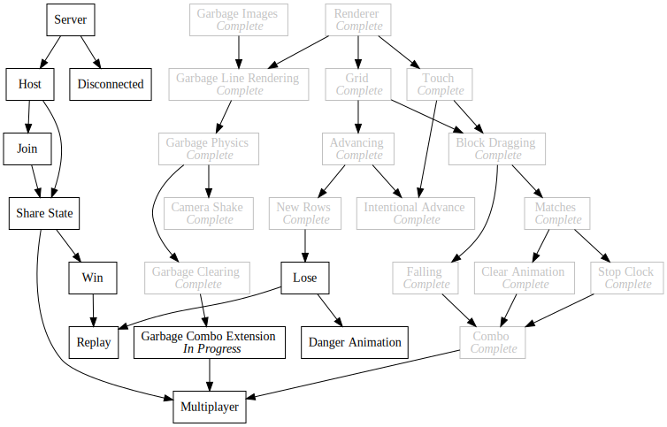

+++
title = "Day93 - Express Server"
description = "Added Express Based Server"
date = 2019-10-26

[extra]
project = "ta"
+++

Today I worked on the preliminary steps required to build a mutliplayer tetris attack server. This required fiddling
with the webpack config and moving some files around tomake things simpler. While I was in the area I also decided to
move all of my assets into the src directory and have webpack copy them to the dist directory. This has a couple of
benefits, the main one being that I can specify which files I need in the javascript source files, and webpack will tell
me if the URL doesn't line up anymore.

## Multi Target

Webpack has a couple of different methods for splitting up a project into multiple files or compiling multiple final
bundles. The classic one is to use multiple entries. This assumes though that the bundles themselves should use the same
configuration. If instead you are trying to build a server and client which have some differences in target, externals
etc, then you need to create completely separate configuration objects.

Luckily there is a simple way to do this. Webpack allows for webpack.config.js files which allow for arbitrary
javascript. Further, if the javascript config file returns an array of objects, webpack will run a build for each of the
configurations in sequence. These two features let me share as much of the configuration as I can while still allowing
me to specialize in any way I want.


const serverConfig = {
  ...createConfigBase({ 
    compilerOptions: {
      "module": "commonjs"
    }
  }),
  target: 'node',
  node: {
    __dirname: false
  },
  entry: { 
    'server': './src/server.ts' 
  },
  externals: [nodeExternals()]
};

const clientConfig = {
  ...createConfigBase(),
  target: 'web',
  entry: { 
    'client': './src/client.tsx' 
  },
};

module.exports = [ serverConfig, clientConfig ];


Here you can see serverConfig and clientConfig objects are created and returned in an array of config objects. I use
object destructuring of a config base (returned from createConfigBase described further below) to allow the server and
client configs to share what they can.

## Shared Config

My preferred method for sharing configuration is to create a function which returns a base config object. This base
config takes arguments for some simple specialization where needed and uses them in the constructed object.


function createConfigBase(tsLoaderOptions = {}) {
  return {
    mode: 'development',
    output: {
      filename: '[name].js',
      path: path.resolve(__dirname, 'dist/')
    },
    devtool: 'source-map',
    resolve: {
      extensions: [".ts", ".tsx", ".js", ".glsl", ".html", ".png"]
    },
    module: {
      rules: [
        {
          test: /\.tsx?$/,
          exclude: /node_modules/,
          use: {
            loader: "ts-loader",
            options: tsLoaderOptions
          }
        },
        {
          test: /\.glsl$/,
          use: {
            loader: 'raw-loader'
          }
        },
        {
          test: /\.(html|png)$/,
          use: {
            loader: 'file-loader',
            options: {
              name: '[name].[ext]'
            }
          }
        }
      ]
    }
  };
}


I use the tsLoaderOptions to specialize how typesript builds for each target.

## Imports

I also added a new loader to the webpack config: the file-loader. This lets me tell webpack that I want to import a
given file path by copying it to the output directory and getting a relative path string to the copied location. I used
this extensively with the image assets and with the index.html page.


export const blockImages = {
  "Bang": require("../images/Bang.png"),
  "Cloud": require("../images/Cloud.png"),
  "Leaf": require("../images/Leaf.png"),
  "Moon": require("../images/Moon.png"),
  "Rain": require("../images/Rain.png"),
  "Stick": require("../images/Stick.png"),
  "Sun": require("../images/Sun.png")
};

export const garbageImages = {
  "ThreeWide": require("../images/garbage/ThreeWideGarbage.png"),
  "FourWide": require("../images/garbage/FourWideGarbage.png"),
  "FiveWide": require("../images/garbage/FiveWideGarbage.png"),
  "SingleLine": require("../images/garbage/SingleLineGarbage.png"),
  "TwoLine": require("../images/garbage/TwoLineGarbage.png"),

  "TopLine": require("../images/garbage/TopLineGarbage.png"),
  "MiddleLine": require("../images/garbage/MiddleLineGarbage.png"),
  "EvenMiddleLine": require("../images/garbage/EvenMiddleLineGarbage.png"),
  "MiddleLineNoExclamationPoint": require("../images/garbage/MiddleLineGarbageNoExclamationPoint.png"),
  "BottomLine": require("../images/garbage/BottomLineGarbage.png"),

  "Lock": require("../images/garbage/Lock.png"),
  "Clear": require("../images/garbage/Clear.png")
};

export const Lose = require("../images/Lose.png") as string;
export const LoseWidthOverHeight = 65 / 30;

export const Win = require("../images/Win.png") as string;
export const WinWidthOverHeight = 51 / 30;

export const imageURLs = Object.values(blockImages).concat(Object.values(garbageImages)).concat([ Lose, Win ]);


As discussed above, this allows webpack to tell me when I get the urls incorrect and lets me place all of the assets in
the src directory instead of cluttering the base directory of the repository.

## Next

With these bits out of the way, I should be able to get started with designing the communication protocol which will
enable multipler TA battles.

Till tomorrow,  
Kaylee
