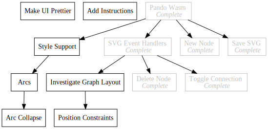

+++
title = "Pando"
description = "Todo Tree Renderer"
date = 2019-02-10

[extra]
project_name = "pando"
+++
[https://github.com/Kethku/Pando](https://github.com/Kethku/Pando)

## What

Pando is a tool for rendering interdependent todo tasks into SVG images for
embedding in my blog. I use it to transform my unstructured personal projects
into intentional explorations of a problem space. Its a talent tree for
programming!

## Why
Frequently when working on personal projects I have found that there is a strong
connection to a tech tree in video games (this is probably why I find working on
them so addicting). So I decided to lean into it and have found much benefit in
working with my projects in this way.

To enable my addiction, I designed a simple format for writing todo trees as
well as a transpiler which converts said format to a graph specification in the
DOT language. Finally I wrote a command line tool which ties these pieces into a
simple renderer which uses GraphViz to draw the image to a file such as the one
above representing the tasks for Pando. It was generated by running Pando on:


x Brainstorm
x Specify Format [ B ]
x Abbreviation Resolver [ SF ]
x DOT Generator [ AR ]
x Implement Parser [ SF ]
x Command Line Interface [ IP, DG ]
- Arcs [ DG ]
- Task Links [ IP ]
- Side Tasks [ DG ]
- References [ IP ]
- SVG Transpiler
- Task Styles [ SvTr ]
- Themes [ TS ]
- Better Error Handling [ CLI ]


## How
The todo file format has three parts for each task: a bullet indicating task status,
a task name, and a dependency list.

### Bullet
Each task can be either waiting, in progress, or complete. This is indicated by
-, >, and x respectively before the line.

### Task Identifier
The task name can be any words, but no symbols at the moment.

### Dependencies
The dependencies are defined in a square bracketed, comma delimited list of
cammel case abbreviations. For example, `DOT Generator` can be refered to with
any of `DG`, `DoG`, `DotGenerator`. Take care that camel case is used; notice
how the `O` and `T` are lower cased in the abbreviation. Tasks without any
dependencies may ommit the empty list.

These three components are combined into a task definition. Many task
definitions in a file produce a graph.

Pando must be built using a recent copy of Rust in order to use it. Also
GraphViz must be installed in the path in order for Pando to be able to render
anything out. I build by running `cargo build --release` and then copy the
pando.exe from `\target\release` to a known location on the path.

Rendering the graph is accomplished by running pando on the graph file, which
will produce an svg drawing of the graph and output it to a file with the same
name as the input file but a with `.svg` extension. Optionally a `-d {path}`
argument can be passed to write out the intermediate DOT format description of
the graph, and `-o {path}` can be passed to specify the finaly output svg.
