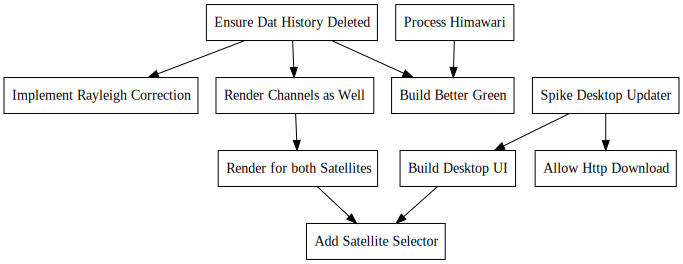

+++
title = "Rusty Marble"
description = "Live pictures of our blue marble written in Rust"
date = 2019-10-18

[extra]
project_name = "rusty-marble"
+++
[https://github.com/Kethku/RustyMarble](https://github.com/Kethku/RustyMarble)

## What

I noticed that the color satellite images published by NOAA from the GOES satellites is highly processed and has 
overlays of state bounds and things making them inconvenient for desktop backgrounds. This is the first test of 
my attempt to fix that!

## Why

I've always been fascinated with the idea of making my computer adapt to the world around me. I love the idea of
my editor and syntax colors matching the sky outside, or having my computer let me know when I should be going to bed.
Similarly I recently saw a mac app which sets the desktop background to a render of the planet. This lead me down
a crazy rabbit hole ending with me learning about satellite imagery, cloud data management, and scientific data formats.
I hope to make something useful while still satisfying the core goal of getting a live picture of our blue marble on
my desktop.

## How

The current code can be found [here](https://github.com/Kethku/RustyMarble). Unfortunately the data provided by NOAA from
the GOES satellites is too big to realistically download under the tyrannical rule of our ISPs. Luckily since I currently
am a full time employee at Microsoft, I get some Azure credit and downloads don't cost anything to Azure servers. So
I am building an app which I will run on a cheap Azure server which will download the imager data from AWS where NOAA hosts
it, process it into a true color approximation, and rehost them in a Dat archive to ease traffic costs.
