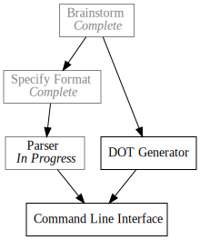

+++
title = "Day6 - Pando Parser Completed"
description = "Wraping up the parser"
date = 2019-02-12

[extra]
project = "pando"
+++

[Yesterday](../day5-pando-parser/) we knocked out the difficult portions of the
Pando file parser. We built parse functions for the status, the task identifier,
and the dependencies list. Today we will tie the parsers together into a full task
parser.

## Todo Entry


- Command Line [ IP, DG ]



do_parse!(
    status: parse_status >>
    identifier: parse_identifier >>
    dependencies: parse_dependencies >>
    (Todo::new(status, identifier, dependencies))
),


To combine the individual components of the line parser I used a new macro:
`do_parse!` which threads a series of parsers together, allowing for naming
individual results at each step, and finally combining the named results into a
final result.

This gets us most of the way there however given that the dependencies parser is
optional, we still get an error if we try to parse `> todo` without a
dependencies list. We need to tell the parser what to expect to end the parsing
of the task. We turn to the `terminated!` macro to do this, which takes a base
parser, and a terminator parser.


named!(todo<CompleteStr, Todo>, terminated!(
    do_parse!(
        status: parse_status >>
        identifier: parse_identifier >>
        dependencies: parse_dependencies >>
        (Todo::new(status, identifier, dependencies))
    ),
alt!(eof!() | nom::eol)));


The two things which will for sure finish a todo item are the end of stream, marked by the `eof!()` macro, and the new line, marked by the `eol` parser.

## Finishing it up

Finally we introduce one last combinator: `many1!` which produces a parser that
can be one or more iterations of another parser. The basic implementation
matches our previous parsers:


named!(pando<CompleteStr, Vec<Todo>, many1!(todo));


However we would prefer to pass the combined parser a `&str`, so we can unwrap the
`named!` macro into an equivalent function and construct a `CompleteStr` for the
input to the `many1!` macro.


fn parse_pando(input: &str) -> IResult<CompleteStr, Vec<Todo>> {
    many1!(input, todo)
}


Similarly, instead of returning an `IResult`, which would require dependence and
understanding of nom types, it would be better if our parser returned an
`Option`. This isn't *really* how the types are meant to be used, but it
simplifies things for us here so I'm going for it. Sue me.


fn parse_pando(input: &str) -> Option<Vec<Todo>> {
    match many1!(CompleteStr(input), todo) {
        Ok((_, todos)) => Some(todos),
        Err(_) => None
    }
}


And voila! We have our file parser. I suspect there are some bugs with regards
to line endings (the identifier looks for `\n` to finish for example), but it
will do for now. Here is the test I used to verify things are working.


#[test]
fn pando_works() {
    assert_eq!(
        parse_pando(
"x Brainstorm
> Specify Format [ B ]
- Implement Parser [ SF ]
- DOT Generator [ B ]
- Command Line [ IP, DG ]"),
        Ok((CompleteStr(""), vec![
            Todo::new(TaskStatus::Completed, "Brainstorm", vec![]),
            Todo::new(TaskStatus::InProgress, "Specify Format", vec!["B"]),
            Todo::new(TaskStatus::Waiting, "Implement Parser", vec!["SF"]),
            Todo::new(TaskStatus::Waiting, "DOT Generator", vec!["B"]),
            Todo::new(TaskStatus::Waiting, "Command Line", vec!["IP", "DG"])
        ]))
    );
}


Next on the docket is the second half of the translator; first we parsed the
format into a data structure, now we have to convert that data structure into a
DOT file. I will save this step for next time.

Till tomorrow,  
Kaylee
