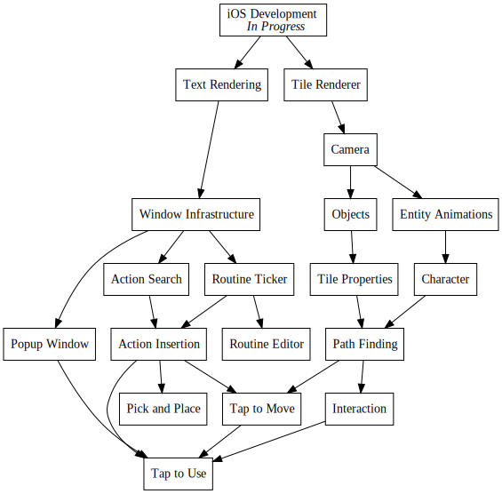
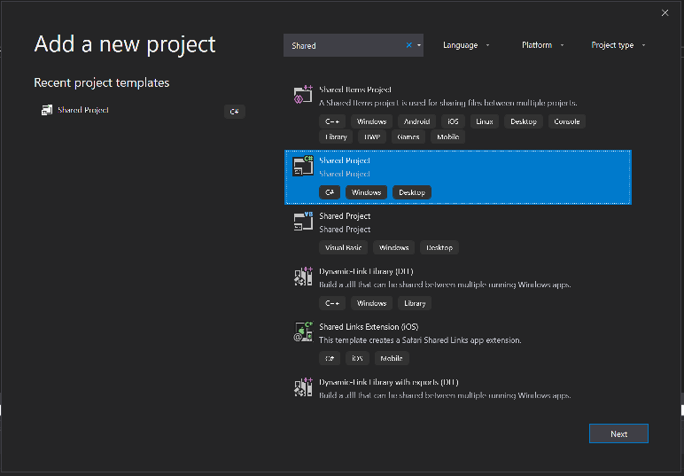
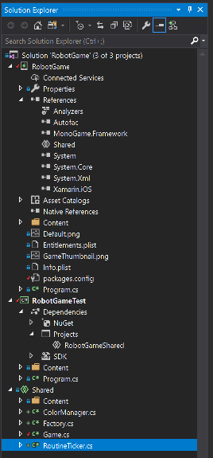

+++
title = "Day74 - Debug Infrastructure and Text"
description = "Added windows target and setup some general game infrastructure"
date = 2019-04-30

[extra]
project = "robot"
+++

The past couple of days I have been pretty sick and had a very foggy brain. So I
decided to take a short break from writing things up. During that time however I
did get a bunch done, so today's post will be a summary of all of the different
bits. As an overview I added a shared project and windows target Monogame
project to improve debugging/testing, I added a simple retro style font and
setup font rendering with testing on the iPhone, and I added AutoFac as a way to
manage the different systems and objects and simplify moving state around.

## Debugging Improvements

While my changes in the last post did improve the experience of building and
debugging on an actual iOS device, they still left a lot to be desired. The
build time is frustratingly slow when communicating over the network to my old
Macbook Air, and it fails in frustrating ways requiring a restart of the mac,
phone, pc or all of the above.

### Shared Projects

To get around this project I decided to take advantage of a rarely used feature
in Visual Studio: Shared Projects which are made for exactly this purpose. The
basic idea is to have a special project type which just includes source files
and other items you might want in a given C# project. Then you add a reference
to the shared components in each of the differing platforms even if the projects
are not compatible for whatever reason.

In my case I wanted to have the core game logic be identical between the Windows
and iOS builds of the game. But I needed the content to be compiled differently,
and the startup logic be different. For this, a Shared Project is perfect as it
has correct error checking depending on which project is currently set as the
startup one.

The process is pretty simple, I just create a new shared project:

And add it to the references of each of the project which need the shared content:

Then I can write code in the shared project and it will get compiled for each
individually.

### Content

Shared this pattern also allows me to do platform specific changes. Since
Monogame preprocesses it's content files I need to compile them differently for
each platform. To do this I add the images themselves into the shared folder,
and add a Monogame Content Pipeline project with platform specific settings for
each platform and link to them in the actual projects instead of the shared one.

This same pattern will be useful if I ever want to build an android or actual
desktop version of the game as I can just add the platform specific code in each
project and keep the shared code in one location.

## Text Rendering

With the content pipeline and debugging out of the way, I was then able to look
into getting the text rendering working. Monogame uses Spritefonts created from
font files to do text rendering. The SpriteBatch (which is the basic 2d
Rendering system in Monogame) has a function called DrawText which takes a
loaded SpriteFont, a string, and location information and renders text to the
screen.

Doing so requires a font to compile. For this purpose I chose the [Gugi
Font](https://fonts.google.com/specimen/Gugi) from Google Fonts as it evoked a
retro futuristic computer vibe to me which I liked. Google Fonts is a pretty
good source for such fonts as it has a pretty permissive license and a wide
selection.

Adding the SpriteFont to the pipeline just required copying the TTF file to the
content directory, and creating a SpriteFont specification file with these
contents:


<?xml version="1.0" encoding="utf-8"?>
<!--
This file contains an xml description of a font, and will be read by the XNA
Framework Content Pipeline. Follow the comments to customize the appearance
of the font in your game, and to change the characters which are available to draw
with.
-->
<XnaContent xmlns:Graphics="Microsoft.Xna.Framework.Content.Pipeline.Graphics">
  <Asset Type="Graphics:FontDescription">

    <!--
    Modify this string to change the font that will be imported.
    -->
    <FontName>Gugi-Regular.ttf</FontName>

    <!--
    Size is a float value, measured in points. Modify this value to change
    the size of the font.
    -->
    <Size>24</Size>

    <!--
    Spacing is a float value, measured in pixels. Modify this value to change
    the amount of spacing in between characters.
    -->
    <Spacing>0</Spacing>

    <!--
    UseKerning controls the layout of the font. If this value is true, kerning information
    will be used when placing characters.
    -->
    <UseKerning>true</UseKerning>

    <!--
    Style controls the style of the font. Valid entries are "Regular", "Bold", "Italic",
    and "Bold, Italic", and are case sensitive.
    -->
    

    <!--
    If you uncomment this line, the default character will be substituted if you draw
    or measure text that contains characters which were not included in the font.
    -->
    <!-- <DefaultCharacter>*</DefaultCharacter> -->

    <!--
    CharacterRegions control what letters are available in the font. Every
    character from Start to End will be built and made available for drawing. The
    default range is from 32, (ASCII space), to 126, ('~'), covering the basic Latin
    character set. The characters are ordered according to the Unicode standard.
    See the documentation for more information.
    -->
    <CharacterRegions>
      <CharacterRegion>
        <Start>&#32;</Start>
        <End>&#126;</End>
      </CharacterRegion>
    </CharacterRegions>
  </Asset>
</XnaContent>


Frustratingly, the loaded font requires specifying the font size and will only
render at that particular sizing at any scale. So in the future I may look into
automating text flowing and sizing, but for now this is good enough as a proof
of concept.

## AutoFac

Finally during my short break from writing I integrated Dependency Injection via
the AutoFac project. As some background, Dependency Injection is a design
pattern which allows automatic hookup of the dependencies of an object when you
construct one. The basic idea is to build a system which can automatically
provide the arguments for a constructed object by either building them or
looking them up in some sort of state storage.

I decided to use this pattern as a more principled form of state management than
I have been using for the Tetris Attack remake or my 8Bomb game. In those I
relied upon modern JavaScript's module pattern to have state at the module
level. In C# the recommended pattern is instead to have objects which get built
and passed around containing the necessary state. In big enough applications
this can get tedious as you have to thread a given object through a potentially
large dependency hierarchy if a leaf in the tree needs some state.

Dependency Injection gets around this by passing in the objects for you. You
only have to request the object in the constructor and all of the arguments will
be passed to the object directly instead of managing them yourself.

### Setup

To get started with AutoFac, I created a Factory helper class which setup the
initial type bindings and allowed registering singleton objects at setup time.
AutoFac builds the container object with all of the state via a Builder type
with which you setup all of the type configuration.


public static class Factory {
    private static IContainer container;
    private static ContainerBuilder builder;

    public static void BeginRegistration() {
        builder = new ContainerBuilder();
        builder.RegisterAssemblyTypes(Assembly.GetExecutingAssembly())
            .AsImplementedInterfaces()
            .AsSelf()
            .InstancePerLifetimeScope();
    }

    public static void RegisterSingleton<T>(T singleton) where T : class {
        builder.RegisterInstance(singleton).AsSelf();
    }

    public static void EndRegistration() {
        container = builder.Build();
        builder = null;
    }

    public static T Resolve<T>() {
        return container.Resolve<T>();
    }
}


Here I use begin and end functions to start and complete the configuration. On
begin I register every class in the current assembly to itself and any
interfaces it may implement. This allows me to play some tricks to request every
type with a given interface as well as a particular class. Then I created a
`RegisterSingleton` function which allows registering singleton objects such as
the `SpriteBatch` and the `GraphicsDevice`. I use this function in the
LoadContent function of the main Game. Then I complete the registration process
by calling `EndRegistration` and use the `Resolve` function to request some
lists of types implementing various lifetime function interfaces.


protected override void LoadContent() {
    spriteBatch = new SpriteBatch(GraphicsDevice);

    Factory.BeginRegistration();
    Factory.RegisterSingleton(GraphicsDevice);
    Factory.RegisterSingleton(spriteBatch);
    Factory.EndRegistration();

    contentLoadables = Factory.Resolve<IList<IContentLoadable>>();
    updateables = Factory.Resolve<IList<IUpdateable>>();
    drawables = Factory.Resolve<IList<IDrawable>>();
    colorManager = Factory.Resolve<Colors>();

    foreach (IContentLoadable contentLoadable in contentLoadables) {
        contentLoadable.LoadContent(Content);
    }
}


AutoFac allows resolving more complicated types via
[RelationshipTypes](https://autofaccn.readthedocs.io/en/latest/resolve/relationships.html).
These allow the user to modify the types returned. There are many such implicit
types, but in my cause I wanted a list of all the types implementing the
IContentLoadable, IUpdateable, and IDrawable interfaces for future use. AutoFac
special cases `IList` in the Resolve code and will return all available
instances.

I then use these `IList`s in each of the lifetime functions. This way any time I
add a new module, I just have to implement the correct interfaces and the type
will automatically get picked up.

### Example

A super simple example of this pattern (which doesn't really take advantage of
the benefits, but whatever) is my `Colors` object which contains some simple
colors I found on
[StackOverflow](https://superuser.com/questions/361297/what-colour-is-the-dark-green-on-old-fashioned-green-screen-computer-displays)
which provide a retro feel.


public class Colors {
  public readonly Color Foreground = new Color(255, 176, 0);
  public readonly Color Background = new Color(40, 40, 40);
}


Then in a module for testing out rendering, I can refer to the `Colors` object
by including it as a parameter to the constructor.


public class RoutineTicker : IContentLoadable, IDrawable {
    Colors colors;
    SpriteBatch spriteBatch;

    SpriteFont font;

    public RoutineTicker(Colors colors, SpriteBatch spriteBatch) {
        this.colors = colors;
        this.spriteBatch = spriteBatch;
    }

    public void LoadContent(ContentManager content) {
        font = content.Load<SpriteFont>("Gugi");
    }

    public void Draw(GameTime gameTime) {
        spriteBatch.DrawString(font, "Hello World!", new Vector2(100, 100), colors.Foreground);
    }
}


The `Colors` object gets automatically created and inserted into the constructor
and this RoutineTicker class is automatically constructed since it implements
the `IContentLoadable` and `IDrawable` interfaces. So now to get this working I
just build and run and the text gets rendered properly.

This is a bunch of boilerplate, but will allow easier testing by replacing
actual types with full interfaces, and faster iteration since I won't have to
wire state through everywhere. I use this pattern a bunch in WPF apps to great
effect and am in general very pleased with AutoFac. Its fast and pretty
bulletproof.

Till tomorrow,  
Kaylee
