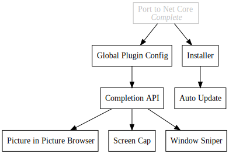

+++
title = "Traffic Control"
description = "Popup Tool Bar"
date = 2019-04-19

[extra]
project_name = "traffic-control"
+++
[https://github.com/Kethku/TrafficControl](https://github.com/Kethku/TrafficControl)

## What

A popup toolbar for easy access to one off utilities.

## Why

Frequently I find myself wanting an omnipresent way to activate small one shot
utilities similar to the mac task bar. I could do this in windows directly, but
I would like a clean way for the tools to have completion information and
documentation which isn't easy to do in the start menu. My solution is to build
a command bar which is summonable via a key combination globally. The tool will
then have a mechanism for automatically adding elements to the completion list
at any time.

## How

This project is actually one that I have worked on in the past (pre daily blog
posts) but my old version was a single c# app with the tools built in. I am
going to adapt that project to be more extensible and allow for any application
with the correct format and registration to show up in the command list.
