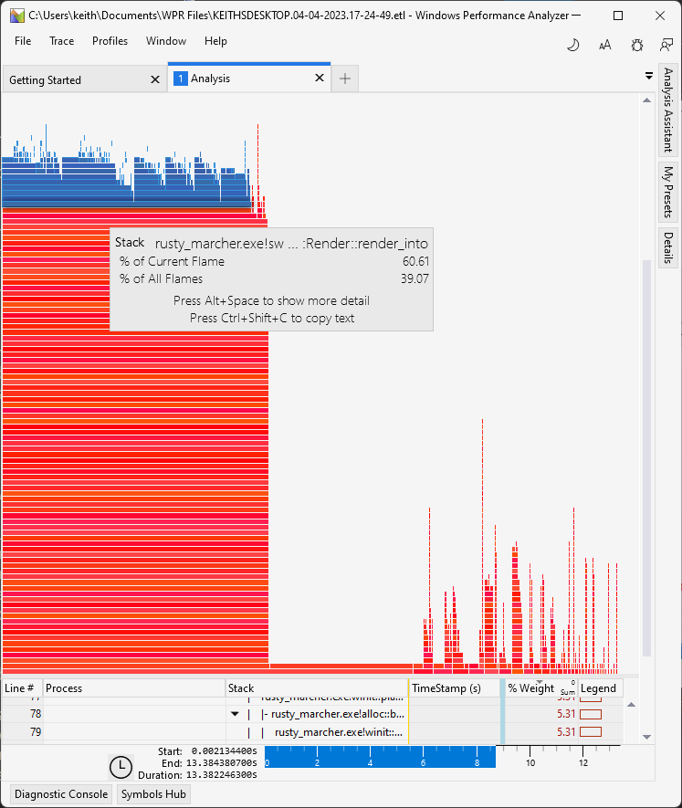

+++
title = "Day10 - Perf Improvements"
description = "Address some performance problems with glyph rendering"
date = 2023-04-04
+++

> The notes scratched into the branches and burned into
> the sanded bark are becoming clearer and more confident.
> Where previous messages were written with a cautious and
> shaky hand, the characters here are more regular and
> efficient. Careful strokes that match all of the formal
> requirements for characters in the local script have given
> way to quick lines that gesture at the correct shape
> rather than emulate it perfectly. Rather than being
> difficult to read, this confidence and consistency makes
> the text much more enjoyable.

Today I worked on cleaning up some of the loose ends I left
last time around the glyph rendering. I ended up postponing
the correctness problems in favor of some other issues I
recognized.

## Down with the Ping Pong

I have been using a tool called [RenderDoc](https://renderdoc.org/)
this week to debug and investigate what is actually
happening under the covers with my gpu code. The tool gives
step by step debugging of a given frame drawn to the screen
including snapshots of the inputs and outputs for each
shader pass. Its pretty incredible.

When digging into the rendering for my glyph renderer I
noticed a few interesting problems. First, the off screen
textures aren't getting cleared between frames. This makes
sense as only the first renderpass had the clear operation
for it's attachment.

The second issue was bigger though. The ping pong strategy
which draws to one texture reading from the other and then
swaps works great if the effect is full screen because every
pixel in the texture gets written at each step. This has the
great side effect of never copying the data and only writing
to the textures as a side effect of each pass.

For my glyph renderer however, this doesn't work so well as
each frame only renders squares around the glyphs in
question. So one pass might draw a rectangle, the following
might draw glyphs in a different part of the screen and so
not capture that rectangle for future passes. If a pass
later on requires that uncovered portion of the screen to
compute it's graphics, it will fail and either miss portions
of the pass or be transparent all together.

After some investigation and searching I eventually decided
to drop the ping pong strategy all together in favor of
copying the data from the output surface to the off screen
texture before each render. I'm told this is a pretty common
approach, so I'm not super worried about the performance
implications especially since the data is being copied
between textures already on the gpu.

This has the added benefit of not requiring two color
attachments for each shader (which required setting two
values) and not requiring managing the tick tock of which
texture to read and which to write to. Over all the code is
simpler and more correct at the cost of some potential
performance. I think this is a fair trade for now.

## Better Caching

With that problem out of the way I decided to look at the
performance of the text rendering as it stands. Step one was
to cache the shaping code so that strings already shaped
aren't reshaped. I did this with a simple hashmap which
contains an arc of the string being shaped, an ordered
float, and a font cache key as the key to a vec of glyphs as
the cached value.

From there I was still getting pretty abysmal performance so
I pulled out the Windows Performance Toolkit to dig in
further. After recording some of the slow render code and
waiting literally 5 minutes for the symbols to load, I was
presented with this:

Which revealed a significant chunk of the render time went
to shaping. Sure enough I was shaping every glyph regardless
of whether it was already in the cache. Fixing this and
trying my benchmark of drawing 10,000 `Hello world!` strings
took the performance from one frame per second to a rock
solid 60 fps or so. More than enough for the moment!

Next up I want to dig a little more for some low hanging
performance fruit if I can find any and then wrap back
around to the correctness issues I highlighted yesterday.

Till tomorrow,  
Kaylee
