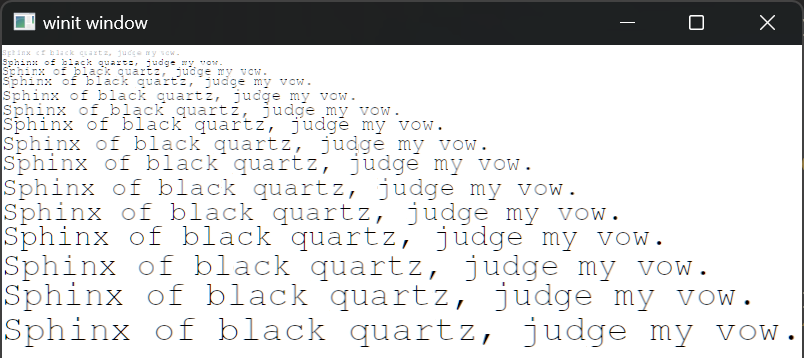

+++
title = "Day14 - Text Rendering"
description = "Finally figured out the text rendering issues"
date = 2023-04-10
+++

I have finally figured out the remaining issues with the
text rendering. Most of them were some typos and mistakes on
my part, but some were some strange gotchas with the output
from swash that threw me for a loop. However its very late
today, so I'm going to just list the issues here for future
reference and call it a day.

## 1. ATLAS_SIZE wasn't used for the atlas textures

This was straight forward. I was defining the atlas for
glyphs with size `1000x1000` rather than by using the
constant set to `1024x1024`. This led to the weirdly offset
glyphs.

## 2. Swash images have a left and top value I was ignoring

Swash returns an `Image` struct which has a placement on it
containing the expected width/height and a left/top in it.
Not only was I not using the left/top values, but they are
also defined with an upward facing coordinate system rather
than the top to bottom coordinates I was expecting from most
graphics systems.

So where I declared the glyph instance object to upload to
the gpu, I needed to convert the left/top offset using the
width/height in the placement and add that to the
bottom_left coordinate of the glyph.

```rs
// Add the glyph to instances
self.glyphs.push(InstancedGlyph {
    bottom_left: bottom_left
        + vec2(
            placement.left as f32,
            placement.height as f32 - placement.top as f32,
        ),
    atlas_top_left: vec2(
        allocation_rectangle.min.x as f32,
        allocation_rectangle.min.y as f32,
    ),
    atlas_size: vec2(placement.width as f32, placement.height as f32),
    _padding: Default::default(),
    color,
});
```

Arriving at this was a lot of trial and error as well as
some printline debugging. I got there in the end.

## 3. Glyph Key needed more than just the glyph id

With the initial version of glyph rendering, I only used the
glyph id for the key. This worked to test things out, but
immediately caused problems because only the first text
size for a glyph was used to render that particular
character from that point on. Turns out not only did I need
the font size as well, but also the font id, and the
subpixel offset.

While I was working on the subpixel offset I went and
implemented the quantization that was highlighted in the
swash demo. In the source code for the demo, there is a
reference to skia's font rendering which quantizes to
quarter pixels. So I followed suite.

```rs
#[derive(Debug, Clone, Copy, Hash, PartialEq, Eq)]
enum SubpixelOffset {
    Zero,
    Quarter,
    Half,
    ThreeQuarters,
}

impl SubpixelOffset {
    fn quantize(value: f32) -> Self {
        let value = value.fract();
        if value < 0.125 {
            Self::Zero
        } else if value < 0.375 {
            Self::Quarter
        } else if value < 0.625 {
            Self::Half
        } else if value < 0.875 {
            Self::ThreeQuarters
        } else {
            Self::Zero
        }
    }

    fn to_f32(&self) -> f32 {
        match self {
            Self::Zero => 0.0,
            Self::Quarter => 0.25,
            Self::Half => 0.5,
            Self::ThreeQuarters => 0.75,
        }
    }
}
```

With this in place I introduced a `GlyphKey` struct which
contains all of the relevant information to key for a
particular Glyph in the atlas.

```rs
#[derive(Debug, Clone, Copy, PartialEq, Eq, Hash)]
struct GlyphKey {
    glyph: GlyphId,
    font_cache_id: CacheKey,
    size: OrderedFloat<f32>,
    x_offset: SubpixelOffset,
    y_offset: SubpixelOffset,
}

impl GlyphKey {
    fn new(font_ref: FontRef, glyph: GlyphId, size: f32, offset: Vec2) -> Self {
        let font_cache_id = font_ref.key;
        let size = size.into();
        let x_offset = SubpixelOffset::quantize(offset.x);
        let y_offset = SubpixelOffset::quantize(offset.y);
        Self {
            glyph,
            font_cache_id,
            size,
            x_offset,
            y_offset,
        }
    }

    fn quantized_offset(&self) -> Vector {
        Vector::new(self.x_offset.to_f32(), self.y_offset.to_f32())
    }
}
```

## IT WORKS!

With these fixes in place, I could properly render many
sizes of glyphs in the same scene. I built a simple demo
json file with a pangram in various sizes.

```json
{
  "texts": [
    {
      "bottom_left": [0, 10],
      "size": 8,
      "color": [0, 0, 0, 1],
      "text": "Sphinx of black quartz, judge my vow."
    },
    {
      "bottom_left": [0, 20],
      "size": 10,
      "color": [0, 0, 0, 1],
      "text": "Sphinx of black quartz, judge my vow."
    },
    ...
    {
      "bottom_left": [0, 295],
      "size": 36,
      "color": [0, 0, 0, 1],
      "text": "Sphinx of black quartz, judge my vow."
    }
  ]
}
```

Which renders like this:



From here, I think the only remaining features are ensuring
that we can allocate new atlases on demand when the atlas is
filled, allowing clipping with scissor rects, and blurring
the backgrounds of layers. At that point I should be able to
integrate this work in with Neovide.

I'm going on vacation and so might miss a couple days. But
either way, till next time,  
Kay
