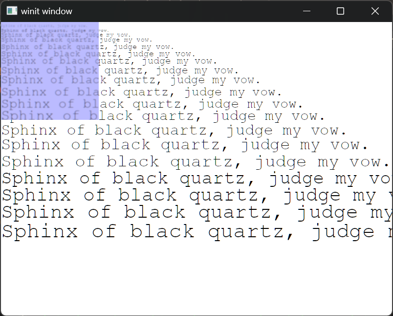

+++
title = "Day15 - Renderer Layers"
description = "Added layered rendering to the new renderer and implemented blurred backgrounds"
date = 2023-04-17
+++

I got back from my vacation which was very relaxing! I
didn't write any blog posts while I was away, but I did work
some more on the new Neovide renderer. I added layers to the
scene struct so that we can get windows working, added
clipping for said layers, and added an optional naive blur
to the background of the layers.



## Scene Layers

One of the goals I have for the new renderer is to make it
easy to capture or record scene objects into a serialized
form that can be written to disk. I have a dream of storing
a rolling buffer of the rendered frames that can then be
rendered to disc on a panic and then drawn back using a
utility tool afterward.

So with that goal in mind, the scene struct needs to be
flexible enough to record everything necessary to draw the
whole frame. A key part for Neovide in particular is to
render each window as a layer on the screen.

```rs
#[derive(Deserialize, Debug)]
pub struct Scene {
    pub layers: Vec<Layer>,
}

#[derive(Deserialize, Debug)]
pub struct Layer {
    #[serde(default)]
    pub clip: Option<Vec4>,
    #[serde(default)]
    pub background_blur_radius: u32,
    #[serde(default)]
    pub background_color: Option<Vec4>,
    #[serde(default = "default_font")]
    pub font_name: String,
    #[serde(default)]
    pub quads: Vec<Quad>,
    #[serde(default)]
    pub texts: Vec<Text>,
}
```

So now rather than storing instances of each primitive at
the root of the struct, a list of layers with clipping,
background color, and blur details is stored in the scene.
Then in the renderer, we loop over each layer calling each
of the drawables in order. Here's the high level structure in
the render function:

```rs
if let Some(surface) = &mut self.surface {
    let frame = surface.get_current_texture()?;
    let frame_view = frame.texture.create_view(&TextureViewDescriptor::default());

    let mut encoder = self
        .device
        .create_command_encoder(&CommandEncoderDescriptor {
            label: Some("Render Encoder"),
        });

    let constants = ShaderConstants {
        surface_size: vec2(
            self.surface_config.width as f32,
            self.surface_config.height as f32,
        ),
        atlas_size: ATLAS_SIZE,
    };

    let mut first = true;
    for layer in scene.layers.iter() {
        for drawable in drawables.iter_mut() {
            self.setup_offscreen_texture(first, encoder);
            let attachment_op = self.attachment_op(first, layer);

            let mut render_pass = encoder.begin_render_pass(&RenderPassDescriptor {
                label: Some("Render Pass"),
                color_attachments: &[Some(RenderPassColorAttachment {
                    view: &frame_view,
                    resolve_target: None,
                    ops: attachment_op,
                })],
                depth_stencil_attachment: None,
            });

            if let Some(clip) = layer.clip {
                render_pass.set_scissor_rect(
                    clip.x as u32,
                    clip.y as u32,
                    clip.z as u32,
                    clip.w as u32,
                );
            }

            drawable.draw(
                &self.queue,
                &mut render_pass,
                constants,
                &self.universal_bind_group,
                &layer,
            );

            first = false;
        }
    }

    self.queue.submit(std::iter::once(encoder.finish()));
    frame.present();
}
```

## Clipping

Clipping is particularly useful for rendering lists of
elements that can be partially cut off. Luckily, scissor
rects are a common feature of graphics apis and let you
specify what should get rendered for a given render pass.

```rs
let mut render_pass = encoder.begin_render_pass(&RenderPassDescriptor {
    label: Some("Render Pass"),
    color_attachments: &[Some(RenderPassColorAttachment {
        view: &frame_view,
        resolve_target: None,
        ops: attachment_op,
    })],
    depth_stencil_attachment: None,
});

if let Some(clip) = layer.clip {
    render_pass.set_scissor_rect(
        clip.x as u32,
        clip.y as u32,
        clip.z as u32,
        clip.w as u32,
    );
}

drawable.draw(
    &self.queue,
    &mut render_pass,
    constants,
    &self.universal_bind_group,
    &layer,
);
```

## Blurred Backgrounds

With layers and clipping working, I now needed to setup the
blurred backgrounds for Neovide. After some fiddling about,
I decided to add a blur flag to the `InstancedQuad` struct.
Due to bytemuck constraints, boolean values are not allowed
because they cannot be initialized from any possible binary
value. So I ended up going for a u32 as the alignment would
cause issues anyway. If non zero, I would then use the
offscreen texture I setup for the subpixel text rendering to
compute a gaussian blur.

I didn't know a ton about how gaussian blurs worked other
than that they use something called a kernel to aggregate
the values of surrounding pixels in the source texture to
compute the blur. The trick is picking what factor to
multiply each of the pixels by when doing the summation.

After some quick googling I found some weights that I put in
a constant table that seem to make a reasonable result. The
shape of a gaussian blur's kernel weights have a number of
symmetries. For my usecase, I took advantage of symmetry
across both axes to reduce the number of weights I had to
list.

```rs
const GUASSIAN_WEIGHT_FACTOR: f32 = 1. / 1003.;
const GUASSIAN_WEIGHTS: [[f32; 4]; 4] = [
    [0., 0., 1., 2.],
    [0., 3., 13., 22.],
    [1., 13., 59., 97.],
    [2., 22., 97., 159.],
];
const GUASSIAN_RADIUS: i32 = 3;
```

Then in the fragment shader for the quad, I check the blur
field and loop over a 9x9 patch of the surface texture
looking up the weights in the table.

```rs
#[spirv(fragment)]
pub fn fragment(
    #[spirv(storage_buffer, descriptor_set = 0, binding = 0)] quads: &[InstancedQuad],
    #[spirv(descriptor_set = 1, binding = 0)] surface: &Image2d,
    #[spirv(descriptor_set = 1, binding = 1)] sampler: &Sampler,
    #[spirv(push_constant)] constants: &ShaderConstants,
    #[spirv(flat)] instance_index: i32,
    #[spirv(frag_coord)] surface_position: Vec4,
    out_color: &mut Vec4,
) {
    let quad = quads[instance_index as usize];

    if quad.blur != 0 {
        // Blur the quad background by sampling surrounding pixels
        // and averaging them using the Gaussian blur kernel.
        // The weights are defined by the top left quadrant of the kernel
        // and then sampled using the symmetry of the kernel.
        *out_color = Vec4::ZERO;
        for y in -GUASSIAN_RADIUS..=GUASSIAN_RADIUS {
            for x in -GUASSIAN_RADIUS..=GUASSIAN_RADIUS {
                let weight = GUASSIAN_WEIGHT_FACTOR
                    * GUASSIAN_WEIGHTS[(GUASSIAN_RADIUS - x.abs()) as usize]
                        [(GUASSIAN_RADIUS - y.abs()) as usize];
                let offset = vec2(x as f32, y as f32);
                let sample_pos = (surface_position.xy() + offset) / constants.surface_size;
                let sample = surface.sample_by_lod(*sampler, sample_pos, 0.);
                *out_color += sample * weight;
            }
        }

        *out_color = *out_color * quad.color;
    } else {
        *out_color = quad.color;
    }
}
```

I decided to modify the quad shader because much of the code
is reused for a blurred rectangle. Some concerns I have
about this approach though:

1. Having a branch at the root of the fragment shader is a
   bad look. Since the instances might differ, I think there
   is performance being left on the table.
2. The severity of the blur isn't configurable. Because the
   table is a lookup and changes with the blur size, I
   didn't really have a good way for making it dynamic. This
   likely requires just doing some more math, but I
   postponed this for now.
3. Gaussian blurs are famously separable meaning you can do
   the vertical slice, and the horizontal slice of the patch
   separately and combine them which is much more efficient.
   I didn't implement this for now as performance isn't my
   highest priority right this moment, but this is something
   to come back to.

With the blur completed, I wrote up a test scene to
demonstrate the effect which is the image at the top of the
post!

From here, I think the majority of the features necessary to
implement Neovide's renderer contract are complete!
Remaining tasks are to add rendering of arbitrary paths (for
drawing the cursor) and to add a higher level render api
like the one exposed via DrawCommands in Neovide.

Till tomorrow,  
Kaylee
