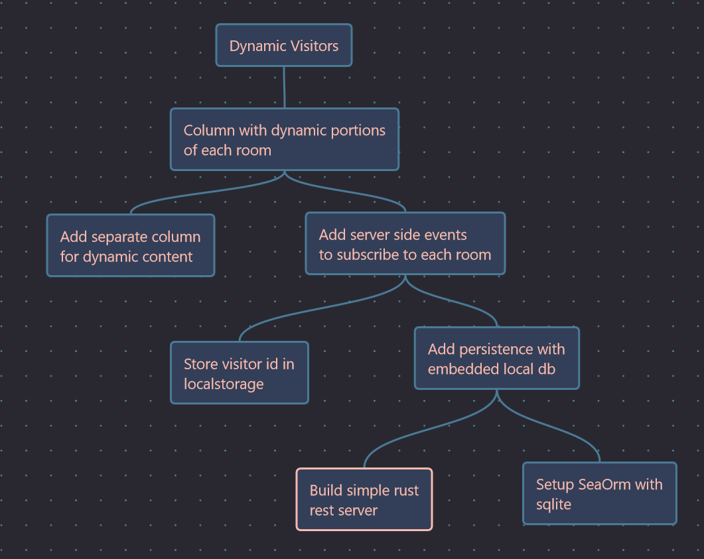

+++
title = "Day18 - Basic Rest Server"
description = "Use Rocket to Create Blog Server Side"
date = 2023-04-26
+++

> This stop in the maple tree has an odd branch that has
> been coaxed up beside the pathway as it has grown making a
> table of sorts. From the table in regular intervals are
> small twigs sticking directly out of the wood. The twigs
> are twisted and conjoined into little humanoid shapes. Now
> that you have recognized them for what they are, you
> notice some gaps in the crowd of figures. In those gaps
> you can make out the beginnings of the same twigs, but
> short as though they have been cut at the feet.



Today I swapped over to working on the blog a bit more. I
have talked about in the past the idea of having dynamic
feedback for when other people are on the page. At the
moment this site has some of the theming and flavor that I
am looking for but none of the dynamic features. So today I
worked on spinning up a basic rest server in rust which will
someday power those more interesting features of the site.

## Basic Data Model

Step one was to create a couple structs to model the live
data for the website. I decided to postpone persisting the
data to disk, so the initial approach has just enough
information to get things off the ground.

```rs
struct Room {
    visitors: RwLock<HashMap<usize, String>>,
}

#[derive(Serialize)]
#[serde(crate = "rocket::serde")]
struct RoomSnapshot {
    visitors: Vec<String>,
}

struct Visitor {
    description: String,
    last_seen: Instant,
    current_room: RwLock<PathBuf>,
}

struct World {
    rooms: RwLock<HashMap<PathBuf, Room>>,
    visitors: RwLock<HashMap<usize, Visitor>>,
}
```

I created a basic Room and Visitor which contain some simple
text that I expect to use when rendering in the future. I
also created a `RoomSnapshot` which can be serialized to
send over the wire.

Of note is the fact that each of the live structs have
parking lot `RwLock`s around them. This is because state in
Rocket apps must be thread safe. A read write lock for this
purpose is easy and plenty fine for my at least a while.

## Rocket Route

Now that I had a place to store this information I wrote a
route function that I expected the client side to request
when visiting any of the pages on the site. This route would
take a visitor_id to track who is who and a path to the
current page from the site root. With that information it
would fetch or create both the room in question and the
visitor and update the state to represent the visitor being
in that particular room.

Rocket heavily depends on convention to set this system up
and looks at the type of the arguments as well as a
specialized attribute to determine which kind of request
this route should respond to.

```rs
#[get("/room/<visitor_id>/<path..>")]
fn room(
    mut visitor_id: usize,
    path: PathBuf, 
    world: &State<World>
) -> Json<RoomSnapshot> {
```

The attribute specifies where in the url the `visitor_id`
and `path` should be parsed from and the `&State<World>`
argument tells the system that it should also pass the World
object to the function. Finally `Json<RoomSnapshot>` says
that it will return a RoomSnapshot object from the function
which should be serialized into Json to send back in the
response body.

Using the passed data is a bit verbose atm because I just
wanted to get something working, but the basic idea is to
compute the visitor id, get or create a new one, remove the
visitor from the previous room if they were seen there, get
or create the new room at `path`, add the visitor to the new
room, and return a `RoomSnapshot`.

```rs
let mut rooms = world.rooms.write();
let mut visitors = world.visitors.write();

// If the visitor_id is 0, create a new visitor id
if visitor_id == 0 {
    visitor_id = visitors.len() + 1;
}

// Get or create the visitor
let visitor = visitors.entry(visitor_id).or_insert_with(|| Visitor {
    description: "Maple Twig".to_string(),
    last_seen: Instant::now(),
    current_room: RwLock::new(PathBuf::from("/")),
});

// Remove the visitor from the previous room
let previous_room_path = visitor.current_room.read().clone();
if let Some(previous_room) = rooms.get_mut(&previous_room_path) {
    previous_room.visitors.write().remove(&visitor_id);
}

// Get or create the room at path
let room = rooms.entry(path.clone()).or_insert_with(|| Room {
    visitors: RwLock::new(HashMap::new()),
});

// Add the visitor to the current room
visitor.current_room = RwLock::new(path.clone());
room.visitors
    .write()
    .insert(visitor_id, visitor.description.clone());

// Update the visitor's last seen time
visitor.last_seen = Instant::now();

// Return the room snapshot
let snapshot = RoomSnapshot {
    visitors: room
        .visitors
        .read()
        .iter()
        .filter_map(|(key, value)| {
            if key != &visitor_id {
                Some(value.clone())
            } else {
                None
            }
        })
        .collect(),
};
Json(snapshot)
```

Finally with the details hammered out, I wrote the rocket
entry point which constructs a rocket instance, initializes
the World state, and mounts the room route.

```rs
#[launch]
fn rocket() -> _ {
    rocket::build()
        .manage(World {
            rooms: RwLock::new(HashMap::new()),
            visitors: RwLock::new(HashMap::new()),
        })
        .mount("/", routes![room])
}
```

I then created a Rocket.toml file to specify that which port
I wanted the server to run on to finish things up. A simple
curl command confirms that everything is working!

```pwsh
# First request should return no other visitors
curl http://127.0.0.1:1248/room/0//
# Yields {"visitors":[]}

# Second request should have the previous visitor
curl http://127.0.0.1:1248/room/0//
# Yields {"visitors":["Maple Twig"]}
```

Eventually each request will likely return an updated
visitor id and potentially other information, but for now
this is good enough to move forward. The goal isn't to make
some perfect rest service. Its only to make something good
enough to power my blog and not much else, and given that
this is all written in rust and pretty simple, I think it
will fit the bill.

I also spent some time working on revamping the site css to
handle a sidebar, but I will save those details for
tomorrow's blog post.

Till tomorrow,  
Kaylee
