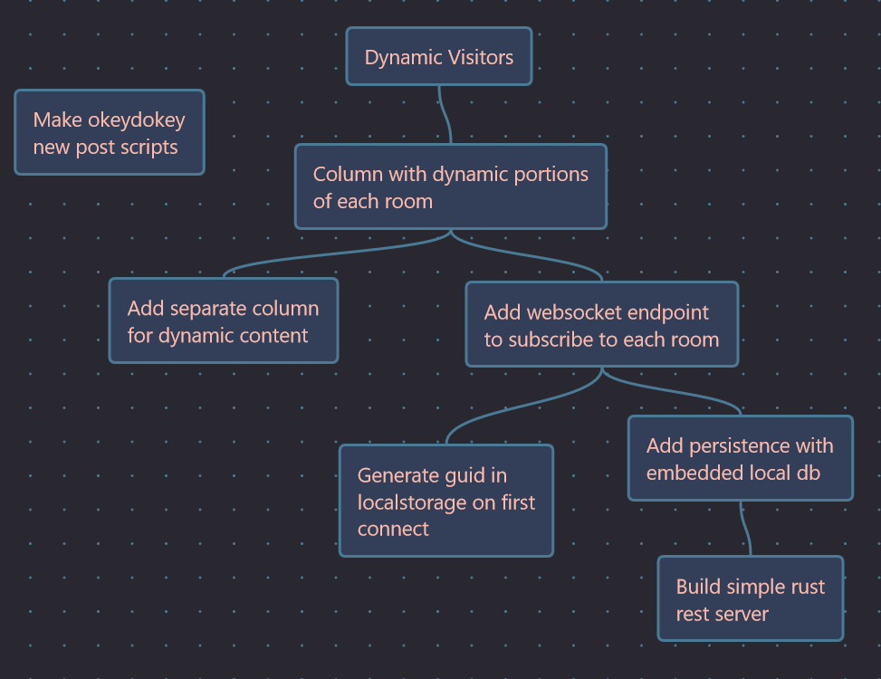

+++
title = "Day2 - Blog Planning"
description = "Making a Todo List for the Blog"
date = 2023-03-24
+++

> Another platform of boards and cords sits around a maple
> branch here. Just as the previous one, there is a ladder
> reaching down from up above and tools scattered here and
> there. This time however there is a small kiln made of
> bricks and stone. Though not currently lit, the oven feels
> warm and you can see ash inside.
>
> The setup is again clearly not permanent and appears
> constructed for a one off project and does not look like
> it would withstand many more firings.

Today I worked on cleaning up some loose ends and creating a
todo tree for the next steps in the blog project.

## Loose Ends

I made the cut yesterday with a rough sketch of some places
to navigate around and some pretty tacky syntax highlighting
using the default zola themes. I'll leave out the text
polishing, but I'll give some details about the syntax
highlighting.

When I first started the site, Zola had pretty rough support
for languages and highlighting themes. At the time, my
approach for fixing this was to rely on a js library called
prism which would search for divs with a particular ID and
replace it with a pre and code element containing formatted
and highlighted text.

This worked great especially with the simple black on white
style, but with the new skin the solarized light scheme
looked pretty bad. I also never liked using a js library for
a feature that should be static.

Luckily in the 4 years since I last used it, Zola has
stepped up their game. Not only are all of the languages I
could want supported (along with an extension model for
supporting more using sublime text language formats), but
they also added support for manually styling via css. 

```sass
.z-code
    background-color: $foreground

.z-comment
    color: $accentPink
    font-weight: bold

.z-modifier .z-entity .z-key .z-constant
    color: $accentDarkBlue

.z-string
    color: $accentDarkBlue
    font-weight: lighter

.z-type
    color: $accentBlue

.z-async .z-keyword
    color: $accentBlue
    font-weight: bold
```

Thus far I've been spot checking colors and adding classes
to the relevant color. The color scheme I've chosen has 5
colors which has been somewhat limiting even with the
occasional bold token. So at some point I may have to come
up with another color to add to the list, but for now this
works.

## Pando Update

A key component of my earlier blog posts were todo trees. In
the intervening time my todo tree app has gone through a
number of iterations. Originally I wrote a simple dsl which
I then compiled into graphviz definition files. This worked
as a proof of concept but I quickly realized that to be
useful, the todos needed to be easier to write and move
around.

The second iteration was a typescript/javascript app based
on a react node graph library I found. This took things a
bit farther but felt limiting because it required the app to
be written in javascript and run as an electron app or
website.

The third and current iteration is built in Rust using the
druid toolkit. Since I wrote it, Druid has been deprecated,
so we are due for another rewrite, but for now I just
quickly adapted the site theme into the druid color
definitions and took a screen cap.

```rs
const FOREGROUND: Color = Color::rgb8(251, 187, 173);
const ACCENT_PINK: Color = Color::rgb8(238, 134, 149);
const ACCENT_BLUE: Color = Color::rgb8(74, 122, 150);
const ACCENT_DARK_BLUE: Color = Color::rgb8(51, 63, 88);
const BACKGROUND: Color = Color::rgb8(41, 40, 49);
...
AppLauncher::with_window(window)
    .configure_env(|env, _| {
        env.set(theme::FOREGROUND_LIGHT, FOREGROUND);
        env.set(theme::FOREGROUND_DARK, ACCENT_PINK);
        env.set(theme::BACKGROUND_LIGHT, ACCENT_DARK_BLUE);
        env.set(theme::BACKGROUND_DARK, BACKGROUND);
        env.set(theme::PRIMARY_LIGHT, FOREGROUND);
        env.set(theme::PRIMARY_DARK, BACKGROUND);
        env.set(theme::BORDER_DARK, ACCENT_DARK_BLUE);
        env.set(theme::BORDER_LIGHT, ACCENT_BLUE);
        env.set(theme::LABEL_COLOR, FOREGROUND);
    })
```

## The Plan



For now I've laid out a path towards simple dynamic visitors
in the site mud. I plan on creating a small lightweight rust
server that runs a rest endpoint and websocket. Once thats
set up I want to model rooms in an embedded database (likely
sqlite) and then use that data to populate the dynamic site
content.

My current thinking is that the dynamic event log should
live in an isolated column to the left of the main content.
This would give the site an asymmetric feel which I think
might work well. But that's for tomorrow.

Till then,  
Kaylee
