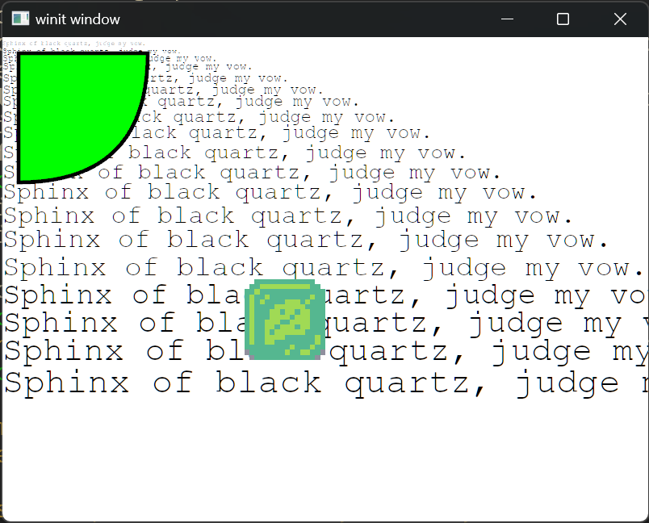

+++
title = "Day20 - Sprites"
description = "Adding sprites to the 2d renderer"
date = 2023-05-08
+++

I've been thinking about my match 3 game a bit more recently
after seeing my close friend's game [Heavenscape](https://twitter.com/heavenscape?lang=en) make more
progress. Its motivated me to work on my own game ideas a
bit more.

Last I worked on my game, I was hitting some walls and
frustration with typescript. I wrote it at the time because
I knew that I could ship typescript wherever I might need
it, but since then, both wgpu and rust have become
significantly more cross platform, and I have written the
majority of a 2d renderer that would work perfectly for a
game like this.

Up till now my renderer (which I'm now calling Bedrock) has
been built with Neovide rendering in mind. Though that is
still a project I would like to push forward, I would love
it if Bedrock could be used for other projects such as 2d
rendering in games. The goal is to make something simple
enough to integrate wherever it might be needed using a
simple scene format as the common interface. Eventually I
expect Vello to fit into this usecase much better as they
have been doing it for much longer, but in the short run I
benefit from understanding the full stack.

## Sprite Rendering

Luckily for me much of the work for rendering textures from
the gpu is identical to rendering glyphs which I have
already done. The main difference is that I need to parse
and pull the binary data from a file rather than rasterizing 
glyphs. To do so I parameterized the SpriteState struct (and
by extension, the Renderer) by a type that implements the
RustEmbed trait.

```rs
pub struct SpriteState<A: RustEmbed> {
    buffer: Buffer,
    atlas_texture: Texture,
    bind_group: BindGroup,
    ...
  }
```

This way the end user of Bedrock can insert their own
embedded files. Eventually I will make components of the
renderer optional so that projects that don't need image
rendering remove the extra compiled code. From here I
followed the glyph code pretty closely using the Image crate
to parse the texture paths taken from the scene, load them
from the RustEmbed struct, and parse them into binary data.

```rs
pub fn upload_sprite(&mut self, queue: &Queue, sprite: &Sprite) -> InstancedSprite {
    let allocation_rectangle = if let Some(alloc_id) = self.image_lookup.get(&sprite.texture) {
        self.atlas_allocator.get(*alloc_id)
    } else {
        let image_file = A::get(&sprite.texture).unwrap();
        let image = image::load_from_memory(image_file.as_ref()).unwrap();
        let data = image.to_rgba8();
        let (image_width, image_height) = image.dimensions();

        let allocation = self
            .atlas_allocator
            .allocate(size2(image_width as i32, image_height as i32))
            .expect("Could not allocate glyph to atlas");

        self.image_lookup
            .insert(sprite.texture.clone(), allocation.id);

        queue.write_texture(
            ImageCopyTexture {
                texture: &self.atlas_texture,
                mip_level: 0,
                origin: Origin3d {
                    x: allocation.rectangle.min.x as u32,
                    y: allocation.rectangle.min.y as u32,
                    z: 0,
                },
                aspect: TextureAspect::All,
            },
            &data,
            ImageDataLayout {
                offset: 0,
                bytes_per_row: Some(4 * image_width as u32),
                rows_per_image: Some(image_height as u32),
            },
            Extent3d {
                width: image_width as u32,
                height: image_height as u32,
                depth_or_array_layers: 1,
            },
        );

        allocation.rectangle
    };

    InstancedSprite {
        top_left: sprite.top_left,
        size: sprite.size,
        atlas_top_left: vec2(
            allocation_rectangle.min.x as f32,
            allocation_rectangle.min.y as f32,
        ),
        atlas_size: vec2(
            allocation_rectangle.width() as f32,
            allocation_rectangle.height() as f32,
        ),
        color: sprite.color,
    }
}
```

Not much to it. With that out of the way, I wrote a simple
shader again matching the glyph code to take the
InstancedSprites and draw them to quads sampling from the
atlas for the image data. I modified the scene to draw one
of the sprites from my old attempt to the screen as a test.



In this image there's an issue I haven't figured out yet
though. For some reason the blurred background from the test
layer containing the path isn't being rendered. I didn't
have time to track down why yet, but I need to address that.
The other problem I haven't investigated fully is that the
scene viewer crashes on my desktop machine which has an
nvidia gpu. I think its possible it crashes due to a texture
format mismatch, but I'm not positive yet and would like to
address that as well.

Once I figure out those two issues, I plan on porting the
old TARemake code to Rust and Bedrock pretty directly. Once
ported over, I can start thinking about where to take the
project next.

Till tomorrow,
Kaylee
