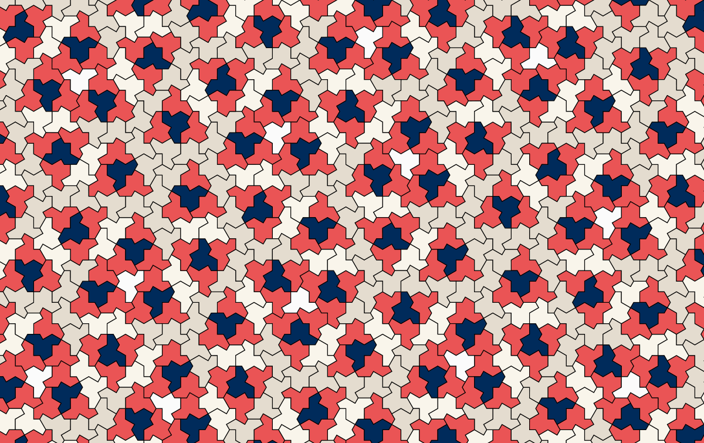
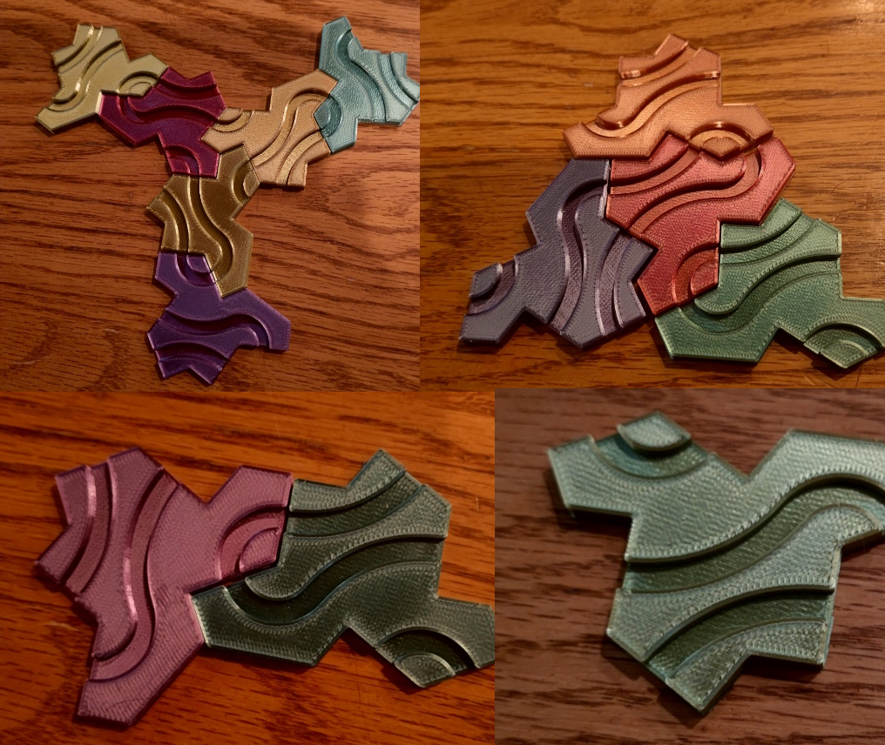
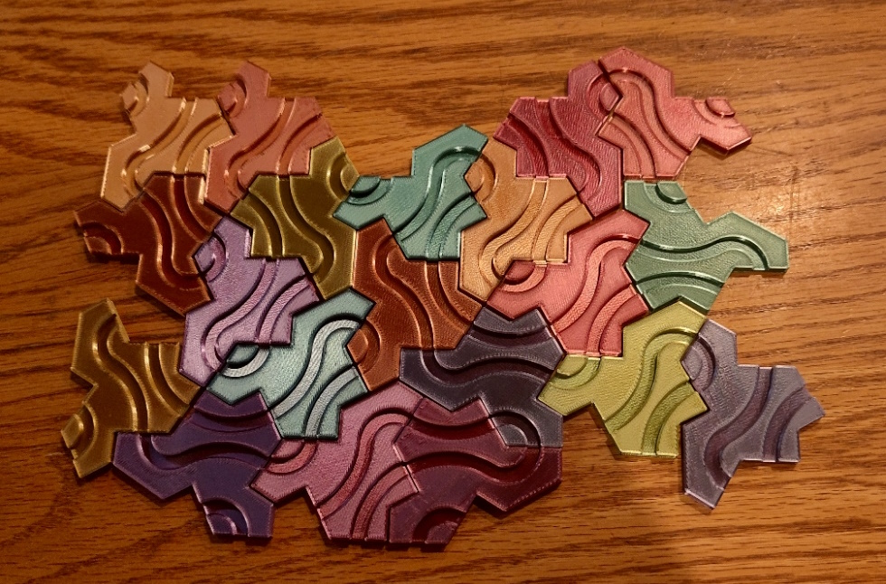
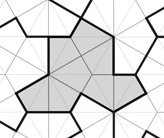

+++
title = "Day4 - Einstein Tiles"
description = "Playing around with Einstein Tiles and 3d Printing"
date = 2023-03-27
+++

> This stop on the maple Path looks rushed and scattered.
> Unlike the other resting spaces this one is barely a stop
> at all. There are some scattered sheets of paper and some
> strange looking wooden tiles in the shape of a hat.

Yesterday I got distracted 3d printing the new aperiodic
tile on the block and playing the Diablo 4 beta so I didn't
get the chance to post anything. So today I will summarize
what I learned and potentially do a second post a little
later.

## Einstein Tiles

Earlier this week my brother Rain sent me a link to an
article talking about a recent discovery of an aperiodic
monotile called an Einstein tile. Along with the link, he
demanded that I print "many of them in a bunch of colors so
that I can pay with them". Naturally I jumped to it and
ordered some color changing filament.

With a quick search online I found a 3d model of the tile
that had a nifty curving path on top. The tile had the same
design on the bottom though which I figured would cause some
print quality issues, so I sliced it in half and sent it to
my printer. It turns out this was a mistake.

I printed about 20 of the tiles all in the same orientation
using the color changing filament but for the life of me I
couldn't figure out how to get the tiles to fit together. No
matter how I tried, there were always contradictions that
made them fit poorly.

## Digging a Little Deeper

Eventually I realized that this monotile tiles infinitely
only if you can flip the tile over. I later discovered by
skimming the paper that the proof for the infinite tiling
depends on constructing 4 different "meta tiles" out of the
basic hat tile. They are as follows:

Of note is the triangle meta tile which is the only one
which contains a reflected tile in the center. I didn't
spend the time to fully understand the paper, but I *think*
the proportion of standard tiles to reflected tiles is
roughly 1 to 9 but I'm not positive.

With my new found knowledge, I printed a couple of the
reflected tiles which enabled me to tile them all together.

## Some Possible Improvements

Although I like the squiggly path over the tile I found
online, I dislike that the pattern doesn't give any hints
about how to properly construct the tiling. Ideally the
pattern on the tile could help you hook up the larger tile
combinations like the pinwheel and the larger triangle.
Bonus points if the larger structure is revealed from the
pattern.

To explain my thinking, its important to recognize the where
the structure of the hat monotile comes from. It is a type
of polygon called a polykite meaning its a shape constructed
from smaller kites.

The path in the original model drew lines from the sides of
the shape which corresponded with a long edge of one of the
internal kites. This optimizes for thicker lines with more
room to work with, but isn't ideal for revealing the meta
tiles because the most important meta tile for the structure
is the pinwheel one made of 6 standard tiles. They meet in
the center with the short edges of the kite rather than the
long edge.

If the paths between tiles joined the short edge, then that
crucial point in the center would be highlighted because it
would be a single tight circle where as the rest of the
paths would meander at least a little bit before closing.
The reflected tile could also contain a special pattern
which has a similar circle in the center to highlight it's
importance in the structure.

With those two reference points I imagine it would be much
easier to construct the larger meta tiles and assemble them
into a tiling of whatever size you would like. But for now
I've left that as an exercise for some other time when I
have patience enough to open some modeling software.

Till Tomorrow,  
Kaylee

