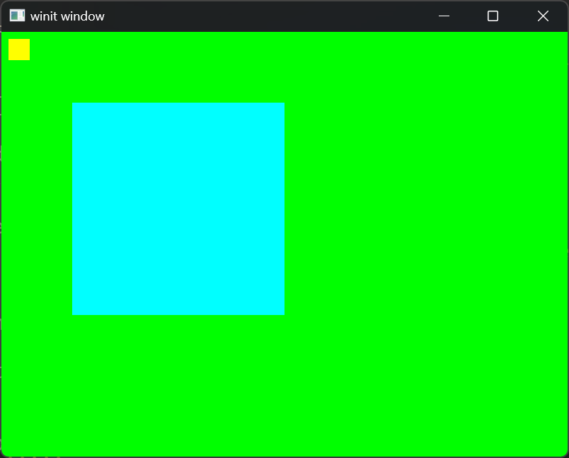

+++
title = "Day4 - Quad Shader"
description = "Playing around with Einstein Tiles and 3d Printing"
date = 2023-03-29
+++

> At this platform there is a table with various kinds of
> markings on it as though somebody was practicing writing
> by executing various strokes over and over. To one side of
> the table is a stylus with a wooden grip, long iron bar
> that ends in a long triangular nib. Next to the tool is a
> large candle with a wooden wick.
>
> It strikes you as interesting that the text on the various
> signs scattered around the Trio is all composed of burnt
> strokes into the wood rather than some sort of ink.
> Looking at the table here and strange tool, it becomes
> clear how this is done.

I missed another day, but I'm not taking this as a failure.
Too often I let my distraction and inconsistency get in the
way of the actual progress I do make. I sometimes feel that
just because I couldn't do it perfectly, there is no point
in doing it at all. Rather than pushing myself to achieve
perfection, this frequently prevents me from the success I
could have.

So with that in mind, yesterday and today I have been
working on this rust-gpu based renderer for 2d graphics.

## Rust-GPU Oddities

I've found rust-gpu to be a mixed bag though in the end
probably worth it. The ability to write actual rust code
that can compile both for the gpu and the cpu is revelatory.
I truly believe this is the path to introducing people to
gpu programming in a way that might actually stick rather
than being opaque and confusing.

That promise isn't here yet though and although it
simplifies things, it is also pretty opaque still. This
could likely be addressed with more helpful error messages
and better documentation but until then its not there yet. 

I am trudging through though. One particular resource I
found to be helpful is [this](https://dev.to/bardt/notes-on-migrating-from-wgsl-to-rust-gpu-shaders-56bg)
post which describes some pitfalls when migrating from wgsl
to rust-gpu. In particular the point that shader argument
locations are inferred by the order of the shader arguments
is huge and not documented anywhere in rust-gpu as far as I
can tell.

One minor pitfall that I fall into on top of that was that
the rust compiler elides unused parameters. I spent a bunch
of time trying to debug this error:

```
[2023-03-29T18:53:15Z ERROR wgpu::backend::direct] Handling wgpu errors as fatal by default
thread 'main' panicked at 'wgpu error: Validation Error

Caused by:
    In Device::create_render_pipeline
      note: label = `Render Pipeline`
    Error matching FRAGMENT shader requirements against the pipeline
    Location[0] is provided by the previous stage output but is not consumed as input by this stage.
```

I went round and round trying to figure out why my fragment
shader wasn't properly declaring the input parameter at
`Location[0]` only to finally try using the parameter and
have things magically start working. Frustrating but I guess
that makes sense.

These sorts of issues are everywhere when using rust-gpu.
Likely this is not so much the fault of the rust-gpu team
but a general confusion that I feel is common with this type
of graphics programming. Lots of technical terms that are
assumed to be understood. This is made worse by using a tool
that doesn't have much coverage on google. And by using a
platform that is pretty new in wgpu itself. The good news is
that I believe this will be fixed with time. But I am
impatient.

## Progress

Above gripes aside I did make progress. My first step for
creating a usable renderer was to enable rendering quads to
the screen. The plan is to use a uniform buffer containing
a flat array of `QuadInstance`s defined in the shader crate
and then index into that array in the vertex and fragment
shaders to decide where to render the quad.

For now I've done a lot of the boilerplate inline, but I
hope to use this quad shader as the prototype for rendering
other types of primitives like text glyphs from a glyph
atlas, blurred regions, or even shadows. Once I have the
boilerplate figured out and a pattern set for doing this
type of instancing, I should be able to extract utility
functions out to make the code easier to understand.

## Step 1: Define the instance type

This happens in the shader crate. The type needs to be flat
and have `#[repr(C)]` attribute so that it can be
interpreted both shader side and rust side.

```rs
#[derive(Copy, Clone, bytemuck::Pod, bytemuck::Zeroable)]
#[repr(C)]
pub struct InstancedQuad {
    pub top_left: Vec2,
    pub size: Vec2,
    pub color: Vec4,
}
```

I also derive the bytemuck `Pod` and `Zeroable` traits so
that it can be treated as plain old data when copying to a
gpu buffer.

## Step 2: Declare a storage buffer and bindgroup for the instances

Wgpu requires that you define storage buffers along with a
position and bind group. I don't fully understand what this
means, but it requires a layout that declares some of the
details about when and how the buffer is accessed. The bind
group then holds onto the buffer itself and is what you
actually set during the render pass.

```rs
let quads = vec! [
    InstancedQuad {
        top_left: vec2(10.0, 10.0),
        size: vec2(30.0, 30.0),
        color: vec4(1.0, 1.0, 0.0, 1.0),
    },
    InstancedQuad {
        top_left: vec2(100.0, 100.0),
        size: vec2(300.0, 300.0),
        color: vec4(0.0, 1.0, 1.0, 1.0),
    },
];

let quad_buffer = device.create_buffer_init(&wgpu::util::BufferInitDescriptor {
    label: Some("Uniform Buffer"),
    contents: bytemuck::cast_slice(&quads[..]),
    usage: wgpu::BufferUsages::STORAGE | wgpu::BufferUsages::COPY_DST,
});
```

Here I initialized the buffer with some manual data for the
moment, but eventually this data will be fully dynamic. One
piece I haven't addressed quite yet is how to resize the
buffer. As far as I know the only way to do that is to
create a new buffer with the new size and copy the old data
over to it. I in the short run I will allocate a set buffer
size and deal with that later.


```rs
// Create uniform buffer bind group layout
let uniform_bind_group_layout =
    device.create_bind_group_layout(&wgpu::BindGroupLayoutDescriptor {
        label: Some("Uniform Bind Group Layout"),
        entries: &[wgpu::BindGroupLayoutEntry {
            binding: 0,
            visibility: wgpu::ShaderStages::FRAGMENT | wgpu::ShaderStages::VERTEX,
            ty: wgpu::BindingType::Buffer {
                ty: wgpu::BufferBindingType::Storage { read_only: false },
                has_dynamic_offset: false,
                min_binding_size: None,
            },
            count: None,
        }],
    });

let uniform_bind_group = device.create_bind_group(&wgpu::BindGroupDescriptor {
    label: Some("Uniform Bind Group"),
    layout: &uniform_bind_group_layout,
    entries: &[wgpu::BindGroupEntry {
        binding: 0,
        resource: quad_buffer.as_entire_binding(),
    }],
});
```

Once the buffer is created, the bind group layout is defined
and the actual bind group is constructed. This gets stored
along with the other graphics state objects.

## Step 3: Specify the layout in the render pipeline

```rs
let render_pipeline_layout =
    device.create_pipeline_layout(&wgpu::PipelineLayoutDescriptor {
        label: Some("Render Pipeline Layout"),
        bind_group_layouts: &[&uniform_bind_group_layout],
        push_constant_ranges: &[wgpu::PushConstantRange {
            stages: wgpu::ShaderStages::all(),
            range: 0..std::mem::size_of::<ShaderConstants>() as u32,
        }],
    });
```

This just tells the pipeline to expect the bind group at
render time.

## Step 4: Set the bind group before drawing

Just like setting PushConstants or other parameters to the
shader, just before drawing the instances we need to set the
bind group from our graphics state.

```rs
render_pass.set_bind_group(0, &self.uniform_bind_group, &[]);
```

## Step 5: Use the storage buffer in the shader

With the setup out of the way, we can actually declare the
storage buffer as an argument to any of the shader entry
points. The amazing part here is that rust-gpu takes care of
the type handling for us. We declare that the argument is
from a `storage_buffer` in the `spirv` attribute and it does
the rest.

```rs
#[spirv(vertex)]
pub fn quad_vertex(
    #[spirv(instance_index)] instance_index: i32,
    #[spirv(vertex_index)] vert_index: i32,
    #[spirv(position, invariant)] out_pos: &mut Vec4,
    #[spirv(storage_buffer, descriptor_set = 0, binding = 0)] quads: &[InstancedQuad],
    #[spirv(push_constant)] constants: &ShaderConstants,
    out_instance_index: &mut i32,
) {
    *out_instance_index = instance_index;

    let unit_vertex_pos = match vert_index {
        0 => vec2(0.0, 0.0),
        1 => vec2(1.0, 0.0),
        2 => vec2(1.0, 1.0),
        3 => vec2(0.0, 0.0),
        4 => vec2(1.0, 1.0),
        5 => vec2(0.0, 1.0),
        _ => unreachable!(),
    };


    let instance = quads[instance_index as usize];
    let vertex_pixel_pos = instance.top_left + unit_vertex_pos * instance.size;

    let final_position = vec2(0.0, 2.0) + vertex_pixel_pos / vec2(constants.pixel_width as f32, constants.pixel_height as f32 * -1.0) * 2.0 - 1.0;
    *out_pos = final_position.extend(0.0).extend(1.0);
}
```

Here I'm using the `instance_index` to fetch which of the
uploaded quad instances to get the position from. This way
the cpu side only handles the high level concept of
generating a quad at a given location and the gpu does the
rest. One nifty piece is that I'm not even using a vertex
buffer here. The vertex shader doesn't have any data
uploaded, it just uses the index of the vertex to compute it
gpu side.

## Next Steps

This isn't too bad, and using the same struct on the cpu to
upload to the gpu buffer is a big safety win. However there
are still a few points of fragility. The biggest in my mind
is that the structure of the render pipeline is dependent on
the contents of the shader but is defined in two places.

With all of above in place, I have two little quads with
different colors and positions drawing to the screen. Given
my experience at Zed, this approach scales pretty well, so I
think its reasonable to move on.



One approach I really love from a library called [TWGL](https://twgljs.org/)
is to fetch the relevant info from the shader itself. I
don't think that wgpu gives us that capability, but the rust
code is being compiled for both sides. So with some careful
work it should be possible to fetch it using a proc macro
and then generate the pipeline setup code automatically. I
haven't yet explored what that would look like but it feels
promising.

Next up I would like to poke a little at this proc macro
approach and then look into rasterizing glyphs with swash
into a texture atlas. Once that's in place, I can work on
making a demo of this new renderer in neovide!

Till tomorrow,  
Kaylee
