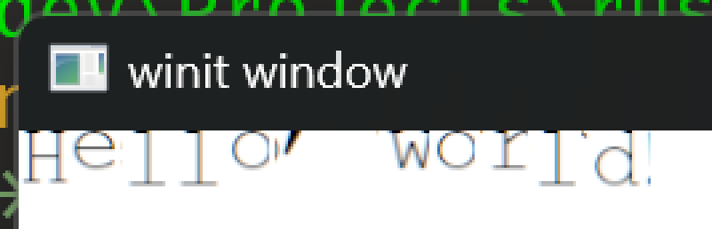

+++
title = "Day9 - Sketchy Text"
description = "Partial support for rendering strings of text"
date = 2023-04-03
+++

> Scratched into a nearby branch is a scattered and unhinged
> rendition of the words "Hello World!". The text is
> misaligned and looks similar to that of a ransom message
> cut out of a magazine. Though misshapen and unnerving, the
> text is recognizable which represents progress.

Short day today where I worked on setting up the initial
text shaping with swash. In doing so a couple bugs were
revealed with the text rendering which I plan on
investigating tomorrow.

Text shaping in Neovide is a lot more complicated than would
normally be required because of it's assumption of text on a
grid. Unlike normal text renderers, Neovide doesn't rely on
the font to specify glyph positions. Instead it positions
them manually and only relies on the font to decide which
glyphs to render.

Neovide also uses some lower level features in swash to hook
into the shaping process and fallback to different fonts if
the initial font used didn't have a necessary glyph for the
text at hand.

For this initial test however I went with the simplest setup
which uses swash's add_str to iterate over the text and
shape it all with one font.

```rs
pub fn add_text<'a, 'b: 'a>(
    &'b mut self,
    queue: &mut Queue,
    glyph_state: &'b mut GlyphState,
    font_ref: FontRef<'a>,
    text: &str,
    top_left: Vec2,
    size: f32,
    color: Vec4,
) {
    let mut shaper = self.context.builder(font_ref).size(size).build();

    shaper.add_str(text);

    let mut current_x = 0.;
    shaper.shape_with(|cluster| {
        for glyph in cluster.glyphs {
            glyph_state.add_glyph(
                queue,
                font_ref,
                glyph.id,
                top_left + vec2(current_x + glyph.x, glyph.y),
                size,
                color,
            );
            current_x += glyph.advance + glyph.x;
        }
    });
}
```

The above code *mostly* works, but has some problems
revealed by the screen shot:



## Vertical Positioning

The first issue is that the text is rendered as though it is
attached to the top of the window. This is because swash and
most fonts use the baseline of the text as the origin of a
rendered string rather than the top left. In contrast, my
glyph renderer uses the top left. This is a relatively
simple issue to fix.

## Glyphs Cut Off

The second issue I noticed was that many of the characters
other than the first one are weirdly cut off. The `H` is
perfect, but all of the other glyphs have a sharp edge on
the right side or in some cases, are rendered completely
incorrectly like the `o` in "Hello".

I'm not sure what is causing this problem but it shouldn't
be too difficult to figure out with a combination of
debugging the atlas positions and inspecting the atlas
texture in Renderdoc.

## Next Steps

After those two issues are resolved, I would like to think
about the api currently used in Neovide for text shaping
with swash directly and see if I can abstract it's usage
into a simple high level api.

I also recently came across a crate called Cosmic Text which
advertises rust native font fallback and uses swash.
Depending on the license, I may look at adapting that font
fallback code for my renderer in order to check off another
feature we currently depend on Skia for in Neovide.

Till tomorrow,  
Kaylee
