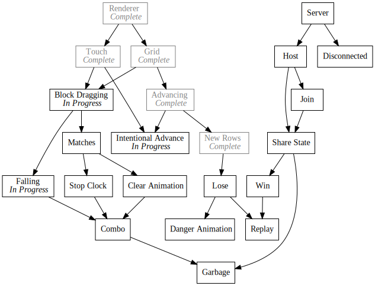
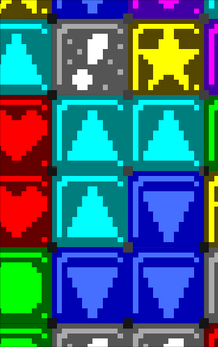
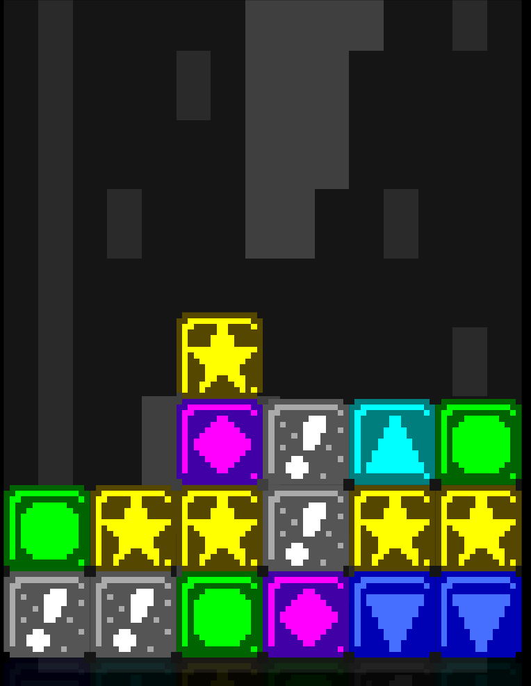
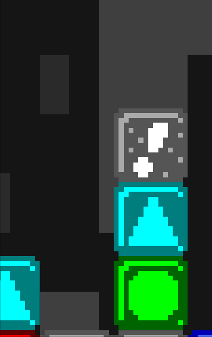

+++
title = "Day38 - Block Manipulation"
description = "Implemented block dragging, falling, and intentional grid advancement in a big spaghetti mess"
date = 2019-03-16

[extra]
project = "ta"
+++


Today I did a bunch of shoot-from-the-hip hacking to knock out a number of block
manipulation gameplay features. I did them very fast and dirty in a giant update
method, but I will do my best to describe what happened and I will definitely
clean it up later. In particular, I implemented block dragging and swapping,
block falling, matches, and the ability to intentionally advance the grid.

Although the code is a big mess, the exercise of moving quickly and cleanup
later helped me wrap my head around all of the moving parts. Now that I have a
better grasp on things I am more able to cleanup my spaghetti mess in the coming
dailies.

## Block State Overview

To manage a little bit of all the complexity, I added another "enum" similar to
the one I created for the block type to specify all of the possible block
states.

```js
export const state = {
  WAITING: "Waiting",
  SPAWNING: "Spawning",
  DRAGGING: "Dragging",
  FALLING: "Falling",
  MATCHED: "Matched",
  CLEARING: "Clearing"
};
```

I haven't implemented all of the different states yet, but these roughly match
my expectations for a given block. When a block is in the spawn row and has not
quite been activated, it will take on the `Spawning` state. After passing the
bottom of the grid, it will transition into the `Waiting` state which means it
is ready to be acted upon. From there if the player were to tap and drag the
block, it will move to the `Dragging` state and will move with the mouse cursor.
Finally if the block finds itself over an empty gap, it will move to the
`Falling` state and slide down the grid until it finds a block to rest upon.

## Dragging

Dragging a block has 3 main parts. First, it has to be visibly obvious that the
block has been picked up. Second, the block must return to a valid state when
dropped. And third, the other blocks must swap out of the way as the dragged
block is moved over them.

I solved the first requirement by adding a simple grow and shrink animation. If
the block is in the `Dragging` state, I linearly animate the current scale
toward a particular larger constant. When not in the dragging state, I linearly
animate the scale back to 1. Since the animation is linear, I don't need to know
how long it has been since it started and the animation can be started and
stopped at any point.

```js
animateBlockSize() {
  if (this.state === state.DRAGGING) {
    if (this.scale < pickedUpScale) {
      this.scale += scaleVelocity;
    } else {
      this.scale = pickedUpScale;
    }
  } else {
    if (this.scale > 1) {
      this.scale -= scaleVelocity;
    } else {
      this.scale = 1;
    }
  }
}
```

Then to actually do something, I modified the render function to utilize the
scale. At the same time I also modified the `z` value of the image position to
draw the block above the other blocks when grabbed.

```js
render() {
  let { center, dimensions } = this.calculateLocation();

  let opacity = this.calculateOpacity(center.y);
  let tint = new Color(1, 1, 1, opacity);

  if (this.state === state.DRAGGING) {
    center = center.withZ(10);
  }
  dimensions = dimensions.multiply(this.scale);

  image(blockImages[this.type], center, dimensions, 0, tint, Vector.center);
}
```



Before actually implementing the drag code, I wrote the logic that causes blocks
to return to their correct location after moving off axis. To do this I split
the block position into `gridPosition` and `gridSlot` variables where the
`gridPosition` would contain the current block animation position and the
`gridSlot` would contain the current integer grid location in block coordinates.
Animating back into the correct `gridSlot` was as simple as applying difference
fraction trick I outlined
[here](@/trio/oak/day25-game-over-screen/index.md). The basic idea is to
modify the current position by the difference between the desired position and
the current position times some fraction. This results in a smooth jump to the
correct location which slows down as it gets close.

```js
if (this.state !== state.DRAGGING) {
  // Bounced Back to Grid
  this.gridPosition.x += (this.gridSlot.x - this.gridPosition.x) * settleVelocity;
}
```

The third and most complicated requirement was solved in a big nested if
statement. I'm not super proud of the code at the moment and will likely try to
clean it up soon, but I will attempt to describe the current state of things.
The dragging functionality depends on the state of these variables:
`touchDown/touchStarted`, `heldBlock` and `this.state`. The touch status is used
to decide when to start or stop dragging, `heldBlock` is used to keep track of
which block to move around, and the block state is used to start and stop the
drag animations.

To initiate a drag, no block must be currently held, the block being touched
must be in the `Waiting` state, and the touch must have started on the current
frame.

```js
if (touchDown) {
  if (heldBlock == null) {
    // Start Dragging
    if (this.state === state.WAITING && touchPosition.within(center, dimensions) && touchStarted) {
      this.state = state.DRAGGING;
      this.dragOffset = touchPosition.subtract(center);
      heldBlock = this;
    }
```

Upon starting a drag, the state is updated to `Dragging`, the `heldBlock` is
set, and the touch offset is recorded so that the block doesn't jump to the
touch location.

After a block is being dragged, the x position must be updated to follow the
touch location. Crucially though, the block must only move one block position at
a time. At 60fps a block is very capable of being dragged across multiple
locations in one frame allowing the player to skip over a location. Although
potentially interesting as a way to add input difficulty, I don't want this
feature for now, so I impose a 0.9 block length speed limit.

The block `gridSlot.x` is set to the rounded `gridPosition.x` value. If the
`gridSlot.x` is updated, then any block in the new position is swapped to the
previous grid position. Since the bounce animation is already setup above, this
doesn't require anymore managing.

Lastly the x position is locked between 0 and 5 in order to prevent blocks from
moving off of the grid.

```js
} else if (heldBlock === this) {
  // Handle Dragged Block
  let previousSlotX = this.gridSlot.x;

  // correctedTouchX accounts for the initial touch offset
  let correctedTouchX = touchPosition.x - this.dragOffset.x - blockWidth / 2;
  let gridLeft = gridCenter.x - gridDimensions.width / 2;
  let newGridXTarget = (correctedTouchX - gridLeft) * gridBlockDimensions.width / gridDimensions.width;

  let diff = newGridXTarget - this.gridPosition.x;
  if (diff > maxDragVelocity) diff = maxDragVelocity;
  if (diff < -maxDragVelocity) diff = -maxDragVelocity;
  this.gridPosition.x += diff;

  if (this.gridPosition.x < 0) this.gridPosition.x = 0;
  if (this.gridPosition.x > 5) this.gridPosition.x = 5;

  this.gridSlot.x = Math.round(this.gridPosition.x);

  if (previousSlotX !== this.gridSlot.x) {
    let blockInTheWay = blocks[this.gridSlot.y][this.gridSlot.x];
    blocks[this.gridSlot.y][this.gridSlot.x] = this;
    blocks[this.gridSlot.y][previousSlotX] = blockInTheWay;

    if (blockInTheWay) {
      blockInTheWay.gridSlot.x = previousSlotX;
    }
  }
}
```

To wrap up the dragging animation, the block state is set to `Waiting` if the
touch is no longer active. This will cause the block to stop being managed by
the touch location and bounce back into the current grid slot.

```js
} else if (this.state === state.DRAGGING) {
  // Stop Dragging
  this.state = state.WAITING;
  heldBlock = null;
}
```

The combination of the above results in this satisfying animation:



## Falling

Falling blocks was somewhat frustrating to get right. My initial implementation
did not manage the block state properly and allowed blocks to get caught in a
half way state between grid locations. I think at this point I have ironed out
the kinks, but it was frustrating to say the least.

To start out I detect if a block should be falling by looking up grid slot below
the block.

```js
handleFalling(center, dimensions) {
  if (this.state !== state.SPAWNING && !blocks[this.gridSlot.y + 1][this.gridSlot.x]) {
    this.state = state.FALLING;
    if (heldBlock === this) heldBlock = null;
  }
```

Then each frame a block is falling, the position is updated by the falling
speed, the new grid position is checked to see if the falling can stop, and if
not, the grid structure is updated to reflect the new block position.

```js
if (this.state === state.FALLING) {
  this.gridPosition.y += fallSpeed;
  if (this.gridPosition.y > this.gridSlot.y && blocks[this.gridSlot.y + 1][this.gridSlot.x]) {
    this.gridPosition.y = this.gridSlot.y;
    this.state = state.WAITING;
  } else {
    let previousSlot = this.gridSlot.clone();
    this.gridSlot.y = Math.ceil(this.gridPosition.y);
    if (!previousSlot.equals(this.gridSlot)) {
      blocks[previousSlot.y][previousSlot.x] = null;
      blocks[this.gridSlot.y][this.gridSlot.x] = this;
    }
  }
}
```

Combined, these result in this animation:



## Intentional Grid Advancement

Finally to speed things along when the grid is moving too slowly, I added a
feature where the user can click on a spawning block to force it to spawn
immediately jumping the grid up. The action must be initiated on the block
itself, but the position modification must happen in the grid module, so I
created a simple function in `grid.js` which increments the blockAdvancement by
1,

```js
export function intentionalAdvance() {
  blockAdvancement = Math.floor(blockAdvancement) + 1;
}
```

And then added a check in `block.update` to call the function when tapped and
spawning.

```js
if (this.state === state.SPAWNING && touchPosition.within(center, dimensions) && touchStarted) {
  intentionalAdvance();
}
```

And with that, the update function is all caught up and documented:

```js
update() {
  let { center, dimensions } = this.calculateLocation();

  this.handleDragging(center, dimensions);
  this.handleFalling(center, dimensions);
  this.animateBlockSize();

  if (this.state === state.SPAWNING && touchPosition.within(center, dimensions) && touchStarted) {
    intentionalAdvance();
  }
}
```

As it turns out, the act of documenting the code forced me to explain it and
rewrite portions to be more understandable. I'm still not super pleased with the
overall structure as it feels somewhat unprincipled, but its way better than it
was. Yay [rubber ducky
programming](https://en.wikipedia.org/wiki/Rubber_duck_debugging)!

## Playable!

I also spent some time working on getting a basic match recognition routine
running. I haven't built the clear animations yet though, so I will save the
details for a future post; this one is long enough as is. As a teaser though,
here is a gif of me playing the current version of the game. Its so satisfying
to reach the playable stage of a game. It motivates me to push it further!


As always, the current version of the game as it exist in real time (not post
time) can be found [here](https://kethku.github.io/TetrisAttackClone/).

Till tomorrow!  
Kaylee
