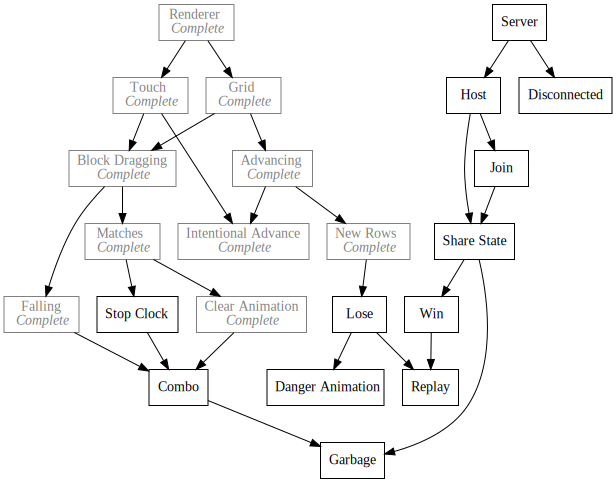

+++
title = "Day40 - WebGL Renderer"
description = "Description of the WebGL renderer I use for Tetris Attack"
date = 2019-03-18

[extra]
project = "ta"
+++

Today I spent a good long while trying to play around with some simple simplex
noise functions in Rust. Unfortunately I couldn't get things where I wanted them
so instead of describing my failures there I will describe the WebGL renderer I
have been using for the Tetris Attack port.

## Background

About a year ago a friend of mine and I started working on a silly game project
that didn't pan out. In the process however I wrote a 2d game engine in
Typescript using WebGL to render sprites very performantly. These days there are
only a couple of options for 2d games in JavaScript. You can use the built in 2d
html5 canvas functions, you can use a prebuilt library such as PIXI.js, or you
can roll your own library. In my experience the 2d canvas APIs are WAY too slow
and cumbersome to do anything interesting with. PIXI.js is plenty fast and
likely faster than anything I would come up with, but it requires you to specify
your graphics in a scene graph which I find limiting and confusing.

So the only remaining option was to roll my own. My engine is an over glorified
quad renderer, but supports transparency, arbitrary scale/rotation and somewhere
around 10000 sprites at a time. I render the textures to a sprite atlas at
startup so that everything can be done in one draw call. The math is all done on
the shader side to lighten the load on the browser.

## Sprite Atlas

By building the sprite atlas at startup, I don't need to worry about importing a
prebuilt atlas format and can play fast and loose with my graphics pipeline. The
first step is to load each of the textures into image tags so that they can be
drawn to a canvas.


export async function loadTextures(texturePaths: string[]) {
  let images: { [id: string]: HTMLImageElement } = {};
  for (let path of texturePaths) {
    let image = new Image();
    let loadedPromise = new Promise(resolve => {
      let handler = () => {
        resolve();
        image.removeEventListener("load", handler);
      };
      image.addEventListener("load", handler, false);
      image.src = path;
    });
    await loadedPromise;
    images[path] = image;
  }

  return packTextures(images);
}


Laying out the textures is done in a very naive way by guessing a multiple of 2
size of the texture, laying out the images sorted by height, and trying at a
larger size if all of the textures don't fit.


export function packTextures(images: {
  [id: string]: HTMLImageElement;
}): TextureInfo {
  let imageArray: { image: HTMLImageElement; id: string }[] = [];
  for (let id in images) {
    imageArray.push({ image: images[id], id: id });
  }
  imageArray = imageArray.sort((a, b) => b.image.height - a.image.height);
  let size = 16;
  let correctSize = true;
  let imageLayoutInfo: { [id: string]: number[] };
  do {
    imageLayoutInfo = {};
    correctSize = true;
    let gap = 10;
    size *= 2;
    let x = gap;
    let y = gap;
    let rowHeight = imageArray[0].image.height;
    for (let imageData of imageArray) {
      let image = imageData.image;
      imageLayoutInfo[imageData.id] = [
        x,
        y,
        x + image.width,
        y,
        x,
        y + image.height,
        x + image.width,
        y + image.height
      ];
      x += image.width + gap;
      if (x > size) {
        x = gap;
        y += rowHeight + gap;
        if (y + image.height + gap > size) {
          correctSize = false;
          break;
        }
        rowHeight = image.height + gap;
      }
    }
  } while (!correctSize);


Once a large enough map is attempted, the images are then rendered to the canvas
one by one and a WebGL texture is created with the contents.


  let canvas = document.createElement("canvas");
  canvas.width = size;
  canvas.height = size;
  // document.body.appendChild(canvas);
  let ctx = canvas.getContext("2d");
  for (var imageData of imageArray) {
    let info = imageLayoutInfo[imageData.id];
    ctx.drawImage(imageData.image, info[0], info[1]);
  }
  return { size: size, canvas: canvas, texCoords: imageLayoutInfo };
}


## Shaders

GLSL shaders most frequently are split into a vertex shader which positions each
triangle onto the screen, and a fragment shader which decides which color to
assign to each pixel within a triangle. My engine is no different and uses this
same structure. In contrast to most graphics engines however, I don't actually
use the vertex position to place vertices into the "world" space and instead
have various attributes for each vertex specifying where it should be drawn.
This way instead of doing a bunch of vertex math on the JavaScript side to
position every sprite, the position data is just passed to the shader and
handled there. This has the added benefit of requiring marginally less data to
be copied about since most of the data doesn't change between frames. Every
sprite is passed to the shader as a single unit wide and single unit tall quad
of two triangles with data about where to render.

The vertex shader does the majority of the work taking `attribute` variables
from the WebGL library and doing all of the necessary math to transform the unit
quad to the correct shape and location. The position of the sprite is
transformed by the center attribute to specify where the center of rotation
should be. Then the position is rotate using some simple trig by the rotation
attribute. The position is then translated into place to match the passed position. Lastly the texture is transformed by the camera position to place it in its final location. Then the texture data and color are passed to the fragment shader as `varying` variables which just means they are interpolated between the vertices.


attribute vec2 a_coord;
attribute vec3 a_position;
attribute vec2 a_texcoord;
attribute float a_rotation;
attribute vec2 a_dimensions;
attribute vec2 a_center;
attribute float a_scale;
attribute vec4 a_color;

varying highp vec2 v_texcoord;
varying highp vec4 v_color;

uniform vec4 u_camera_dimensions;

void main() {
  vec2 relativePosition = (a_coord * a_dimensions - a_dimensions * a_center) * a_scale;
  vec2 rotatedPosition = vec2(cos(a_rotation) * relativePosition.x - sin(a_rotation) * relativePosition.y,
                              sin(a_rotation) * relativePosition.x + cos(a_rotation) * relativePosition.y);
  vec3 worldCoords = vec3(rotatedPosition + a_position.xy, 0);
  gl_Position = vec4((worldCoords.xy - u_camera_dimensions.xy - u_camera_dimensions.zw / 2.0) / (u_camera_dimensions.zw / 2.0), worldCoords.z, 1);
  v_texcoord = a_texcoord;
  v_color = a_color;
}


In contrast, the fragment shader is incredibly simple just sampling the texture
in the correct location to match the requested sprite and multiplying by the
tint to get the final pixel color.


precision highp float;
uniform float u_map_dimensions;
uniform sampler2D u_texmap;

varying vec2 v_texcoord;
varying vec4 v_color;

void main() {
  vec4 sampledColor = texture2D(
    u_texmap,
    vec2(v_texcoord.s / u_map_dimensions, v_texcoord.t / u_map_dimensions)
  );
  gl_FragColor = vec4(sampledColor.rgb * v_color.rgb, sampledColor.a * v_color.a);
}


## TWGL

After the texture atlas is constructed, the WebGL boilerplate can be started. To
simplify things, I use a helper library called [TWGL](https://twgljs.org/) which
simplifies compiling the shader code, sending data to the shader, and managing
texture settings. Using TWGL, you compile a shader "program" using the glsl
shader code, and construct an arrays object containing the data arrays for each
of the shader attributes.


export const canvas = document.createElement("canvas");
canvas.setAttribute("touch-action", "none");
document.body.appendChild(canvas);
const gl = canvas.getContext("webgl", {alpha: false});
let spriteProgram = twgl.createProgramInfo(gl, [vert, frag]);
gl.useProgram(spriteProgram.program);
let maxCount = 800;
let spriteArrays = {
  a_coord: {numComponents: 2, data: new Float32Array(maxCount * 2), drawType: gl.DYNAMIC_DRAW},
  a_position: {numComponents: 3, data: new Float32Array(maxCount * 2), drawType: gl.DYNAMIC_DRAW},
  a_texcoord: {numComponents: 2, data: new Float32Array(maxCount * 2), drawType: gl.DYNAMIC_DRAW},
  a_rotation: {numComponents: 1, data: new Float32Array(maxCount * 2), drawType: gl.DYNAMIC_DRAW},
  a_dimensions: {numComponents: 2, data: new Float32Array(maxCount * 2), drawType: gl.DYNAMIC_DRAW},
  a_center: {numComponents: 2, data: new Float32Array(maxCount * 2), drawType: gl.DYNAMIC_DRAW},
  a_scale: {numComponents: 1, data: new Float32Array(maxCount * 2), drawType: gl.DYNAMIC_DRAW},
  a_color: {numComponents: 4, data: new Float32Array(maxCount), drawType: gl.DYNAMIC_DRAW},
  indices: {numComponents: 3, data: new Uint16Array(maxCount * 2), drawType: gl.DYNAMIC_DRAW}
};
let bufferInfo = twgl.createBufferInfoFromArrays(gl, spriteArrays);


In the above, the vert and frag variables are the text from the vertex and
fragment assets imported by Parcel into strings like so:


import vert from './shaders/vert.glsl';
import frag from './shaders/frag.glsl';


Then every frame I clear the viewport, set the camera position, and resize the attribute arrays if needed.


export function drawToScreen() {
  gl.clearColor(0, 0, 0, 1);
  gl.clear(gl.COLOR_BUFFER_BIT);
  gl.viewport(0, 0, screenSize.x, screenSize.y);

  twgl.setUniforms(spriteProgram, {
    u_camera_dimensions: [0, 0, screenSize.x, screenSize.y],
    u_texmap: textures.texture,
    u_map_dimensions: textures.size
  });

  for (let id in spriteArrays) {
    let expectedLength = 0;
    if (id == "indices") {
      expectedLength = imagesToDraw.length * spriteArrays[id].numComponents * 2;
    } else {
      expectedLength = imagesToDraw.length * spriteArrays[id].numComponents * 4;
    }

    if (spriteArrays[id].data.length < expectedLength) {
      console.log(expectedLength);
      if (id == "indices") {
        spriteArrays[id].data = new Uint16Array(expectedLength);
      } else {
        spriteArrays[id].data = new Float32Array(expectedLength);
      }
    }
  }


During the draw portion of every frame, modules in the game can call an image
function passing an image name, and location/tint information to draw in this
frame. Since a draw call draws the vertices in order, the image function acts
somewhat like an immediate mode API which simplifies thinking about how things
will be drawn to the screen. However the images are not drawn immediately and
instead are stored in a list to be drawn at the end of the frame.


let imagesToDraw = [];
export function image(imageUrl, position, dimensions, rotation = 0, color = Color.white, center = Vector.half) {
  imagesToDraw.push({ imageUrl, position, dimensions, rotation, color, center });
}


I then splice in data for each of the images at the expected location. Since
some browsers still do not support instanced data effectively, I use a helper
method to copy the vertex data for each of the 4 vertexes of a quad made from
two triangles. `spliceData` repeats the passed in array of data 4 times while
splice array just copies the single array slice into the destination array.


export function spliceArray(dest: Uint16Array | Float32Array, offset: number, data: number[]) {
  for (let i = 0; i < data.length; i++) {
    dest[offset + i] = data[i];
  }
}

export function spliceData(array: {numComponents: number, data: Float32Array | Uint16Array}, entityIndex: number, data: number[]) {
  let expectedCount = array.numComponents * 4;
  for (let i = 0; i < expectedCount; i += data.length) {
    spliceArray(array.data, entityIndex * expectedCount + i, data);
  }
}


I suspect that there are standard optimized versions of these functions which
would speed things up somewhat, but I have yet to encounter performance problems
with the engine as is, so I probably will not worry too much about it.

These helpers are used to copy the data into the attribute arrays like so:


imagesToDraw.sort((a, b) => a.position.z - b.position.z);
let index = 0;
for (let imageToDraw of imagesToDraw) {
  spliceData(spriteArrays.a_coord, index, [ 0, 1, 1, 1, 0, 0, 1, 0 ]);
  spliceData(spriteArrays.a_position, index, [
    imageToDraw.position.x,
    imageToDraw.position.y,
    imageToDraw.position.z
  ]);
  spliceData(spriteArrays.a_texcoord, index, textures.texCoords[imageToDraw.imageUrl]);
  spliceData(spriteArrays.a_rotation, index, [imageToDraw.rotation || 0]);
  spliceData(spriteArrays.a_dimensions, index, [
    imageToDraw.dimensions.x,
    imageToDraw.dimensions.y
  ]);
  spliceData(spriteArrays.a_center, index, [
    imageToDraw.center.x,
    imageToDraw.center.y
  ]);
  spliceData(spriteArrays.a_scale, index, [1]);
  spliceData(spriteArrays.a_color, index, [imageToDraw.color.r, imageToDraw.color.g, imageToDraw.color.b, imageToDraw.color.a]);
  let offset = index * 4;
  spliceArray(spriteArrays.indices.data, index * 6,
              [offset + 0, offset + 1, offset + 2, offset + 2, offset + 1, offset + 3]);
  index++;
}


With the attribute arrays filled, all that is left is to bind the arrays to the
gpu memory, make the draw call, and clear the `imagesToDraw` list for the next
frame.


for (let id in spriteArrays) {
  if (id != "indices") {
    twgl.setAttribInfoBufferFromArray(gl, bufferInfo.attribs[id], spriteArrays[id]);
  } else {
    gl.bindBuffer(gl.ELEMENT_ARRAY_BUFFER, bufferInfo.indices);
    gl.bufferData(gl.ELEMENT_ARRAY_BUFFER, spriteArrays[id].data, spriteArrays[id].drawType);
  }
}

twgl.setBuffersAndAttributes(gl, spriteProgram, bufferInfo);

twgl.drawBufferInfo(gl, bufferInfo, gl.TRIANGLES, imagesToDraw.length * 6);

imagesToDraw = [];


And thats it! I've found this method of drawing textures to the screen to be
incredibly flexible and fast. I've used this same basic structure in a number of
experiments and basic game engines to good effect. At some point I will reassess
the browser support for instanced geometry which would speed things up even
further by not requiring copies of the quad and repeat data in the attributes
buffers for each vertex, but until then this works fine and has great support on
all of the browsers I've tried it on. As an added benefit, I have stronger more
consistent control over how the pixels are sampled which is a huge plus as the
normal canvas APIs do not have a clean way to do nearest neighbor sampling cross
platform.

Thats about it for today, not a very visually interesting post, but hopefully somebody finds this useful!

Till tomorrow,  
Kaylee
