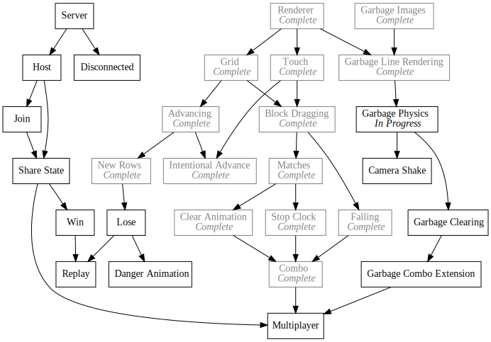
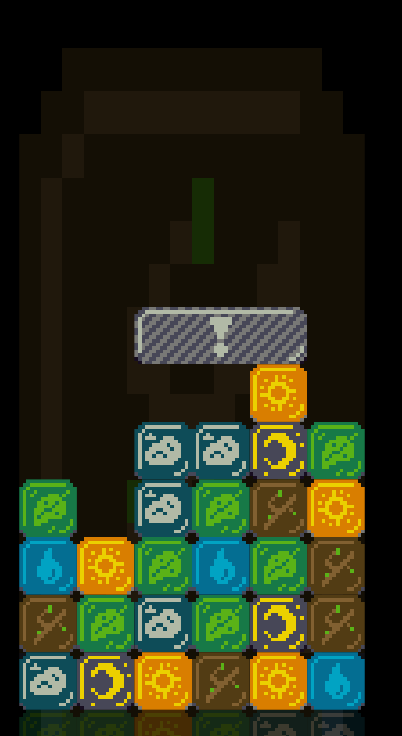

+++
title = "Day49 - Garbage Physics"
description = "Added falling and grid representation to garbage blocks"
date = 2019-03-27

[extra]
project = "ta"
+++

Today I added the garbage blocks to the grid and implemented physics for them.
Unfortunately much of this code is fairly close to the block physics, but
modified to support blocks larger than a single block wide. For now I am ok with
the repeated code since its only in two places and there is a fundamental
difference, but in the future I may try to pull out the shared bits.

## Garbage Class

The first step was to create a class for the garbage blocks in order to manage
state and property access.


export class Garbage {
  constructor(left, gridDimensions) {
    this.gridSlot = new Vector(left, previousFilledY - gridBlockDimensions.height - gridDimensions.height);
    this.gridPosition = this.gridSlot.clone();
    this.gridDimensions = gridDimensions;
    this.type = type.GARBAGE;
    this.state = state.FALLING;
  }

  render() {
    let blocksTopLeft = new Vector(
      gridCenter.x - gridDimensions.width / 2,
      gridCenter.y - gridDimensions.height / 2 + blockPixelAdvancement);

    let renderInfos = garbageRenderInfo(this.gridDimensions);
    let topLeft = blocksTopLeft.add(this.gridPosition.multiply(blockWidth).multiplyParts(new Vector(1, -1))).withZ(2);

    for (let renderInfo of renderInfos) {
      image(renderInfo.texture, topLeft, renderInfo.dimensions, 0, Color.White, Vector.topLeft);
      topLeft = topLeft.add(new Vector(0, -renderInfo.dimensions.height));
    }
  }
}


## Grid Management

At this point the garbage block is very similar to the normal blocks. I moved
the grid rendering code into the class `render` method. Then getting the block
to render is as simple as setting the block into the correct grid position.
Unfortunately since the garbage blocks take up more than a single slot, I needed
to modify the grid access functions accordingly.


let blocks = {};

export function getBlock(gridSlot) {
  let row = blocks[gridSlot.y];
  if (row) {
    return row[gridSlot.x];
  }
  return undefined;
}

export function setBlock(block) {
  let topLeft = block.gridSlot;

  for (let overlappingSlot of block.overlappingSlots()) {
    if (!blocks[overlappingSlot.y]) {
      blocks[overlappingSlot.y] = [];
    }
    blocks[overlappingSlot.y][overlappingSlot.x] = block;
  }
}

export function clearSlot(position) {
  if (blocks[position.y]) {
    delete blocks[position.y][position.x];
  }
}

export function* allBlocks() {
  let seenBlocks = new Set();

  let rowYValues = Object.keys(blocks);
  let topRow = Math.min(...rowYValues);
  let bottomRow = Math.max(...rowYValues);
  for (let y = bottomRow + 1; y >= topRow; y--) {
    let row = blocks[y];
    if (row) {
      for (let block of row) {
        if (block && !seenBlocks.has(block)) {
          yield block;
          seenBlocks.add(block);
        }
      }
    }
  }
}


`getBlock` stayed the same, but `setBlock` now sets the block into every slot
which the block overlaps. Similarly instead of just yielding blocks directly in
`allBlocks`, a set of already yielded blocks is maintained so that blocks aren't
rendered more than once. Lastly I split `clearSlot` out of `setBlock` so that I
no longer do duck typing to decide whether to clear or set a block into a
position.

## `overlappingBlocks`

Importantly I added a function to both garbage and standard blocks which returns
the list of grid positions which are overlapped by said block. For standard
blocks its as simple as returning the `gridSlot` in an array:


overlappingSlots() {
  return [ this.gridSlot ];
}


For garbage blocks `overlappingBlocks` is a generator which returns the slots
covered by the rectangle of the garbage block.


* overlappingSlots() {
  for (let x = this.gridSlot.x; x < this.gridSlot.x + this.gridDimensions.width; x++) {
    for (let y = this.gridSlot.y; y < this.gridSlot.y + this.gridDimensions.height; y++) {
      yield new Vector(x, y);
    }
  }
}


Note: the `*` is important to indicate that the class method is a generator
function.

## Falling

Falling for garbage blocks is also pretty similar to the standard blocks except
any filled slot below the garbage block is sufficient to stop the entire block
from moving. To that end I wrote a simple function which decides if there is a
gap under the garbage block to move to.


gapBelow() {
  let gapBelow = true;
  for (let x = this.gridSlot.x; x < this.gridSlot.x + this.gridDimensions.x; x++) {
    if (getBlock(new Vector(x, this.gridSlot.y + this.gridDimensions.height))) {
      gapBelow = false;
      break;
    }
  }
  return gapBelow;
}


I then use this in the `handleFalling` method which gets called by update.


handleFalling() {
  if (this.state === state.CLEARING) return;

  if (this.gapBelow()) {
    this.state = state.FALLING;
  }

  if (this.state === state.FALLING) {
    this.gridPosition.y += fallSpeed;
    if (this.gridPosition.y > this.gridSlot.y && !this.gapBelow()) {
      this.gridPosition.y = this.gridSlot.y;
      this.state = state.WAITING;
    } else {
      let previousSlot = this.gridSlot.clone();
      let newY = Math.ceil(this.gridPosition.y);
      if (newY != this.gridSlot.y) {
        for (let slot of this.overlappingSlots()) {
          clearSlot(slot);
        }
        this.gridSlot.y = newY;
        setBlock(this);
      }
    }
  }
}

update() {
  this.handleFalling();
}


The main difference here from standard is that I clear each overlapping slot
instead of the single previous gridPosition when the block is falling.

And thats about it. Beyond these changes I added some checks in the standard
block code to make sure you cannot swap with a garbage block, made it so that
Bang blocks no longer spawn in the random blocks (I will add these back once I
build metal garbage blocks), and I change the background to be a random standard
block.

Next up is to implement a clear animation and have garbage blocks watch matches
to decide when to clear themselves. Then I will need to make sure that combos
can be extended through garbage block clears.

Till tomorrow,  
Kaylee
