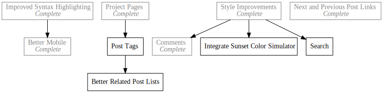

+++
title = "Day51 - Project Link Cleanup"
description = "Automatically output related blog post links on project page"
date = 2019-03-29

[extra]
project = "blog"
+++

Today I made some improvements to my blog routine to improve efficiency and add
some information to the project pages. Currently the project pages only contain
links to each of the blog posts as `dayN` without any further information about
what the post is about. Furthermore, those links are added manually to the
markdown in my new post script instead of being automatically generated by Zola.

I also noticed that the project pages all have a repeat message at the end which
could be pulled out into the template.

## Front-Matter

To improve this I decided to add a custom property to every blog post
front-matter referencing the project,


+++
title = "Day51 - Project Link Cleanup"
description = "Automatically output related blog post links on project page"
date = 2019-03-29

[extra]
project = "blog"
+++


And added a custom property to each project front-matter with the project name.


+++
title = "Tetris Attack Remake"
description = "A browser remake of Nintendo's Tetris Attack"
date = 2019-03-10

[extra]
project_name = "ta"
+++


## Template Changes

The custom properties allow me to get fancier in the blog post templates. In my
new post script I currently add a link to the project page if the project
property is defined. I moved this to the page template like so:


  
  

    <a href="../../projects/{{ page.extra.project }}/">Project Page</a>
  

  


Then in the project template I loop over every post in the blog section, sort
them in order by date, and check if the post's project matches the current
project's name. Then I add a link to the permalink for the post with the post
title as the name.



  
  
    
      <a href="{{ post.permalink }}">{{ post.title }}</a>
       
    
  



Lastly I added the end paragraph to the project content with a link to the blog
project like so:



  <h2>Dev Log</h2>
  

    {{ page.title }} is a part of <a href="https://kaylees.dev/projects/blog/">my push</a> to make
    tangible and documented progress on a project every day.
  




And thats it. This is a pretty small change overall but makes a huge difference
in the usability of the project pages and pulls a bunch of template code out of
my new post script. Overall this makes my life easier as I don't have to double check the links every time and is in general more data driven, which I like.

Till tomorrow,  
Kaylee
