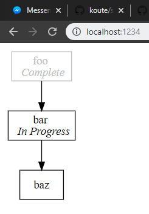

+++
title = "Day53 - Pando in the Browser"
description = "Port Pando to the browser and make a new plan"
date = 2019-03-31

[extra]
project = "pando"
+++


Recently I came across a quote from an author named [John
Gall](https://en.wikipedia.org/wiki/John_Gall_(author)). He has been attributed
with coming up with "Gall's Law" which when summarized, states: "No complex
system was ever built from scratch. Instead all systems are built simply and
modified until they are complex." With this principle in mind I have decided
against rewriting much of Pando.

I have decided to abandon my plan I described
[here](@/trio/oak/day22-pando-vnext/index.md) to write my own graph
renderer and manipulation UI. I've decided that GraphViz produces better graphs
than I can reasonably expect to draw with any algorithm I can come up with in a
short period of time. So instead of rebuilding everything from scratch I will
use GraphViz and instrument the produced svg with event handlers to enable a
simple modification UI.

## The "New" Plan

The new plan is to use the emscripten compiled version of GraphViz found
[here](https://github.com/mdaines/viz.js) to run GraphViz in the browser,
compile the Pando code to web assembly using stdweb, and add event handlers for
mouse functions to the svg elements produced from GraphViz to figure out what
connections to add and remove from the nodes.

The user interaction will support five operations: Add a node with a given
title, remove a node, change a node status, link a node to another node, and
unlink two nodes. 

 - Adding will be supported by a simple input box which allows naming a node and
tracks when the user presses enter at which point the node will be added to the
tree.
 - Removing will be enabled via middle mouse clicking a node.
 - Node status will be cycled by clicking the node without dragging.
 - Linking will be done by dragging from one node to another currently unlinked node.
 - Unlinking will be enabled by linking two already linked nodes.

Overall much of the work is already finished however there are two new tasks
with this plan. First, I will need to add support in the current rust code for
turning a parsed pando file back into text after being modified. This will allow
me to store in a clean readable fashion the modified graph. Secondly and as a
result of the first, I will need to build some way to abbreviate node names.
Neither of these tasks is overly hard, but will likely get a daily post about
each individually.

## Why tho?

I have realized that some change is needed for the way that Pando is interacted
with. For the most part Pando is easy to read and understand, but modifying a
Pando graph is very cumbersome as the graph gets larger. I found myself not
wanting to modify my todo tree in response to new ideas which is VERY bad. So
for the next couple of days I will do some work to fix things up and make the
tool more easy to use.

## Rusty WASM

The first step for this plan is to port Pando to Web Assembly so that it can be
imported and used from javascript. There are a couple of tools for this, you can
produce wasm from Cargo directly by targeting wasm-unknown-unknown, you can use
cargo-web, or as I did, you can use [stdweb](https://github.com/koute/stdweb)
and a [plugin in Parcel](https://github.com/koute/parcel-plugin-cargo-web). For
new and exploratory projects I like to use Parcel, and at the moment the best
way I have found to use it when strings are involved is to use stdweb. Stdweb
adds a ton of support in Rust for running javascript code, interacting with the
browser, and other related tasks, but in my case the main thing it provides is
simple type translation for strings across the native/javascript barrier.

Porting Pando was pretty easy. First I added stdweb to the toml file, and
changed the crate type to cdylib which will allow the wasm bindgen tool used by
the parcel plugin to produce the correct wrappers.

```toml
[dependencies]
nom = "4.2.0"
stdweb = "*"
```

[lib]
crate-type = ["cdylib"]


Then I moved main.rs to lib.rs, deleted the now unused main function and panic
handler, and added an `js_export` attribute to the compile function.

```rs
#[js_export]
pub fn compile(pando_code: &str) -> String {
    generate_dot_file(parse_pando(pando_code))
}
```

Finally I created a super simple html file with a link to an `index.js` file:

```html
<html>
  <body>
    <script src="./index.js"></script>
  </body>
</html>
```

and created a javascript file which imports Viz.js, the compiled Pando binary,
and renders a test svg to the screen:

```js
import {compile} from "./PandoRust/Cargo.toml";
import Viz from "viz.js";
import { Module, render } from 'viz.js/full.render.js';
import "babel-polyfill";

const viz = new Viz({ Module, render });

async function renderGraph() {
  let element = await viz.renderSVGElement(compile("x foo\n> bar [ F ]\n- baz [ B ]"));
  document.body.appendChild(element);
}

renderGraph();
```

After running the produced graph is identical to what I would have gotten from
the command line version but in the browser.



And thats it for today. Tomorrow I will look into modifying the Pando rust code
to allow serializing modified todo trees back into the Pando file format.

Till tomorrow,  
Kaylee
