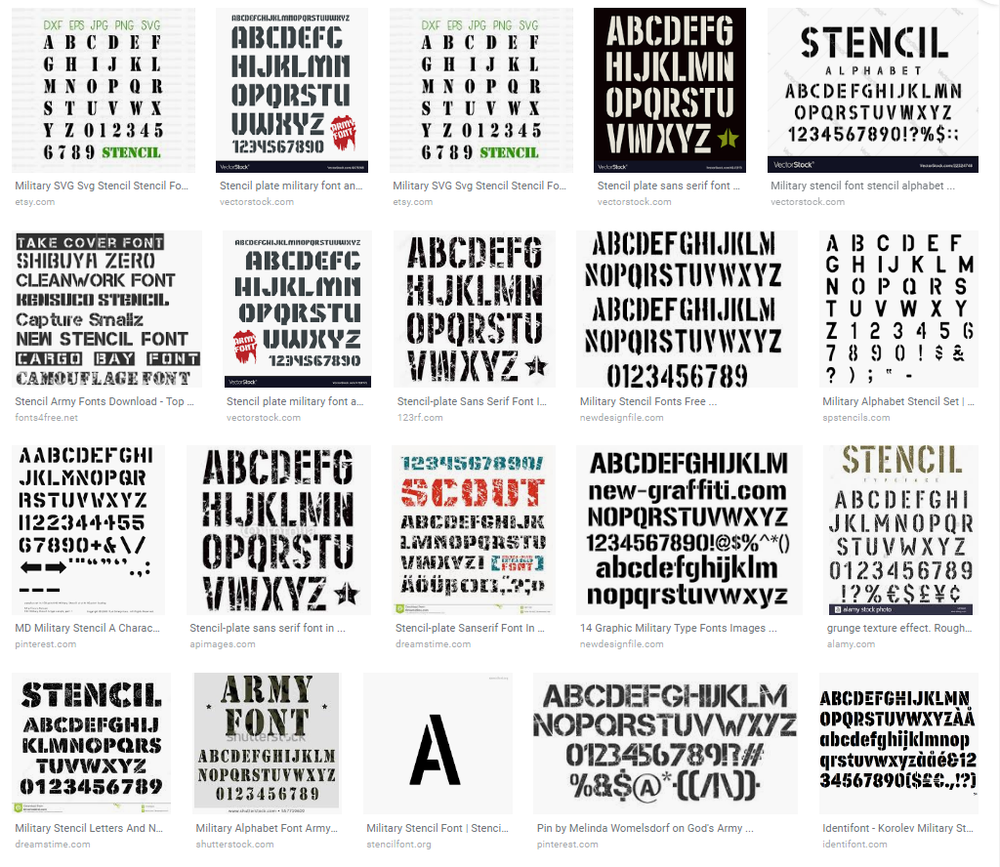
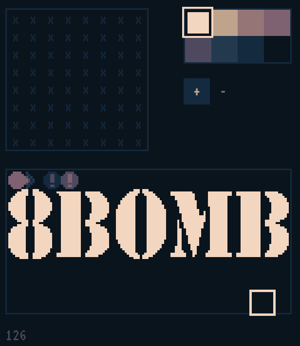

+++
title = "Day58 - 8Bomb Logo"
description = "Pixel Art for 8Bomb Logo"
date = 2019-04-05

[extra]
project = "8bomb"
+++

Today I worked on implementing in SCRIPT-8 a logo text for 8Bomb for use in a
start screen. Unfortunately given that to import graphics in SCRIPT-8 each pixel
has to be manually set, this task took a rediculous amount of time.

Given that the game is about avoiding bombs that fall from the sky, I decided to
use a military stencil font as reference for the title text. 

My strategy was to look at a ton of different stencil font images as reference,
and build a low resolution pixel version in Paint.Net which was the correct size
to fit width wise in the tile set.

I then took that logo and selected 8 by 8 squares to draw into the tile set in
SCRIPT-8. This took a rediculous amount of time (all that I could spend today)
but should put me in a good place to draw something interesting for the final
start screen! The final result in the tile editor looks like this:

Since each tile is only a small portion of the full text, I will to render these
as a set later, but this is sufficient work for today.

Till tomorrow,  
Kaylee
