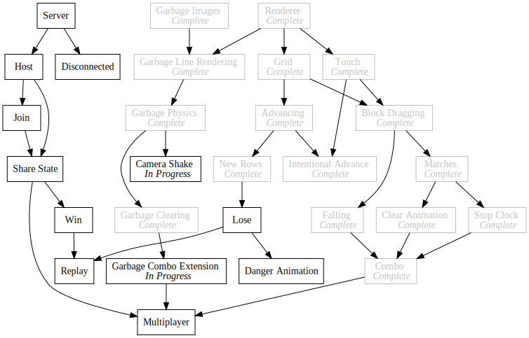
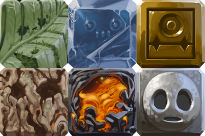

+++
title = "Day62 - New Blocks and Camera Shake"
description = "Added new block art and added camera shake on garbage fall"
date = 2019-04-09

[extra]
project = "ta"
+++

Today I swapped the pixel art standard blocks out for much better assets
provided by my friend who has been working on the Robot game project with me.
Longer term he is planning on working on some background assets and such, but as
a first step he drew new assets for the standard blocks in order to change the
art style to enable more interesting backgrounds etc later.

Swapping out the textures only required changing the image names in the images
file,


export const blockImages = {
  "Bang": "./images/Bang.png",
  "Wood": "./images/Wood.png",
  "Ice": "./images/Ice.png",
  "Stone": "./images/Stone.png",
  "Leaf": "./images/Leaf.png",
  "Lava": "./images/Lava.png",
  "Gold": "./images/Gold.png"
};


and the block types to match.


export const type = {
  WOOD: "Wood",
  ICE: "Ice",
  STONE: "Stone",
  LEAF: "Leaf",
  LAVA: "Lava",
  GOLD: "Gold",
  BANG: "Bang",
  GARBAGE: "Garbage"
};

export const standardBlocks = [
  type.WOOD,
  type.ICE,
  type.STONE,
  type.LEAF,
  type.LAVA,
  type.GOLD
];


## Camera Shake

New textures out of the way I decided implement camera shake whenever garbage
blocks fall to add some visual interest and weight to the blocks. To make this
change easier I pulled the WebGL specific parts out of `graphics.js` into
`webgl.js` in order to separate out the graphics api functions from the webgl
integration.


import { imagesToDraw } from "./webgl";
import { Color, Vector } from "./math";

export function image({ imageUrl, position, dimensions, rotation = 0, tint = Color.white, center = Vector.half }) {
  imagesToDraw.push({ imageUrl, position, dimensions, rotation, tint, center });
}


Then I added a shake function with associated delay and amount constants which
gets reduced by a certain percentage each frame.


const shakeDecay = 0.8;
const shakeAmount = 50;

let currentShake = 0;
let cameraShake = 0;

export function shake() {
  cameraShake = shakeAmount;
}

Update.Subscribe(() => {
  cameraShake *= shakeDecay;
  currentShake = (Math.random() - 0.5) * cameraShake;
});


The idea here is to build a function which sets a shake level that determines
how much to move the screen. I then store the camera offset in the
`currentShake` variable which gets used in the image call to offset the texture
positions vertically by a random amount.


export function image({ imageUrl, position, dimensions, rotation = 0, tint = Color.white, center = Vector.half }) {
  let shakenPosition = position.withY(position.y + currentShake);
  imagesToDraw.push({ imageUrl, position: shakenPosition, dimensions, rotation, tint, center });
}


Now when run, any time a block falls, the screen shakes up and down before
tapering to normal position again.

Thats it for today. I may not get to post tomorrow because I am flying to a
friend's wedding, but I will try to get a daily post finished on the plane. If I
don't I have all of Thursday to work on personal projects, so I will get it done
then instead.

Till tomorrow (or day after),  
Kaylee
