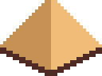
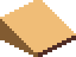
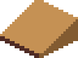
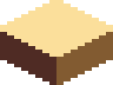
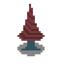
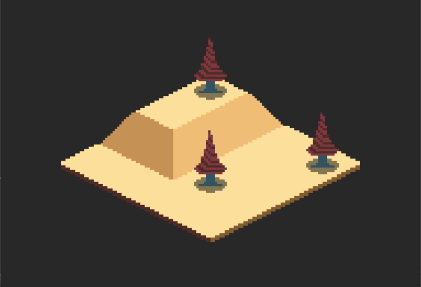

+++
title = "Day76 - Isometric Rendering Textures"
description = "Make some debug textures for isometric rendering"
date = 2019-05-04

[extra]
project = "robot"
+++

Today I worked on building a set of basic textures for testing out an isometric
renderer. I'm incredibly slow when it comes to pixel art work so building a
simple set of terrain textures and a simple entity to place in the world took
all of my time. To make up for the lack of substantial progress I will do a
writeup on the isometric renderer tomorrow. 

In the meantime, it is much to late to do more, so I will leave you with the
tile set I created and a test render I did with them in Monogame.

Tileset:

Combined Rendered Terrain:

Till tomorrow,  
Kaylee
