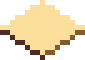
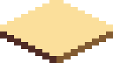
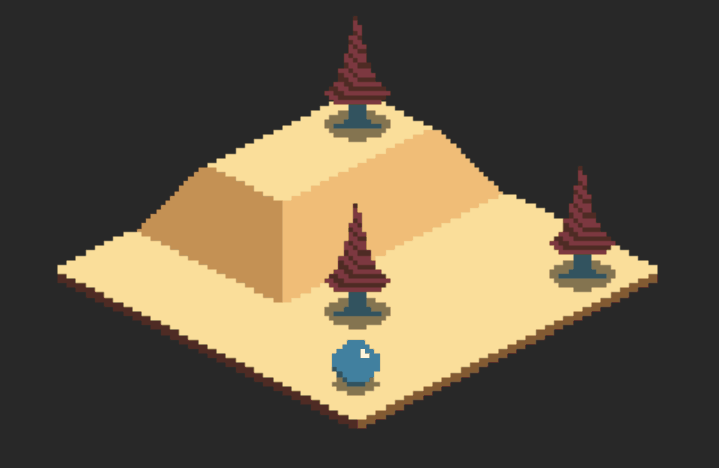

+++
title = "Day77 - Isometric Renderer"
description = "Building the basics of an isometric renderer"
date = 2019-05-05

[extra]
project = "robot"
+++

Building on yesterday's asset creation, today I worked on the isometric
rendering system. Isometric rendering has some significant benefits when it
comes to rendering them using some kind of engine. Since isometric tiles have a
clear definition for all 3 axis, we can almost treat the objects in the world as
though they are moving in 3d space and then convert them to the actual 2d
coordinates by transforming their positions into a certain screen x and y as
well as rendering order.

## A Note About the Word Isometric

Contrary to the modern popular usage of the word "Isometric" in gyms, the term
Isometric was originally used in technical drawings to describe a particular way
of drawing 3d shapes in a flat plane such that each axis has the same visual
length regardless of the distance from the camera.

As shown in this Wikipedia image, all sides of the cube have the same visual
length. Physically this doesn't make sense, but there are some significant
advantages in a technical setting. The lack of perspective enables comparing
distances with a ruler and removes some of the artistic license provided by
choices of camera parameters and scene layout.

In games we use a slightly relaxed definition of Isometric. We use the distance
preservation along the x and y axis on the horizontal plane but throw away the
constraints on the vertical axis. Similarly instead of the carefully prescribed
angles of the technical version of Isometric graphics, we often use a 2-1 ratio.
This frequently results in smoother aliasing and simpler math than the more
exact specification.

True Isometric results in jagged lines and bumpy edges because the ratio does
not divide evenly:

In contrast Faux isometric ratios such as 2-1 alias great since the pattern is
just two pixels horizontally, one pixel vertically:

Comparing the two, it becomes obvious that the fake version is much cleaner. As
an added benefit, the math gets cleaner as well. Technical drawings used the
true isometric approach to make vertical distances more obvious, but for the
purposes of a video game they often don't matter, so we can get away without it.

## Implementation

My implementation of an Isometric renderer uses a two step approach. I create a
grid containing all of the ground level tiles in it and create a list of objects
to be rendered on top of that grid for a given position. I use a dictionary
containing the loaded textures indexed by an enum with values for each of them.


public Tiles[][] TileMap = new[]{
    new [] { Tiles.RaisedDirt, Tiles.SlopeLeft, Tiles.Dirt, Tiles.Dirt },
    new [] { Tiles.RaisedDirt, Tiles.SlopeLeft, Tiles.Dirt, Tiles.Dirt },
    new [] { Tiles.SlopeRight, Tiles.SlopeUp, Tiles.Dirt, Tiles.Dirt },
    new [] { Tiles.Dirt, Tiles.Dirt, Tiles.Dirt, Tiles.Dirt }
}.FlipHorizontally();

public List<(Tiles tile, Vector3 position)> Entities = new List<(Tiles tile, Vector3 position)> {
    (Tiles.Tree, new Vector3(3, 0, 1)),
    (Tiles.Tree, new Vector3(1, 2, 0)),
    (Tiles.Tree, new Vector3(3, 3, 0))
};

public void LoadContent(ContentManager content) {
    tileTextures[Tiles.Dirt] = content.Load<Texture2D>("Tiles/U0R0D0L0");
    tileTextures[Tiles.SlopeRight] = content.Load<Texture2D>("Tiles/U1R1D0L0");
    tileTextures[Tiles.SlopeLeft] = content.Load<Texture2D>("Tiles/U1R0D0L1");
    tileTextures[Tiles.SlopeUp] = content.Load<Texture2D>("Tiles/U1R0D0L0");
    tileTextures[Tiles.RaisedDirt] = content.Load<Texture2D>("Tiles/U1R1D1L1");
    tileTextures[Tiles.Tree] = content.Load<Texture2D>("Tiles/Tree");
    tileTextures[Tiles.Ball] = content.Load<Texture2D>("Tiles/Ball");
}


To draw both categories of objects I use a function `DrawTile` which takes a
particular tile and position in world coordinates to draw it at. I use a helper
function for converting world coordinates to the screen coordinates:


private Vector2 WorldToScreen(Vector3 worldPosition) {
    Vector3 relativePosition = worldPosition - new Vector3(CameraWorldPosition, 0);

    return (new Vector2(
        relativePosition.X * TileBaseWidth + relativePosition.Y * TileBaseWidth,
        -relativePosition.X * TileBaseHeight + relativePosition.Y * TileBaseHeight - relativePosition.Z * TileBaseHeight)
        + new Vector2(screenSizeManager.PixelWidth, screenSizeManager.PixelHeight)) / 2;
}


Then I calculate the size and offset of the object to draw and use the
spritebatch to render it to the screen. Importantly I use the world position to
calculate a layer to draw the sprite at in order to get the ordering of the
textures correct. The core idea is that y values move down and to the right, x
values move up and to the right, and z values move up. Since the `layerDepth`
parameter must be from 0 to 1, I also add 50 to the value and divide by 100 to
ensure that the value is somewhere in that range. I also added a `layerOffset`
parameter for use when the automatic system screws up for whatever reason.
Sometimes textures may have an implicit vertical offset in the asset. I use this
to correct for that offset.


private void DrawTile(Tiles tileToDraw, Vector3 worldPosition, float layerOffset = 0) {
    Texture2D textureToDraw = tileTextures[tileToDraw];

    float tileWidth = TileBaseWidth;
    float tileHeight = TileBaseWidth * textureToDraw.Height / textureToDraw.Width;

    Vector2 screenPosition = WorldToScreen(worldPosition);
    float positionX = screenPosition.X - tileWidth / 2;
    float bottom = screenPosition.Y + TileBaseWidth * 18 / (32 * 2);
    float positionY = bottom - tileHeight;

    spriteBatch.Draw(
        texture: textureToDraw, 
        destinationRectangle: new Rectangle((int)positionX, (int)positionY, (int)tileWidth, (int)tileHeight), 
        sourceRectangle: null, color: Color.White, rotation: 0, origin: Vector2.Zero, effects: SpriteEffects.None,
        layerDepth: (worldPosition.Y - worldPosition.X + worldPosition.Z + layerOffset + 50) / 100);
}


Finally I combine them all to draw the ground and tree entities.


bool increasing = true;
double progress = 0;
public void Draw(GameTime gameTime) {
    for (int x = 0; x < TileMap.Length; x++) {
        var column = TileMap[x];
        for (int y = 0; y < column.Length; y++) {
            DrawTile(column[y], new Vector3(x, y, 0));
        }
    }

    foreach ((Tiles tile, Vector3 position) in Entities) {
        DrawTile(tile, new Vector3(position.X, position.Y, position.Z));
    }

    DrawTile(Tiles.Ball, new Vector3(0, (float)animationManager.Interpolate("Test", progress, 0.0, 3.0), 0), 1);
    if (increasing) progress += 0.0025;
    else progress -= 0.0025;

    if (progress > 1) increasing = false;
    if (progress < 0) increasing = true;
}


Since the draw order is defined by the draw layer, I only needed to loop over
every index of the world map and draw them one by one. Same goes for the
entities except the position is defined explicitly. Finally I created a simple
animation test with a ball texture that bounces from `(x: 0, y: 0)` to `(x:0, y:
3)` using an animation curve. The resulting animation looks like this:

Thats it for today. Next I would like to get some form of camera movement
working and possibly entity movement and or path finding working. 

Till tomorrow,  
Kaylee
